---

## Algorithms: Their Key Role in Computing

In this chapter, we aim to demystify algorithms. What exactly are algorithms, and why is it worthwhile to delve into their intricacies? How do algorithms differentiate themselves amidst the various computer technologies? This chapter wil answer these questions.

### Algorithms

Informally, an ***algorithm*** is any well-defined computational procedure that takes some value, or set of values, as ***input*** and produces some value, or set of values, as ***output*** in a finite amount of time. An algorithm is thus a sequence of computational steps that transform the input into the output.

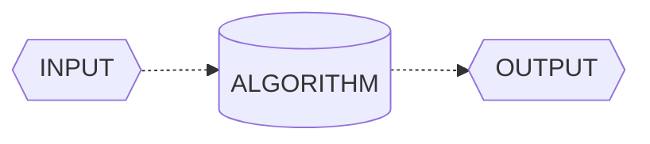

Therefore, an algorithm serve as a tool for solving a ***well-specified computational problem***. The statement of the problem specifies in general terms the desired *input/output* relationship for problem instances. The algorithm describes a specific computational procedure for achieving that *input/output* relationship for all problem instances. 

As an example, suppose that you need to *sort a sequence of numbers into increasing order*. Here is how we formally define the ***sorting problem***: 

**INPUT:**  
**A sequence of *n* numbers  $\langle a_{1}, \\, a_{2}, \\, ... \\,,\\, a_{n}  \rangle$**.

**OUTPUT:**   
**A permutation or reordering $\langle a_{1}^{\prime}\\, ,\\, a_{2}^{\prime}\\,,\\, ... \\,,\\, a_{n}^{\prime} \rangle$ of the input sequence such that $a_{1}^{\prime} \leq \\, a_{2}^{\prime} \leq \\, a_{n}^{\prime}.$**

Thus, given the input sequence $\langle 52, \\, 28, \\, 4, \\, 12, \\, 12, \\, 36 \rangle$, a  ***correct sorting algorithm*** returns as output the sequence $\langle 4, \\, 12, \\, 12, \\, 28, \\, 36, \\, 52 \rangle$. 

#

Such an input sequence is called an ***instance*** of the ***sorting problem***. In general, an ***instance of a problem*** consists of the input (satisfying whatever **constraints** are imposed in the problem statement) needed to compute a solution to the problem.

> ***Note:** A constraint problem occurs when the wrong units (e.g.,Fahrenheit instead of Celsius) are input for a temperature conversion algorithm.*

Because many programs use it as an intermediate step, sorting is a fundamental operation in **Computer Science**. As a result, you have a large number of good sorting algorithms at your disposal. Which algorithm is best for a given application depends on several factors, including *item count*, *initial sorting*, *value constraints*, *computer architecture*, and *storage device type* (e.g., main memory or disks), among others.

An algorithm for a ***computational problem*** is ***correct*** if, for every problem instance provided as input, it ***halts*** - *its computing in finite time* - and outputs the correct solution to the problem instance. An ***incorrect*** algorithm might not halt at all on some input instances, or it might halt with an incorrect answer. 

> ***Note:** Surprisingly, incorrect algorithms can have their utility, especially when their error rate is manageable.*

#

**What Kinds of Problems are Solved by Algorithms?**

Algorithms are the unsung heroes of the digital age, silently working behind the scenes to tackle a multitude of problems across various domains. Practical applications of algorithms are ubiquitous and include the following examples: 

- **Social Media Recommendation Algorithms:** Think about how social media platforms like Facebook or Instagram suggest friends to connect with or posts to engage with. These recommendation algorithms analyze your past interactions and those of others to present content and connections tailored to your interests. For instance, when Facebook suggests reconnecting with an old friend you haven't seen in years, it's driven by algorithms mining data on mutual friends, shared interests, and past interactions.

- **Uber's Ride-Matching Algorithm:** When you book a ride through Uber, an algorithm is at work behind the scenes to optimize your journey. Uber's ride-matching algorithm considers various factors like your pickup location, destination, driver availability, and real-time traffic data to calculate the quickest and most cost-effective route. This ensures you get to your destination efficiently and at a fair price, all thanks to complex algorithms.

- **Netflix Recommendation Engine:** Ever wondered how Netflix knows exactly what TV shows and movies you'll love? Netflix's recommendation engine employs powerful algorithms that analyze your viewing history, genre preferences, and even the viewing habits of users with similar tastes. It then suggests personalized content that keeps you binge-watching. For instance, when Netflix suggests a new series that becomes your favorite, it's the result of these recommendation algorithms.

**Algorithms as A Technology**

In a hypothetical scenario where computers possessed infinite processing speed and memory came at no cost, *would you have any reason to study algorithms?* Surprisingly, the answer is **yes**. Even in such a scenario, you would still like to be certain that your solution method terminates and does so with the correct answer. 

In a world of infinitely fast computers, any method that leads to the correct solution would do. While you would still uphold the principles of good ***software engineering*** — *ensuring that your implementation is well-designed and meticulously documented* — the primary criterion for choosing a method would likely be **simplicity and ease of implementation**.

Despite their impressive speeds, computers are not infinitely fast. Time, as a computing resource, is bounded and therefore, exceedingly precious. Although the saying goes, *Time is money*, while well-known, falls short in emphasizing the true value of time; it is even more precious than money itself. Money can be regained after being spent, but once time is expended, it is irrevocably lost.

Memory, on the other hand, may seem relatively inexpensive, but it is **neither infinite nor free**. It is crucial to exercise prudence in selecting algorithms that utilize time and space resources efficiently. **In other words, even with vast computing power and memory at your disposal, the art of algorithm design remains essential, as it ensures that you maximize the utility of your finite resources.**

#

**Efficiency**

Different algorithms devised to solve the same problem often differ dramatically in their efficiency. These differences can be much more significant than differences due to hardware and software. Two common ****sorting algorithms***, **Insertion Sort** and **Merge Sort**, offer a striking contrast in terms of efficiency.

**Insertion Sort**, with its simple and intuitive nature, offers a basic way to sort a collection of elements. On the other hand, **Merge Sort** employs a more sophisticated *divide and conquer* strategy to efficiently sort large datasets. To understand the profound difference in efficiency between these two algorithms, we turn to mathematical analysis.

Efficiency in sorting algorithms can be quantified through their ***time complexity***, often expressed using **Big O** notation. The time complexity provides a mathematical representation of how an algorithm's runtime scales concerning the size of the input data.

**Insertion Sort Efficiency:**
Insertion sort operates with a time complexity of $O(n^2)$ in the worst case. This quadratic growth signifies that as the input size (n) increases, the time required to sort the data grows quadratically. It can be represented as:

$$T_{i}(n) = k_{i} \times n^2$$

$T_{i}(n) \textit{represents the time taken by insertion sort for an input of size n, and } k_{i} \textit{ is another constant factor}$

**Merge Sort Efficiency:**
Merge sort, in contrast, exhibits a time complexity of $O(n \times \log_2(n))$ for all cases, including the worst case. This indicates a more efficient growth rate as the input size increases. It can be represented as:

$$T_{m}(n) = k_{m} \times n \times \log_2(n)$$

$T_{m}(n) \textit{represents the time taken by merge sort for an input of size n, and } k_{m} \textit{ is another constant factor}$

#

Let's illustrate the difference in efficiency using a practical example. We will compare the sorting efficiency of two computers. 

Let's consider the specifications of each computer: **Computer A** operates at an impressive rate of *10 billion instructions per second*. In stark contrast, **Computer B** executes instructions at a much slower pace, managing only *10 million instructions per second*. Consequently, **Computer A** outpaces **Computer B** *by a factor of 1000* in terms of raw computing power.

To accentuate this difference further, let's assume that **Computer A** benefits from the expertise of a highly skilled programmer who codes an optimized version of the insertion sort algorithm in machine language. This finely-tuned code operates at a complexity of $2 \times n^2$ instructions to sort a dataset of n numbers.

On the other hand, **Computer B** takes a different route. Here, an average programmer has implemented the merge sort algorithm using a high-level language with an inefficient compiler. This results in a code with a time complexity of $50 \times n \times \log_2(n)$ instructions to sort the same dataset.

**How long will it take for each computer to sort this 10 million-number dataset?**

$$\text{Computer A (Insertion Sort):}$$

$$T_{i}(10^7) = \frac{k_{i} \times n^2}{10^{10}} \rightarrow \frac{2 \times (10^7)^2}{10^{10}} \\: \frac{ \text{instructions}}{\text{instructions / sec}} = 20.000 \text{ seconds} \approx 5,5 \text{ hours}$$

<br>

$$\text{Computer B (Merge Sort):}$$

$$T_{m}(10^7) = \frac{k_{m} \times n \times \log_2(n)}{10^7} \rightarrow \frac{50 \times 10^7 \times \log_2(10^7)}{10^{7}} \\: \frac{ \text{instructions}}{\text{instructions / sec}} \approx 1.162,5 \text{ seconds} \approx  19,375 \text{ minutes}$$

Here, it becomes evident that as the input size increases, the *efficiency difference* between Insertion Sort and Merge Sort becomes increasingly pronounced. Merge Sort's linearithmic ( $O(n \times \log_2(n) )$ ) complexity allows it to maintain a consistent advantage over Insertion Sort, especially when dealing with large datasets.

**Algorithms and other Technologies**

In computing, algorithms are as crucial as hardware and advanced technologies. Even in the age of machine learning and data science, algorithms underpin most operations, from hardware design to user interfaces and networking. 

Efficient algorithms are essential, especially as computers tackle larger problems. A solid understanding of algorithms remains a defining trait of skilled programmers, enhancing their capabilities in the ever-evolving world of computing.

#

**Analyzing Algorithms**

Analyzing an algorithm involves predicting the resources it requires, such as *memory*, *communication bandwidth*, *energy consumption*, and most commonly, ***computational time***. By evaluating multiple candidate algorithms for a problem, we can identify the *most efficient one*, often eliminating inferior alternatives. This process requires a model of the technology on which the algorithm runs, including the associated resources and their costs.

The **RAM** **(Random-Access Machine)** model is the primary framework for *algorithm analysis*. In this model, instructions execute sequentially with constant time for each operation, closely resembling real computers. It covers *common instructions*, *data types*, and *control flow*. While it simplifies some real-world complexities, like *memory hierarchy*, it offers reliable performance predictions. Analyzing algorithms in the **RAM** model can be challenging, requiring mathematical tools, but it aids in selecting efficient algorithms for various tasks.

**Worst-Case, Average-Case, Best-Case, and Amortized Time Complexity**

**Worst-Case Running Time:** This denotes the behavior of an algorithm with respect to the **worst possible case** of the input instance. The *worst-case running time* of an algorithm is an ***upper bound*** on the running time for any input. Therefore, having the knowledge of worst-case running time gives us an assurance that the algorithm will never go beyond this time limit.

**Average-Case Running Time:** The *average-case running time* of an algorithm is an estimate of the running time for an ***average*** input. It specifies the expected behavior of the algorithm when the input is randomly drawn from a given distribution. Average-case running time assumes that all inputs of a given size are equally likely.

**Best-Case Running Time:** The term ***best-case performance*** is used to analyze an algorithm under optimal conditions. For example, the best case for a simple linear search on an array occurs when the desired element is the first in the list. However, while developing and choosing an algorithm to solve a problem, we hardly base our decision on the best-case performance. It is always recommended to improve the ***average performance*** and the ***worst-case performance*** of an algorithm.

**Amortized Running Time:** Amortized running time refers to the time required to perform a sequence of (related) operations averaged over all the operations performed. Amortized analysis guarantees the average performance of each operation in the worst case.

### Asymptotic Notation

When we analyze algorithms for large inputs, we focus on their ***asymptotic efficiency*** – *how their running time scales as input size approaches infinity*. In practice, algorithms with superior asymptotic efficiency are usually the best choice, except for exceptionally small inputs. This approach helps us understand the long-term performance characteristics of algorithms.

**$O$-Notation**

$O$-Notation characterizes an *upper bound* on the ***asymptotic*** behavior of a function. In other words, it says that a function grows no faster than a certain rate, based on the highest-order term.

Consider, for example, the function $f(x) = 3n^3 - 2n^2 + 5n + 1$ . Its highest-order term is $3n^3$, and so we say that this function’s rate of growth is $n^3$. Because this function grows no faster than $n^3$ , we can write that it is $O(n^3)$. More generally, it is $O(n^c)$ for any constant $c \gg 3$. Here is the formal definition of $O$-Notation. 

For a given function $g(n)$, we denote by $O(g(n))$ (*pronounced big-oh of g of n*) the *set of functions*):

$$O(g(n)) = \\{ f(n) : \text{ there exist positive constants c and } n_{0} \text{ such that }  0 \leq f(n) \leq cg(n), \forall \text{  n } \geq n_{o} \\}$$

#

A function $f(n)$ belongs to the set $O(g(n))$ if there exists a ***positive constant*** $c$ such that $f(n) \leq cg(n)$ for sufficiently large $n$.

The definition of $O(g(n))$ requires that every function $f(n)$ in the set $O(g(n))$ be ***asymptotically nonnegative***: $f(n)$ must be nonnegative whenever $n$ is sufficiently large. (An ***asymptotically positive*** function is one that is positive for all
sufûciently large $n$.). 

Consequently, the function $g(n)$ itself must be ***asymptotically nonnegative***, or else the set $O(g(n))$ is **empty**. We therefore assume that every function used within $O$-Notationis ***asymptotically nonnegative***. 

You might be surprised that we defined $O$-notation in terms of sets. Indeed, you might expect that we would write $f(n) \in O(g(n))$ to indicate that $f(n)$ belongs to the set $O(g(n))$. Instead, we usually write $f(n) = O(g(n))$ and say
$f(n)$ is big-oh of $g(n)$ to express the same notion. 

Let’s explore an example of how to use the formal definition of $O$-Notation to justify our practice of discarding lower-order terms and ignoring the constant coefficient of the highest-order term: 

We'll show that $f(x) = 4n^2 + 100n + 500 = O(n^2)$. 

We need to find positive constants $c$ and $n_0$ such that $f(x) = 4n^2 + 100n\leq O(n^2)$ for all $n \geq n_0$. 

By definition, we have:

$$0 \leq 4n^2 + 100n\leq cn^2$$

Dividing both sides of the inequality by $n^2$ yields: 

$$0 \leq 4 + \frac{100}{n} \leq c$$ 

Now to determine the value of $c$, we see that $4 + \frac{100}{n}$ is maximum when $n = 1$. Therefore, $c = 104$.

To determine the value of $n_0$:

$$0 \leq 4 + \frac{100}{n_0} \leq 104$$ 

$$-4{n_0} \leq 100 \leq 100{n_0}$$ 

This implies, $n_0 = 1$. Hence, $0 \leq 4n^2 + 100n \leq n^2 \\: \forall \text{  n } \geq n_{0} = 1 \\}$


#

**$\Omega$-Notation**

$\Omega$-Notation characterizes a *lower bound* on the ***asymptotic*** behavior of a function. In other words, it says that a function grows at *least as fast* as a certain rate, based on the ***highest-order term***. 

Because the ***highest-order term*** in the function $f(x) = 7n^3 + 100n^2 - 20n + 6$ grows at least as fast as $n^3$, this function is $\Omega(n^3)$. This function is also $\Omega(n^2)$ and $\Omega(n)$. More generally, it is $\Omega(n^c)$ for any constant $c \leq 3$. 

Just as $O$-notation provides an ***asymptotic upper bound*** on a function, $\Omega$-Notation provides an ***asymptotic lower bound***. For a given function $g(n)$, we denote by $\Omega(g(n))$ (*pronounced big-omega of g of n*) the set of functions 

$$\Omega(g(n)) = \\{ f(n) : \text{ there exist positive constants c and } n_{0} \text{ such that }  0 \leq cg(n) \leq f(n), \forall \text{  n } \geq n_{o} \\}$$

#

Now let’s show that $f(x) = 4n^2 + 100n + 500$ is $\Omega(n^2)$. We need to find positive constants $c$ and $n_0$ such that $f(x) = 4n^2 + 100n + 500 \leq cn^2$ for all $n \geq n_0$. As before, we divide both sides by $n^2$: 

$$4 + \frac{100}{n} + \frac{500}{n^2} \leq c$$

This inequality holds when $n_0$ is any positive integer, and we can choose $c = 4$.

What if we had a small coefficient for the $n^2$ term? The function would still be $\Omega(n^2)$. For example, let’s show that $f(x) = n^2/100 + 100n + 500$ is $\Omega(n^2)$. Dividing by $n^2$ gives: 

$$\frac{1}{100} + \frac{100}{n} + \frac{500}{n^2} \leq c$$ 

We can choose any value for $n_0$ that is at least 10,005 and find a positive value for $c$. For example, when $n_0 = 10,005$, we can choose $c = 2.49 \times 10^{-9}$. If we select a larger value for $n_0$, we can also increase $c$. For example, if $n_0 = 100,000$, then we can choose $c = 0.0089$. The higher the value of $n_0$, the closer to the coefficient $\frac{1}{100}$ we can choose $c$.

#

**$\Theta$-Notation**

$\Theta$-Notation characterizes a *tight bound* on the ***asymptotic behavior*** of a function. It says that a function grows *precisely at a certain rate*, based once again on the ***highest-order*** term. Put another way, $\Theta$-Notation characterizes the rate of growth of the function to within a **constant factor from above** and to within a **constant factor from below**. 

These two constant factors *don't need to be equal*. If you can show that a function is both $O(f(n))$ and $\Omega(f(n))$ for some function $f(n)$, then you have shown that the function is $\Theta(f(n))$. For example, $f(x) = 7n^3 + 100n^2 - 20n + 6$ it's a $\Theta(n^3)$

For a given function $g(n)$, we denote by $\Theta(g(n))$ (*theta of g of n*) the set of functions

$$\Theta(g(n)) = \\{ f(n) : \text{ there exist positive constants } c_1 \text{ and }c_2 \text{ and } n_{0} \text{ such that }  0 \leq c_{1}g(n) \leq f(n) \leq c_{2}g(n), \forall \text{ n } \geq n_{o} \\}$$

#

For all values of n at and to the right of $n_0$, the value of $f(n)$ lies at or above $c_{1}g(n)$ and at or below $c_{2}g(n)$. In other words, for all $n \geq n_0$, the function $f(n)$ is equal to $g(n)$ to within constant factors. The definitions of $O$-, $\Omega$-, and  $\Theta$-Notations lead to the following theorem.

For any two functions $f(n)$ and $g(n)$, we have $f(n) = \Theta(g(n))$ if and only if

$$f(n) = O(g(n)) \text{ and } f(n) = \Omega(g(n))$$

<br>

## Understanding the Fundamentals of Data Structures

In this chapter, we explore data structures, the essential components of computer science. What are data structures, and why are they crucial for efficient algorithms? How do they impact the world of technology and problem-solving? Let's demystify data structures and discover their profound significance.

### Data Structures

For many problems, the ability to formulate an ***efficient algorithm*** depends on being able to organize the data in an appropriate manner. The term *data structure* is used to denote a particular way of organizing data for particular types of operation.

Data structures are like organizational tools in programming, defining how data is stored and handled. They come in various forms, each tailored for specific tasks. Examples include *arrays*, *trees*, and *graphs*. These structures are vital for crafting efficient solutions in coding.
 

**Why are They Important in Programming?**

A program should undoubtedly give correct results, but along with that it should also run **efficiently**. A program is said to be efficient when it executes in *minimum time* and with *minimum memory space*. In order to write efficient programs we need to apply certain ***data management*** concepts.

The concept of data management is a complex task that includes activities like *data collection*, *organization of data into appropriate structures*, and *developing and maintaining routines for quality assurance*. A data structure is basically a group of data elements that are put together under one name, and which defines a particular way of ***storing*** and ***organizing data*** in a computer so that it can be used efficiently

Specific data structures are essential ingredients of many efficient algorithms as they enable the programmers to manage huge amounts of data easily and efficiently. Some formal design methods and programming languages emphasize data structures and the algorithms as the key organizing factor in software design. This is because **representing information is fundamental to computer science**. The primary goal of a program or software is not to perform calculations or operations but to *store* and *retrieve information* as fast as possible.

**Choosing the Right Data Structure**

In the world of problem-solving, choosing the right data structure is a fundamental step toward achieving *efficient solutions*. To gauge efficiency, we examine if a solution not only meets the problem's needs but also operates effectively within set **resource constraints**, including ***storage space*** and ***processing time***. And the best solution is the one that requires fewer resources than known alternatives. The ultimate goal is to minimize resource usage, particularly in terms of time, while still adhering to other resource limits.

In today's programming landscape, writing code extends beyond problem-solving; it's about crafting ***efficient solutions***. To accomplish this, programmers embark on a process of problem analysis, where they establish **clear performance objectives**. Subsequently, they meticulously select the data structure that best suits the task at hand.

However, in some cases, program designers lacking a solid grasp of data structure concepts may bypass this crucial analysis phase. Instead, they opt for a data structure they're familiar with. Unfortunately, this choice may not align with the specific problem, potentially leading to subpar performance, such as sluggish operation speeds.

Conversely, if a program meets its performance goals with a data structure that is simple to use, then it makes no sense to apply another complex data structure just to exhibit the programmer’s skill. When selecting a data structure to solve a problem, the following steps must be performed.

1. **Analysis of the problem to determine the basic operations that must be supported.**
2. **Quantify the resource constraints for each operation.**
3. **Select the Data Structure that best meets these requirements.**

> ***Note:** In the approach above, the first concern is the data and the operations that are to be performed on them. The second concern is the representation of the data, and the final concern is the implementation of that representation.*

C language supports various data structure types, each with its unique characteristics. Some structures allow adding data items only at the beginning, while others permit insertion at any position. Some enable sequential data access, while others facilitate random access. So, selection of an appropriate data structure for the problem is a crucial decision and may have a major impact on the performance of the program.

#

**Operations On Data Structures**

This section discusses the different operations that can be performed on the various data structures previously mentioned.

**Traversing:** It means to access each data item exactly once so that it can be processed. For example, to print the names of all the students in a class.

**Searching:** It's used to locate data items that may or may not be present in the given collection, satisfying a given constraint. For example, to find the names of all the students who secured 100 marks in mathematics.

**Inserting:** It is used to add new data items to the given list of data items. For example, to add the details of a new student who has recently joined the course.

**Deleting:** It means to remove (*delete*) a particular data item from the given collection of data items. For example, to delete the name of a student who has left the course.

**Sorting:** Data items can be arranged in some order like *ascending order* or *descending order* depending on the type of application. For example, calculating the top three winners by arranging the participants’ scores in descending order and then extracting the top three.**

**Merging:** Lists of two sorted data items can be combined to form a single list of sorted data items.

Frequently, multiple operations need to be applied simultaneously in a given situation. For instance, consider the scenario where we need to delete the details of a student with the name "X". In this case, we must first conduct a search within the list of students to determine whether the record of "X" exists and, if so, identify its location. Subsequently, we can proceed to delete the details from that specific location.

#

**Classification of Data Structures**

Classification of Data Structures categorizes them based on their organization and functionality, helping programmers choose the right tool for specific tasks. These categories include *Linear*, *Non-Linear* data structures, each suited to distinct data manipulation requirements. 

**Data structures are generally categorized into two classes: *Primitive* and *Non-Primitive* Data Structures.**

**Primitive and Non-Primitive Data Structures**  
Primitive Data Structures are the fundamental data types which are supported by a programming language. Some basic data types are *integer*, *real*, *character*, and *boolean*. The terms ***data type***, ***basic data type***, and ***primitive data type*** are often used interchangeably. 

Non-Primitive data structures, on the other hand, are constructed using primitive data types. They encompass complex structures such as *linked lists*, *stacks*, *trees*, and *graphs*. Non-Primitive data structures can be categorized into two primary types: **Linear Structures**, which follow a linear progression, and **Non-Linear Structures**, characterized by their more intricate relationships between elements.

**Linear and Non-Linear Structures**  
If data elements within a structure are organized in a sequential manner, it falls into the category of Linear data structures. Well-known examples encompass arrays, *linked lists*, *stacks*, and *queues*. Linear structures can be stored in memory using two approaches: ***contiguous memory locations*** to maintain a direct linear relationship between elements or ***linked structures*** where connections establish the linear order.

Conversely, when data elements are not arranged in a sequential order, the structure is classified as Non-Linear. Non-Linear data structures lack adjacency relationships among their elements, making them suitable for more complex scenarios. Examples of Non-Linear structures include *trees* and *graphs*, which allow for versatile data organization and retrieval.

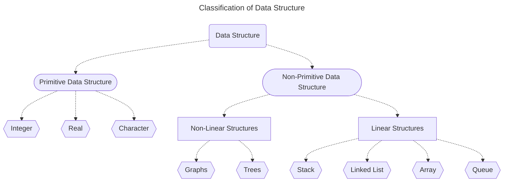


## Data Types in C

A data type determines the set of values that a data item can take and the operations that can be performed on it.

**Integers, Floating-point, and Characters.**

The C language classifies variables based on the type of data they can hold, ensuring efficient memory usage and precise operations. Thus, C provides fundamental types such as integers, characters, and floating-point numbers, offering versatility in data representation.

For instance, the **char** data type is of **one byte** and is used to store *single characters*. Note that C does not provide any data type for ***storing text***, this is because text is made up of individual characters.


| Data Type       | Description                | Size (in bytes) | Range                                                   |
|-----------------|----------------------------|:-------------------------:|---------------------------------------------------------|
| **int**           | Integer                         | 4                   | $\pm \\: -2.147 \times 10^9  \text{ to } \pm \\: 2.147 \times 10^9$                        |
| **char**          | Character                       | 1                   | $-128 \text{ to } 127$  (or $0 \text{ to } 255$ for unsigned char)      |
| **float**         | Single-Precision Floating Point | 4                   |  $\pm  \\: 1.2 \times 10^{-38} \text{ to } \pm \\: 3.4 \times 10^{38}$            |
| **double**        | Double-Precision Floating Point | 8                   |  $\pm  \\: 2.2 \times 10^{-308} \text{ to } \pm \\: 1.8 \times 10^{308}$           |

> **Note:* In addition, C also supports four modifiers — two sign specifiers (***signed*** and ***unsigned***) and two size specifiers (***short*** and ***long***).*

These ranges provide a general idea of the value limits for each of the principal data types in C. However, it's important to note that the actual range may vary depending on the specific system and compiler.

**Data Type Compatibility**

Data type compatibility is a vital concept, especially in languages like C, where precise control over data representation and memory management is crucial. It essentially deals with how different data types interact with each other in a program. It governs how variables of various types can be used together, ensuring that operations are carried out correctly and safely.

**Example of Data Type Compatibility:**

Let's consider a simple example to illustrate data type compatibility in C:

```c
#include <stdio.h>

int main(void)
{
int integerVariable = 42;
double doubleVariable = 3.14159265359;

double result = integerVariable + doubleVariable;

printf("Result:" %lf\n, result);

return 0;
}
```

In this C program, we have an **int** variable and a **double** variable. We want to add these two variables together and store the result in the result variable, which is also of type double.

Here's what's happening in terms of data type compatibility:

- The int variable is implicitly converted to a double when it's added to ***doubleVariable***. This is an example of implicit type conversion to ensure that both operands have a compatible type for the addition operation.
- The result of the addition, which is a double, is then stored in the result variable.
- Finally, we print the result using the %lf format specifier because it's of type double.

This example demonstrates how data type compatibility allows for operations involving different data types. C's rules for type conversion ensure that the code compiles and produces the expected result without requiring explicit type casting. 

> [!NOTE]
> For more reference about Data Types and The C Language, check my [Student Guide - The C Language](https://github.com/artghieri/Student-Guide-The-C-Language/blob/main/guide.md)

## Arrays

In this chapter, we will discuss arrays. An *array* is a user-defined data type that stores related information together. All the information stored in an *array* belongs to the **same data type**. So, in this chapter, we will learn how arrays are defined, declared, initialized, and accessed. We will also discuss the different operations that can be performed on array elements and the different types of arrays such as two-dimensional arrays, multi-dimensional arrays, and sparse matrices.

**An Array as a Concept**

Consider a situation in which we have 20 students in a class and we have been asked to write a program that reads and prints the marks of all the 20 students. 

Now to read the values of these 20 variables, we must have 20 read statements. Similarly, to print the value of these variables, we need 20 write statements. If it is just a matter of 20 variables, then it might be acceptable for the user to follow this approach. But would it be possible to follow this approach if we have to read and print the marks of students,

- **In the entire course (say 100 students)**
- **In the entire college (say 500 students)**
- **In the entire university (say 10,000 students)**

The answer is no, definitely **not**! To process a large amount of data, we need a data structure known as an ***array***.

An array is a collection of similar data elements. These data elements have the same data type. The elements of the array are stored in consecutive memory locations and are referenced by an index (also known as the *subscript*). The subscript is an ordinal number which is used to identify an element of the array.

```c
#include <stdio.h>  

int main(void)  
{
// Declare an integer array named "students" with 5 elements and initialize it with these values.
int students[5] = {10, 8, 7, 5, 10};  

// Print the value of the element at index 2 (third element) of the "students" array.
printf("%d", students[2]);  
return 0;  
}
```

#


**Declaration and Initialization of Arrays.**

In programming, every variable must be declared before it is used, and the same concept applies to array variables. Before using an array, it must be declared. Declaring an array involves specifying the following information:

- **Data Type**: This indicates the kind of values the array can store, such as *int*, *char*, *float*, or *double*.
- **Name**: An identifier used to uniquely identify the array.
- **Size**: The maximum number of elements that can be stored in the array.

**Arrays are declared using the following syntax:**

```sql
datatype name[size];
```

The data type can be either*int*, *char*, *float*, *double* or any other valid data type. The number within brackets indicates the *size* of the array.  
For example, if we declare:

```sql
int marks[5];
```

Then the statement declares marks to be an array **containing 10 elements**. In C, the array index starts from zero. The first element will be stored in **marks[0]**, second element in **marks[1]**, and so on. Therefore, the ***last element***, that is the 5th element, will be stored in **marks[9]**. 

> ***Note:** Note that 0, 1, 2, 3 written within square brackets are the subscripts.*

**In the memory, each element of the array will be stored as shown:**

<table>
  <tr>
    <td style="text-align:center; background-color:#3498db; color:white; width: 120px; height: 80px; font-size: 10px;">1st</td>
    <td style="text-align:center; background-color:#3498db; color:white; width: 120px; height: 80px; font-size: 10px;">2nd</td>
    <td style="text-align:center; background-color:#3498db; color:white; width: 120px; height: 80px; font-size: 10px;">3rd</td>
    <td style="text-align:center; background-color:#3498db; color:white; width: 120px; height: 80px; font-size: 10px;">4th</td>
    <td style="text-align:center; background-color:#3498db; color:white; width: 120px; height: 80px; font-size: 10px;">5th</td>
  </tr>
</table>

#

**Accessing Elements of an Array.**

To access all the elements, we must use a loop. In other words, we can access all the elements of an array by incrementing the value of the subscript into the array within a loop.

```c
// Declare an integer array named "marks" with a size of 5 elements
int marks[5];

// Initialize each element of the "marks" array to 0 using a loop
for (int i = 0; i < 5; ++i)
{
    marks[i] = 0;
}
```

> ***Note:** The subscript must be an integral value or an expression that evaluates to an integral value.*

The first element of the array **marks[5]** can be accessed by writing **marks[0**]. To process all the elements of the array, we use a loop that accesses each individual element of the array and sets its value to 0. 

In the for loop, first, the value of **marks[0]** is set to 0, then the value of the ***index*** i is incremented, and the next value, **marks[1**], is set to 0. This procedure continues until all 5 elements of the array are set to 0.

**Array marks after executing the code given:**

<table>
  <tr>
    <td style="text-align:center; background-color:#3498db; color:white; width: 120px; height: 80px; font-size: 10px;">0</td>
    <td style="text-align:center; background-color:#3498db; color:white; width: 120px; height: 80px; font-size: 10px;">0</td>
    <td style="text-align:center; background-color:#3498db; color:white; width: 120px; height: 80px; font-size: 10px;">0</td>
    <td style="text-align:center; background-color:#3498db; color:white; width: 120px; height: 80px; font-size: 10px;">0</td>
    <td style="text-align:center; background-color:#3498db; color:white; width: 120px; height: 80px; font-size: 10px;">0</td>
  </tr>
</table>


> ***Note:** There is no single statement that can read, access, or print all the elements of an array. To do this, we have to use a loop to execute the same statement with different index values.*


**Storing Values in Arrays**

When declaring an array, we allocate space for its elements without storing values. Three methods exist for storing values in an array: initializing elements during declaration, inputting values for individual elements from the keyboard, or assigning values to individual elements.

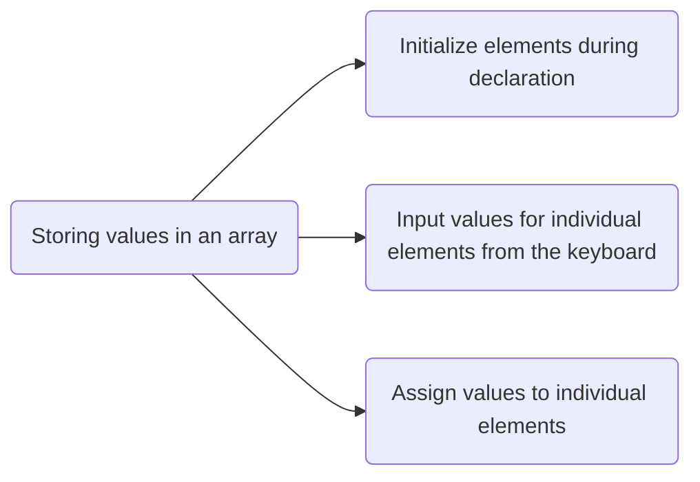

**Initializing Arrays During Declaration**

Arrays can be initialized at the time of declaration, just like any other variable. When initializing an array, you must provide a value for every element within the array. This is done by specifying the values within curly braces, separated by commas, in the following format:

```sql
type array_name[size] = {list of values};
```

It's important to ensure that the number of values matches the number of elements in the array; specifying more values than there are elements will result in a compiler error.

```sql
int marks[5] = {90, 82, 78, 95, 88};
```

In this example, an array named marks is declared with enough space to store five elements. The first element, **marks[0]**, is assigned the value 90, the second element, **marks[1]**, is assigned 82, and so on. 

**Inputting Values from the Keyboard**

Arrays can be initialized by inputting values from the keyboard using loops, such as **while/do–while** or **for** loops. 

```c
int i, marks[10];
i = 0;

while (i < 10)
{
  printf("Enter a value for element %d: ", i);
  
  scanf("%d", &marks[i]); // Input value for the current element
  i++;  // Increment index i
}
```

For instance, a loop iterates through the array elements, starting from index 0 and inputting values for each element. This process continues for arrays with indices ranging from 0 to 9. 

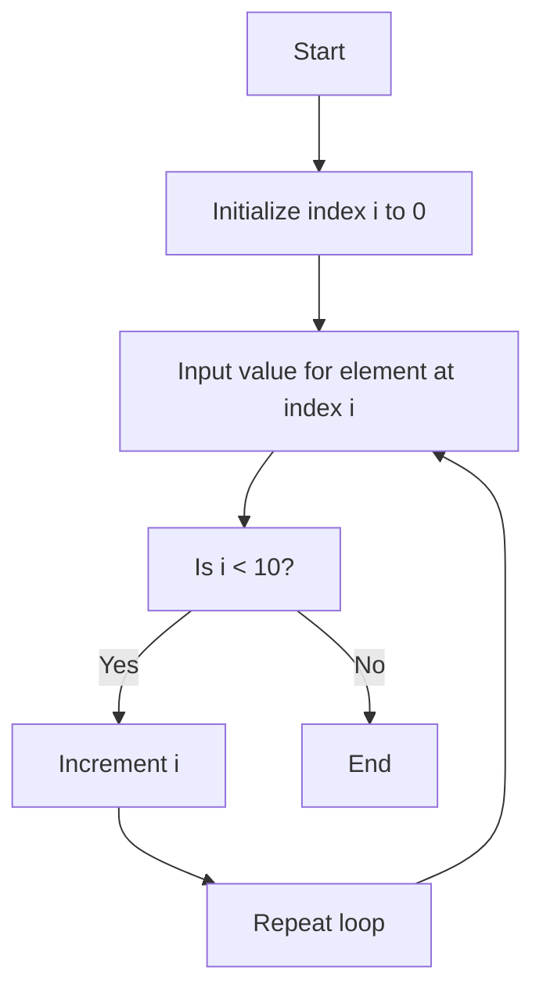

**Assigning Values to Individual Elements**

The third method involves assigning values to individual elements of the array using the assignment operator. You can assign any value that matches the data type of the array to an individual array element.

```sql
marks[0] = 10
```

To copy the contents of one array into another, you must copy the value of each individual element from the first array to the corresponding element in the second array.

```c
#include <stdio.h>

int main()
{
int firstArray[5] = {1, 2, 3, 4, 5};
int secondArray[5];

// Copy the values from firstArray to secondArray
for (int i = 0; i < 5; i++)
  secondArray[i] = firstArray[i];
return 0;
}
```

In this example, the loop accesses each element of the first array and simultaneously assigns its value to the corresponding element of the second array. The index value i is incremented to access the next element in succession

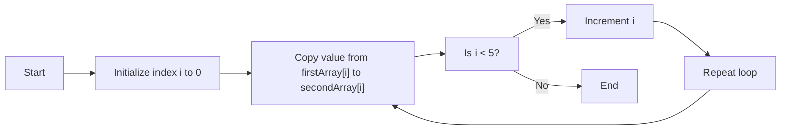

> ***Note:** It's important to note that we cannot assign one array directly to another array, even if the two arrays have the same type and size.* 

#

**Common Operations on Arrays.**

There are a number of operations that can be preformed on arrays. These operations include:

- **Traversal:** Iterating through all elements of the array to perform an operation on each.
- **Search:** Looking for a particular value within the array.
- **Insertion:** Adding a new element into the array.
- **Deletion:** Removing an element from the array.
- **Sorting:** Arranging the elements of the array in a specific order.
- **Merging:** Combining two or more arrays into a single array.
- **Copying:** Creating a copy of an array with the same or different size.  

> [!NOTE]
> For more reference, check ["Operations on array in C"](https://www.studymite.com/blog/operation-on-arrays-in-c-1).

**Two-Dimensional Arrays**

Up until now, our discussions have focused on **one-dimensional arrays**. These arrays are organized *linearly* in a *single direction*. However, in certain situations, we encounter the need to store data in a more structured manner, resembling grids or tables.

This is where the concept of one-dimensional arrays extends into **two-dimensional data structures**. A two-dimensional array is defined using two *subscripts*: the first subscript indicates the **row**, and the second denotes the **column**. In the world of programming, a two-dimensional array is essentially treated as an array of one-dimensional arrays.


| &nbsp;&nbsp;&nbsp;&nbsp;&nbsp;&nbsp;&nbsp;&nbsp;&nbsp;&nbsp;&nbsp;&nbsp;&nbsp;&nbsp;&nbsp;&nbsp;&nbsp;&nbsp;&nbsp;&nbsp;&nbsp; | &nbsp;&nbsp;&nbsp;&nbsp;&nbsp;&nbsp;&nbsp;&nbsp;&nbsp;&nbsp;&nbsp;&nbsp;&nbsp;&nbsp;&nbsp;&nbsp;&nbsp;&nbsp;&nbsp;&nbsp;&nbsp; | &nbsp;&nbsp;&nbsp;&nbsp;&nbsp;&nbsp;&nbsp;&nbsp;&nbsp;&nbsp;&nbsp;&nbsp;&nbsp;&nbsp;&nbsp;&nbsp;&nbsp;&nbsp;&nbsp;&nbsp;&nbsp; | &nbsp;&nbsp;&nbsp;&nbsp;&nbsp;&nbsp;&nbsp;&nbsp;&nbsp;&nbsp;&nbsp;&nbsp;&nbsp;&nbsp;&nbsp;&nbsp;&nbsp;&nbsp;&nbsp;&nbsp;&nbsp; |
|:-----------:|:-----------:|:-------------:|:-------------:|
| &nbsp;&nbsp;&nbsp;&nbsp;&nbsp;&nbsp;&nbsp;&nbsp;&nbsp;&nbsp;&nbsp;&nbsp;&nbsp;&nbsp;&nbsp;&nbsp;&nbsp;&nbsp;&nbsp;&nbsp;&nbsp; | &nbsp;&nbsp;&nbsp;&nbsp;&nbsp;&nbsp;&nbsp;&nbsp;&nbsp;&nbsp;&nbsp;&nbsp;&nbsp;&nbsp;&nbsp;&nbsp;&nbsp;&nbsp;&nbsp;&nbsp;&nbsp; |  &nbsp;&nbsp;&nbsp;&nbsp;&nbsp;&nbsp;&nbsp;&nbsp;&nbsp;&nbsp;&nbsp;&nbsp;&nbsp;&nbsp;&nbsp;&nbsp;&nbsp;&nbsp;&nbsp;&nbsp;&nbsp; | &nbsp;&nbsp;&nbsp;&nbsp;&nbsp;&nbsp;&nbsp;&nbsp;&nbsp;&nbsp;&nbsp;&nbsp;&nbsp;&nbsp;&nbsp;&nbsp;&nbsp;&nbsp;&nbsp;&nbsp;&nbsp; |
| &nbsp;&nbsp;&nbsp;&nbsp;&nbsp;&nbsp;&nbsp;&nbsp;&nbsp;&nbsp;&nbsp;&nbsp;&nbsp;&nbsp;&nbsp;&nbsp;&nbsp;&nbsp;&nbsp;&nbsp;&nbsp; | &nbsp;&nbsp;&nbsp;&nbsp;&nbsp;&nbsp;&nbsp;&nbsp;&nbsp;&nbsp;&nbsp;&nbsp;&nbsp;&nbsp;&nbsp;&nbsp;&nbsp;&nbsp;&nbsp;&nbsp;&nbsp; |  &nbsp;&nbsp;&nbsp;&nbsp;&nbsp;&nbsp;&nbsp;&nbsp;&nbsp;&nbsp;&nbsp;&nbsp;&nbsp;&nbsp;&nbsp;&nbsp;&nbsp;&nbsp;&nbsp;&nbsp;&nbsp; | &nbsp;&nbsp;&nbsp;&nbsp;&nbsp;&nbsp;&nbsp;&nbsp;&nbsp;&nbsp;&nbsp;&nbsp;&nbsp;&nbsp;&nbsp;&nbsp;&nbsp;&nbsp;&nbsp;&nbsp;&nbsp; |

**Declaring Two-dimensional Arrays**

Any array must be declared before being used. The declaration statement tells the compiler the name of the array, the data type of each element in the array, and the size of each dimension. 

**A two-dimensional array is declared as:**

```sql
datatype array_name[row_size][column_size];
```

For example, if we want to store the marks obtained by three students in five different subjects, we can declare a two-dimensional array as:

```c
int marks[3][4];
```

In the above statement, a two-dimensional array called marks has been declared that has 3 rows and 4 columns. The first element of the array is denoted by **marks[0][0]**, the second element as **marks[0][1]**, and so on. Here, **marks[0][0]** stores the marks obtained by the first student in the first subject, **marks[1][0]** stores the marks obtained by the second student in the first subject.

This two-dimensional array can store a grid of data, making it suitable for situations where you need to organize information in rows and columns.

| | Collumn 0 | Collumn 1 | Collumn 2 |
| :--: | :--: | :--: | :--: | 
| Row 0 | [0][0] | [0][1] | [0][2] |
| Row 1 | [1][0] | [1][1] | [1][2] |
| Row 2 | [2][0] | [2][1] | [2][2] |

Although we have shown a ***two-dimensional array***, in the memory, these elements actually will be stored **sequentially**. There are two ways of storing a two-dimensional array in the memory. The first way is the **row major order** and the second is the **column major order**. Let us see how the elements of a 2D array are stored in a row major order. 

Here, the elements of the first row are stored before the elements of the second and third rows. That is, the elements of the array are stored row by row where n elements of the first row will occupy the first n locations.

<table>
  <tr>
      <td>(0,0)</td>
      <td>(0,1)</td>
      <td>(0,2)</td>
      <td>(0,3)</td>
      <td>(1,0)</td>
      <td>(1,1)</td>
      <td>(1,2)</td>
      <td>(1,3)</td>
      <td>(2,0)</td>
      <td>(2,1)</td>
      <td>(2,2)</td>
      <td>(2,3)</td>
  </tr>
</table>

> ***Note:** Elements of a 3 x 4 2D array in row major order*

However, when we store the elements in a column major order, the elements of the first column are stored before the elements of the second and third column. That is, the elements of the array are stored column by column where m elements of the first column will occupy the first m locations. 
   
<table>
  <tr>
      <td>(0,0)</td>
      <td>(1,0)</td>
      <td>(2,0)</td>
      <td>(3,0)</td>
      <td>(0,1)</td>
      <td>(1,1)</td>
      <td>(2,1)</td>
      <td>(3,1)</td>
      <td>(0,2)</td>
      <td>(1,2)</td>
      <td>(2,2)</td>
      <td>(3,2)</td>
  </tr>
</table>

> ***Note:** Elements of a 4 x 3 2D array in column major order*

**Initializing Two-dimensional Arrays**

Like in the case of other variables, declaring a two-dimensional array only reserves space for the array in the memory. No values are stored in it. A two-dimensional array is initialized in the same way as a one-dimensional array is initialized. For example:

```c
int marks[2][3] = { {90,87,78}, {68, 62, 71} };
```

In the above example, each row is defined as a one-dimensional array of three elements that are enclosed in braces. Note that the commas are used to separate the elements in the row as well as to separate the elements of two rows.

**Operations On Two-Dimensional Arrays**

Two-dimensional arrays can be used to implement the mathematical concept of matrices. In mathematics, a matrix is a grid of numbers organized into rows and columns. Using two-dimensional arrays, we can perform the following operations on an $m \times n$ matrix:

**Transpose:** The transpose of an $m \times n$ $matrix A$ is a new $matrix B$ with dimensions $n \times m$, where each element $B_{(i \times j)}$ of $B$ is equal to the element $A_{(j \times i)}$ of $A$.

$$B_{(i \times j)} = A_{(j \times i)}$$

**Sum:** Two matrices that are compatible with each other can be added together, storing the result in the third matrix. Two matrices are said to be compatible when they have the same number of rows and columns. The elements of two matrices can be added by writing:
$$C_{(j \times i)} = A_{(j \times i)} + B_{(i \times j)}$$

**Difference:** Two matrices that are compatible with each other can be subtracted, storing the result in the third matrix. Two matrices are said to be compatible when they have the same number of rows and columns. The elements of two matrices can be subtracted by writing:
$$C_{(j \times i)} = A_{(j \times i)}- B_{(i \times j)}$$

**Product:** Two matrices can be multiplied with each other if the number of columns in the first matrix is equal to the number of rows in the second matrix. Therefore, $matrix A_{m \times n}$ can be multiplied with a $matrix B_{p \times q}$ if $n = p$. The dimension of the product matrix is a $matrix C_{m \times q}$ The elements of two matrices can be multiplied by writing:
$$C_{(j \times i)}= Σ(A_{(j \times i)} * B_{(i \times j)}) \\: for \\: k = 1 \\: to \\: n$$


## Multi-Dimensional Arrays

A multi-dimensional array in simple terms is an array of arrays. As we have one index in a onedimensional array, two indices in a two-dimensional array, in the same way, we have $n$ indices in an n-dimensional array or multi-dimensional array. 

Conversely, an n–dimensional array is specified using $n$ indices. An n-dimensional $m_1 \times m_2 \times m_3 \times \cdots \times m_n$ array is a collection of $m_1 \times m_2 \times m_3 \times \cdots \times m_n$ elements. In a multi-dimensional array, a particular element is specified by using n subscripts as $A[I_1][I_2][I_3]...[I_n]$, where:

$$I_1 <= M_1 \\: , \\: I_2 <= M_2 \\: , \\: I_3 <= M_3 \\: , \\:  ... \\: I_n <= M_n$$

A multi-dimensional array can contain as many indices as needed and as the requirement of memory increases with the number of indices used. However, in practice, we hardly use more than three indices in any program. 

> ***Note:** A multi-dimensional array is declared and initialized the same way we declare and initialize one- and two-dimensional arrays.*

For instance, consider a three-dimensional array defined as int $A[2][2][2]$. Calculate the number of elements in the array. Also, show the memory representation of the array in the row major order and the column major order.

A three-dimensional array consists of pages. Each page, in turn, contains m rows and n columns

**Row Major Order**
<table>
  <tr>
    <td>(0,0,0)</td>
    <td>(0,0,1)</td>
    <td>(0,1,0)</td>
    <td>(0,1,1)</td>
    <td>(1,0,0)</td>
    <td>(1,0,1)</td>
    <td>(1,1,0)</td>
    <td>(1,1,1)</td>
  </tr>
</table>

**Column Major Order**

<table>
  <tr>
    <td>(0,0,0)</td>
    <td>(0,1,0)</td>
    <td>(0,0,1)</td>
    <td>(0,1,1)</td>
    <td>(1,0,0)</td>
    <td>(1,1,0)</td>
    <td>(1,0,1)</td>
    <td>(1,1,1)</td>
  </tr>
</table>

The three-dimensional array will contain $2 \times 2 \times 2 = 8$ elements.

## Sparse Matrices

Sparse matrix is a matrix that has large number of elements with a zero value. In order to efficiently utilize the memory, specialized algorithms and data structures that take advantage of the sparse structure should be used. If we apply the operations using standard matrix structures and algorithms to sparse matrices, then the execution will slow down and the matrix will consume large amount of memory. Sparse data can be easily compressed, which in turn can significantly reduce memory usage.

**There are two principal types of sparse matrices:**

In a lower-triangular matrix, $A_{(i \times j)} = 0$ where $i < j$. $A_n n \times n$ lower-triangular matrix A has **one non-zero** element in the first row, two non-zero elements in the second row and likewise n non-zero elements in the nth row. 

<table>
  <tr>
      <td>5</td> <!-- Non-zero element -->
      <td>0</td> <!-- Zero element -->
      <td>0</td> <!-- Zero element -->
  </tr>
  <tr>
      <td>3</td> <!-- Non-zero element -->
      <td>7</td> <!-- Non-zero element -->
      <td>0</td> <!-- Zero element -->
  </tr>
  <tr>
      <td>1</td> <!-- Non-zero element -->
      <td>4</td> <!-- Non-zero element -->
      <td>9</td> <!-- Non-zero element -->
  </tr>
</table>

In an upper-triangular matrix, $A_{(i \times j)} = 0$ where $i > j$. $A_n n \times n$ upper-triangular matrix A has **n non-zero** elements in the first row, n–1 non-zero elements in the second row and likewise one non-zero element in the nth row.

<table>
  <tr>
      <td>5</td> <!-- Non-zero element -->
      <td>3</td> <!-- Non-zero element -->
      <td>1</td> <!-- Non-zero element -->
  </tr>
  <tr>
      <td>0</td> <!-- Zero element -->
      <td>7</td> <!-- Non-zero element -->
      <td>4</td> <!-- Non-zero element -->
  </tr>
  <tr>
      <td>0</td> <!-- Zero element -->
      <td>0</td> <!-- Zero element -->
      <td>9</td> <!-- Non-zero element -->
  </tr>
</table>


## Structures

A structure is quite similar to a record, as it helps organize and store related information about an entity. Think of a structure as a custom data type that allows you to group various pieces of information, even if they have different data types, into one package. Unlike an array, which can only handle data of the same type, a structure gives you the flexibility to combine variables of different data types. 

In simpler terms, it's like having a container for multiple variables, each with its own data type and a unique name for easy access within the structure.

**Declaration of Structures.**

A structure is declared using the keyword ***struct*** followed by the structure name. All the variables of the structure are declared within the structure. A structure type is generally declared by using
the following syntax:

```c
struct struct-name
{
  dataype variable-name
  (...)
}
```

For instance, in scenarios involving **2D graphics** or **geometry**, you often need to manage points with both horizontal **(x)** and vertical **(y)** coordinates. To streamline this process, you can create a C structure called Point. This structure combines the x and y coordinates into a single data type, simplifying the handling of 2D spatial data in your program.

```c
struct Point
{
    double x;
    double y;
};
```

Now the structure has become a ***user-defined data type***. Each variable name declared within a structure is called a **member** of the structure. The structure declaration, however, does not allocate any memory or consume storage space. It just gives a template that conveys to the C compiler how the structure would be laid out in the memory and also gives the details of member names. 

Like any other data type, memory is allocated for the structure when we declare a variable of the structure.

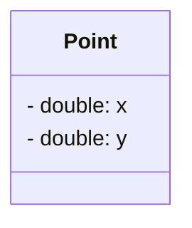

> ***Note:** Template of the Point Struct*

For example, we can define a variable of Point by writing:

```c
struct Point p

// Here, struct Point is a data type and p is a variable.
```

> ***Note:** Structure type and variable declaration of a structure can be either local or global depending on their placement in the code*

Last but not the least, structure member names and names of the structure follow the same rules as laid down for the names of ordinary variables. However, care should be taken to ensure that the name of structure and the name of a structure member should not be the same. 

**Typedef Declarations**

The **typedef** (derived from type definition) keyword enables the programmer to create a new data type name by using an existing data type. By using typedef, no new data is created, rather an alternate name is given to a known data type. The general syntax of using the typedef keyword is given as: 

```c
typedef existing_data_type new_data_type;
```

Note that typedef statement does not occupy any memory; it simply defines a new type. When we precede a struct name with the typedef keyword, then the struct becomes a new type. It is used to make the construct shorter with more meaningful names for types already defined by C or for types that you have declared. For example, consider the following declaration:

```c
typedef struct Point
{
  double x;
  double y;
}
```

Now that you have preceded the structure’s name with the typedef keyword, student becomes a new data type. Therefore, now you can straightaway declare the variables of this new data type
as you declare the variables of type int, float, char, double, etc. To declare a variable of structure Point, you may write:

```c
Point p;
```

#

**Initializing and Accessing Structures Members.**

A structure can be initialized in the same way as other data types are initialized. Initializing a structure means assigning some constants to the members of the structure. The initializers are enclosed in braces and are separated by commas. However, care must be taken to ensure that the initializers match their corresponding types in the structure definition.

The general syntax to initialize a structure variable is as follows:

```c
struct Point
{
  double x;
  double y;
}p = {1.0, 2.5}, q = {3.7};
```

```c
struct Point
{
  double x;
  double y;
};

struct Point p = {1.0, 2.5};
struct Point q = {3.7};
```

This is a illustration of how the values will be assigned to individual fields of the structure:

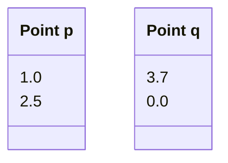

When all the members of a structure are not initialized, it is called partial initialization. In case of partial initialization, first few members of the structure are initialized and those that are
uninitialized are assigned default values.

#

Each member of a structure can be used just like a normal variable, but its name will be a bit longer. A structure member variable is generally accessed using a '.' (dot) operator. The syntax
of accessing a structure or a member of a structure can be given as:

```julia
struct_var.member_name
```

The dot operator is used to select a particular member of the structure. For example, to assign values to the individual data members of the structure variable **p**:

```julia
p.x = 4.5;
p.y = 1.9;
```

To input values for data members of the structure variable **p**:

```c
scanf("%lf", &(p.x));
```

Similarly, to print the values of structure variable **p**:

```c
printf("%lf\n", p.x);
```

Memory is allocated only when we declare the variables of the structure. In other words, the memory is allocated only when we instantiate the structure. In the absence of any variable, structure
definition is just a template that will be used to reserve memory when a variable of type struct is declared.

Once the variables of a structure are defined, we can perform a few operations on them. For example, we can use the assignment operator (=) to assign the values of one variable to another.

**Self-Referenced Structures**

Self-referential structures are those structures that contain a reference to the data of its same type. That is, a self-referential structure, in addition to other data, contains a pointer to a data that is
of the same type as that of the structure. For example, consider the structure node given below.

```c
struct node
{
  int val;
  struct node *next;
};
```

Here, the structure node will contain two types of data: an integer val and a pointer next. You must be wondering why we need such a structure. Actually, self-referential structure is the foundation
of other data structures. We will be using them throughout this guide and their purpose will be clearer to you when we discuss linked lists, trees, and graphs.


## Pointers

Every variable in C has a name and a value associated with it. When a variable is declared, a specific block of memory within the computer is allocated to hold the value of that variable. The size of the allocated block depends on the data type.

Consider the following statement.

```c
int x;
```

When this statement executes, the compiler sets aside **2 bytes of memory** to hold the value 10. It also sets up a symbol tabl in which it adds the symbol **x** and the **relative address in the memory** where those 2 bytes were set aside. Thus, every variable in C has a value and also a **memory location (commonly known as address) associated with it**.

Actually, **pointers are nothing but memory addresses**. A pointer is a variable that contains the memory location of another variable. Therefore, a pointer is a variable that represents the **location of a data item**, such as a variable or an array element. Pointers are frequently used in C*, as they have a number of *useful applications. These applications include:

- Pointers are used to pass information back and forth between functions.
- Pointers enable programmers to return multiple data items from a function via function arguments.
- Pointers provide an alternate way to access the individual elements of an array.
- Pointers are used to pass arrays and strings as function arguments (discussed in subsequent chapters).
- Pointers are used to create complex data structures, such as trees, linked lists, linked stacks, linked queues, and graphs.
- Pointers are used for the dynamic memory allocation of a variable (refer to Appendix A for memory allocation in C programs).

**Declaring Pointer Variables**

The general syntax of declaring pointer variables can be given as below.

```c
dataype *ptr_name;
```

Here, ***data_type*** is the data type of the value that the pointer will point to. For example,

```c
int *ptr;
```

In each of the above statements, a pointer variable is declared to point to a variable of the specified data type. It's worth noting that all pointers, even if they point to different data types, will occupy the same amount of space in memory. However, the exact amount of space they occupy depends on the platform where the code is executed

```c
int x, *ptr;

x = 10;
ptr = &x;
```

In the above statement, **ptr** is the name of the pointer variable. The **\*** informs the compiler that **ptr** is a pointer variable and the int specifies that it will store the address of an integer variable.

An integer pointer variable, therefore, *points to* an integer variable. In the last statement, **ptr** is assigned the address of **x**. The **&** operator retrieves the ddress of **x**, and copies that to the contents of the pointer **ptr**.

We can 'dereference' a pointer, meaning we can access the value of the variable it points to by using the unary * operator, as in *ptr. For example, *ptr = 10 assigns the value 10 to the variable pointed to by ptr, which in this case is equivalent to setting the value of x to 10.

```c
#include <stdio.h>

int main()
{
  int num, *pnum;
  pnum = &num;

  printf("\n Enter the number : ");
  scanf("%d", &num);
  printf("\n The number that was entered is : %d", *pnum);
  return 0;
}
```

**Output**

```julia
Enter the number : 10
The number that was entered is : 10
```

#

**Null Pointers**

In some cases, we may prefer to have a null pointer which is a special pointer value and does not point to any value. This means that a null pointer does not point to any valid memory address.

To declare a **null pointer**, you may use the predefined constant **NULL** which is defined in several standard header files including **<stdio.h>**, **<stdlib.h>**, and **<string.h>**. After including any of these files in your program, you can write

```c
int *ptr = NULL;
```

You can always check whether a given pointer variable stores the address of some variable or contains **NULL** by writing,

```c
if (ptr == NULL)
{
  statement block;
}
```

**Pointer to Pointers**

The pointers in turn point to data or even to other pointers. To declare pointers to pointers, just add an asterisk * for each level of reference

**For example, consider the following code:**

```c
int x;
int *px, **ppx;

int x = 10;
px = &x;
ppx = &px;
```

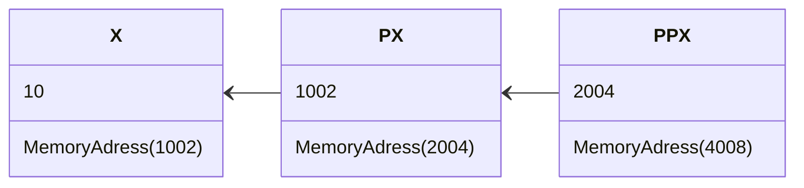

## Recursion

A *Recursive Function* is defined as a function that calls itself to solve a **smaller version of its task until a final call is made** which does not require a call to itself. Since a recursive function
repeatedly calls itself, it makes use of the system stack to temporarily store the return address and local variables of the calling function. Every recursive solution has two major cases:

- ***Base case***, in which the problem is simple enough to be solved directly without making any further calls to the same function.
- ***Recursive case***, in which first the problem at hand is divided into simpler sub-parts. Second the function calls itself but with sub-parts of the problem obtained in the first step. Third, the
result is obtained by combining the solutions of simpler sub-parts.

Therefore, recursion is defining large and complex problems in terms of smaller and more easily solvable problems. In recursive functions, a complex problem is defined in terms of simpler problems and the simplest problem is given explicitly. 

Let us take an example of calculating factorial of a number. To calculate $n!$, we multiply the number with factorial of the number that is 1 less than that number. 

$$n! = n \\ \times \\ (n–1)!$$

Let us say we need to find the value of $5!$

$$5! = 5 \\ \times \\ 4 \\ \times \\ 3 \\ \times \\ 2 \\ \times \\ 1 = 120$$

Similarly, we can further expand and rephrase the sentence from above as follows:
	
|  **Problem**							|  **Solution** |
| :---								| :---	|
|  $5!$								| $5 \\ \times \\ 4 \\ \times \\ 3 \\ \times \\ 2 \\ \times \\ 1$ |
|  $5 \\ \times \\ 4!$						| $5 \\ \times \\ 4 \\ \times \\ 3 \\ \times \\ 2 \\ \times \\ 1$ |	
|  $5 \\ \times \\ 4 \\ \times 3!$				| $5 \\ \times \\ 4 \\ \times \\ 3 \\ \times \\ 2 \\ \times \\ 1$ |			
|  $5 \\ \times \\ 4 \\ \times \\ 3 \\ \times 2!$		| $5 \\ \times \\ 4 \\ \times \\ 3 \\ \times \\ 2 \\ \times \\ 1$ |		
|  $5 \\ \times \\ 4 \\ \times \\ 3 \\ \times 2 \\ \times 1! $	| $5 \\ \times \\ 4 \\ \times \\ 3 \\ \times \\ 2 \\ \times \\ 1$ |

> ***Note:** The factorial of 0 and 1 is defined to be 1.*

Now if you look at the problem carefully, you can see that we can write a recursive function to calculate the factorial of a number. Every recursive function must have a base case and a recursive case. For the factorial function:

- ***Base case*** is when $n = 1$, because if $n = 1$, the result will be $1$ as $1! = 1$.
- ***Recursive case*** of the factorial function will call itself but with a smaller value of n, this case can be given as:

$$factorial(n) = n \\ \times \\ factorial (n–1)$$

#

 **Recursive Factorial**

Factorial is a mathematical operation that calculates the product of all positive integers up to a given number. It is denoted by the symbol "!" and is often used in permutations, combinations, and other mathematical computations. 

The combination of factorials and recursion provides an elegant and efficient way to calculate factorials, breaking down the problem into simpler sub-problems until reaching the base case. 

Here's a brief example in C demonstrating the calculation of factorial using recursion:

 ```c
#include <stdio.h>

// Recursive function to calculate factorial
int factorial(int n)
{
	if (n == 0 || n == 1)
		return 1;
	else
		return n * factorial(n - 1);
}

int main(void)
{
	int number;
	
	// Ask the user for a positive integer
	printf("Enter a positive integer: ");
	scanf("%d", &number);
	
	// Check if the number is non-negative
	if (number < 0)
		printf("Please enter a non-negative number.\n");
	else 
		// Call the factorial function and display the result
		printf("The factorial of %d is %d\n", number, factorial(number));
	return 0;
}
```

From the above example, let us analyse the steps of a recursive program

- Specify the base case which will stop the function from making a call to itself.
- Check to see whether the current value being processed matches with the value of the base case. If yes, process and return the value.
- Divide the problem into smaller or simpler sub-problems. 
- Call the function from each sub-problem. 
- Combine the results of the sub-problems.
- Return the result of the entire problem.

In summary, the program employs a recursive approach to compute the factorial of the user-provided number and then displays the result.

#

**Fibonacci Series**

The *Fibonacci Series* is a sequence of numbers where each number is the sum of the two preceding ones, usually starting with 0 and 1. This sequence was introduced to the Western world by the Italian mathematician **Leonardo Fibonacci** in his 1202 book *Liber Abaci* but the sequence had been previously described in Indian mathematics.

The Fibonacci sequence begins with 0 and 1, and each subsequent number in the sequence is the sum of the two preceding ones. Mathematically, it can be defined by the recurrence relation:

$$F(n)= F(n−1) + F(n−2)$$

Where $F(0) = 0$ and $F(1) = 1$. The Fibonacci sequence is **infinite**, and it goes: $0, 1, 1, 2, 3, 5, 8, 13, 21, 34$, and so on.

In computer science, the Fibonacci sequence is often used as an illustrative example for recursion and dynamic programming, as the computation of Fibonacci numbers can be efficiently optimized using these techniques. 

In summary, the Fibonacci sequence is defined by the formula  $F(n) = F(n−1 )+ F(n−2)$ with two base cases, reflecting the division of every problem into two smaller problems.

$$
\ F(n) =
  \begin{cases}
    0								  & \quad \text{if } n = 0\\
    1        				  & \quad \text{if } n = 1\\
	  F(n-1) + F(n-2)   & \quad \text{otherwise }\\
  \end{cases}
\
$$

The following C code demonstrates how to calculate the Fibonacci series using a recursive approach.

```c
#include <stdio.h>

// Recursive function to calculate Fibonacci number at a given position
int fibonacci(int n)
{
  if (n <= 1)
    return n;
  else
    return fibonacci(n - 1) + fibonacci(n - 2);
}

int main(void)
{
  int terms;
	
  // User input for the number of terms in the Fibonacci series
  printf("Enter the number of terms in the Fibonacci series: ");
  scanf("%d", &terms);

  // Check if the input is non-negative
  if (terms < 0)
    printf("Please enter a non-negative integer.\n");
  else
  {
  // Display the Fibonacci series using recursion
  printf("Fibonacci series up to term %d:\n", terms);
  for (int i = 0; i < terms; ++i) {
    printf("%d, ", fibonacci(i));
  }
  printf("\n");
 }
 return 0;
}
```
#

### Types of Recursion

Recursion is a technique that breaks a problem into one or more sub-problems that are similar to the original problem. Any recursive function can be characterized based on:

- Whether the function calls itself directly or indirectly (*direct* or *indirect recursion*)
- Whether any operation is pending at each recursive call (*tailrecursive* or *not*)
- The structure of the calling pattern (*linear* or *tree-recursive*).

**Direct Recursion**

A function is said to be *directly* recursive if it explicitly calls itself. 

```c
int function(int n)
{
  if (n == 0)
    return n;
  else
    return (function(n–1));
}
```

**Indirect Recursion**

A function is said to be *indirectly* recursive if it contains a call to another function which ultimately calls it.

```c
int functionA(int n)
{
  if (n == 0)
    return n;
  else
    return functionB(n);
}

int functionB(int x)
{
  return functionA(x–1);
} 
```

**Tail Recursion**

A recursive function is said to be *tail* recursive if no operations are pending to be performed when the recursive function returns to its caller. when the called function returns, the returned value
is immediately returned from the calling function. 

Tail recursive functions are highly desirable because they are much more efficient to use as the amount of information that has to be stored on the system stack is independent of the number of recursive calls.

```c
int factorialA(n)
{
  return factorialB(n, 1);
}

int factorialB(int n, int res)
{
  if (n == 1)
    return res;
  else
    return factorialB(n–1, n*res);
}
```

Whenever there is a pending operation to be performed, the function becomes non-tail recursive. In such a non-tail recursive function, information about each pending operation must be stored, so the
amount of information directly depends on the number of calls. As shown in this example:

```c
int factorial(int n)
{
  if (n == 1)
    return 1;
  else
  return (n * factorial(n–1));
} 
```

In the code, $factorialB$  function preserves the syntax of $factorialA(n)$. Here the recursion occurs in the $factorialB$ function and not in $factorialA(n)$ function.

Carefully observe that $factorialB$ has no pending operation to be performed on return from recursive calls. The value computed by the recursive call is simply returned without any modification. So in this case, the amount of information to be stored on the system stack is constant (only the values of $n$ and res need to be stored) and is independent of the number of recursive calls. 

#

**Recursion versus Iteration**

Recursion is more of a top-down approach to problem solving in which the original problem is divided into smaller sub-problems. On the contrary, iteration follows a bottom-up approach that
begins with what is known and then constructing the solution step by step. 

Recursion is an excellent way of solving complex problems especially when the problem can be defined in recursive terms. For such problems, a recursive code can be written and modified in a much simpler and clearer manner. 

However, recursive solutions are not always the best solutions. In some cases, recursive programs may require substantial amount of run-time overhead. Therefore, when implementing a recursive solution, there is a trade-off involved between the time spent in constructing and maintaining the program and the cost incurred in running-time and memory space required for the execution of the program. 

Whenever a recursive function is called, some amount of overhead in the form of a run time stack is always involved. Before jumping to the function with a smaller parameter, the original parameters, the local variables, and the return address of the calling function are all stored on the system stack. Therefore, while using recursion a lot of time is needed to first push all the information on the stack when the function is called and then again in retrieving the information stored on the stack once the control passes back to the calling function.

To conclude, one must use recursion only to find solution to a problem for which no obvious iterative solution is known. To summarize the concept of recursion, let us briefly discuss the pros
and cons of recursion.

The advantages of using a recursive program include the following:

- Recursive solutions often tend to be shorter and simpler than non-recursive ones.
- Code is clearer and easier to use.
- Recursion works similar to the original formula to solve a problem.
- Recursion follows a divide and conquer technique to solve problems.
- In some (limited) instances, recursion may be more efficient.

The drawbacks/disadvantages of using a recursive program include the following:

- For some programmers and readers, recursion is a difficult concept.
- Recursion is implemented using system stack. If the stack space on the system is limited, recursion to a deeper level will be difficult to implement.
- Aborting a recursive program in midstream can be a very slow process.
- Using a recursive function takes more memory and time to execute as compared to its nonrecursive counterpart.
- It is difficult to find bugs, particularly while using global variables.

The advantages of recursion pay off for the extra overhead involved in terms of time and space required. 

#

**Before we move on to the next topic in this document, it's important to communicate a relevant decision regarding the purpose of this guide.**

**In the upcoming sections, we will delve into the main Abstract Data Types (ADTs), highlighted throughout the guide as essential for its construction. As emphasized in the description, this guide serves as an introductory foundation.**

**The following topics will be covered succinctly. For a deeper understanding of the mentioned data structures, I recommend referring to the reference works cited in this document. Thank you for your understanding.**

## Linked Lists 

We have studied that an array is a linear collection of data elements in which the elements are stored in consecutive memory locations. While declaring arrays, we have to specify the size of the array, which will restrict the number of elements that the array can store. For example, if we declare an array as int $marks[10]$, then the array can store a maximum of $10$ data elements but not more than that. 

But what if we are not sure of the number of elements in advance? Moreover, to make efficient use of memory, the elements must be stored randomly at any location rather than in consecutive locations. So, there must be a data structure that removes the restrictions on the maximum number of elements and the storage condition to write efficient programs.

Linked list is a data structure that is free from the aforementioned restrictions. A *linked list* does not store its elements in consecutive memory locations and the user can add any number of elements to it. However, unlike an array, a linked list does not allow random access of data. Elements in a linked list can be accessed only in a sequential manner. But like an array, insertions and deletions can be done at any point in the list in a constant time.

**Basic Terminologies**

A linked list is a linear collection of data elements known as *nodes*. Functioning as a fundamental data structure, it serves as a foundational component for implementing various data structures like stacks, queues, and their derivatives. Conceptually, a linked list resembles a sequence of nodes, akin to a train, where each node comprises data fields and a pointer to the subsequent node.

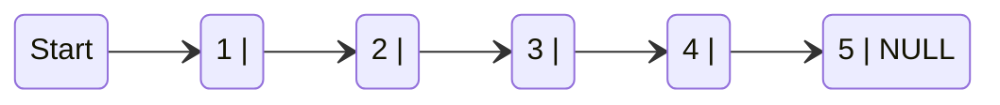

We can see a linked list in which every node contains two parts, an integer and a pointer to the next node. The left part of the node which contains data may include a simple data type, an array, or a structure. The right part of the node contains a pointer to the next node (or address of the next node in sequence). The last node will have no next node connected to it, so it will store a special value called $NULL$. 

While programming, we usually define $NULL$ as $–1$. Hence, a $NULL$ pointer denotes the end of the list. Since in a linked list, every node contains a pointer to another node which is of the same type, it is also called a *self-referential data type*.

Linked lists contain a pointer variable $START$ that stores the address of the first node in the list. We can traverse the entire list using START which contains the address of the first node; the next
part of the first node in turn stores the address of its succeeding node. Using this technique, the individual nodes of the list will form a chain of nodes. If $START = NULL$, then the linked list is empty
and contains no nodes.

In C, we can implement a linked list using the following code:

```c
struct node
{
  int data;
  struct node *next;
};
```

> ***Note:** Linked lists provide an efficient way of storing related data and perform basic operations such as
insertion, deletion, and updation of information at the cost of extra space required for storing address of the
next node.*

In order to form a linked list, we need a structure called *node* which has two fields, **DATA** and **NEXT**. **DATA** will store the information part and **NEXT** will store the address of the next node in sequence.

In the table, we can see that the variable START is used to store the address of the first node. Here, in this example, START = 1, so the first data is stored at address 1, which is H. The
corresponding **NEXT** stores the address of the next node, which is 4. So, we will look at address 4 to fetch the next data item.

The second data element obtained from address 4 is E. Again, we see the corresponding **NEXT** to go to the next node. From the entry in the **NEXT**, we get the next address, that is 7, and
fetch L as the data. We repeat this procedure until we reach a position where the **NEXT** entry contains –1 or NULL, as this  would denote the end of the linked list. When we traverse **DATA** and **NEXT** in this manner, we finally see that the linked list in the above example stores characters that when put together form the word **HELLO**.


|		 	 |	**Data**	 	 |	**Next**	  |
|	:---	 	 	 | :--- | :---	|
|	1	 	 	 | 	H	 |	4		|
|	2	 	 	 | 		 |			|
|	3	 	 	 | 		 |			|
|	4	 	   | 	E	 |	7		|
|	5	 	 	 | 		 |			|
|	6    	 | 		 |			|
|	7	 	 	 | 	L	 |	8		|
|	8	 	 	 | 	L	 |	10		|
| 9		 	 | 		 |			|
|	10	 	 | 	O	 |	-1		|

> ***Note:** The Memory Adress 1 corresponds to the START, pointing to the first element of the linked list in the memory*

Note that this table shows a chunk of memory locations which range from 1 to 10. The shaded portion contains data for other applications. Remember that the nodes of a linked list need not be in consecutive memory locations. In our example, the nodes for the linked list are stored at addresses 1, 4, 7, 8, and 10.

#

**Linked Lists versus Arrays**

Arrays and linked lists, both linear data structures, exhibit key distinctions. Linked lists, in contrast to arrays, do not demand contiguous memory locations and lack random data access, relying on sequential access. Nevertheless, both structures share the efficiency of constant-time insertions and deletions.

A notable advantage of linked lists lies in their dynamic flexibility, enabling the addition of an arbitrary number of elements. In contrast, arrays, when declared with a fixed size, such as int $marks[20]$, are limited to storing a predefined maximum of $20$ data elements. Linked lists thus offer adaptability without the constraints associated with fixed-size arrays.

|   |   Roll No   |   Name   |   Aggregate   |   Next   |   Grade        |
|:-:|:-----------:|:--------:|:-------------:|:--------:|:--------------:|
| 1 |      S01     |    Ram   |       78      |     6    |  Distinction   |
| 2 |      S02     |  Shyam   |       64      |    14    | First division |
| 3 |      S03     |  Mohit   |       89      |    17    |  Outstanding   |
| 4 |      S04     |  Rohit   |       77      |     2    |  Distinction   |
| 5 |      S05     |  Varun   |       86      |     1    |  Outstanding   |
| 6 |      S06     |  Karan   |       65      |    12    | First division |
| 7 |      S07     |  Veena   |       54      |    –1    | Second division|
| 8 |      S08     |  Meera   |       67      |     4    | First division |
| 9 |      S09     |  Krish   |       45      |    13    | Third division |
|10 |      S10     |  Kusum   |       91      |    11    |  Outstanding   |
|11 |      S11     |  Silky   |       72      |     7    | First division |
|12 |      S12     | Monica   |       75      |     1    |  Distinction   |
|13 |      S13     | Ashish   |       63      |    19    | First division |
|14 |      S14     | Gaurav   |       61      |     -    | First division |

> ***Note:** Students’ Linked list*

Thus, linked lists provide an efficient way of storing related data and performing basic operations such as insertion, deletion, and updation of information at the cost of extra space required for storing the address of next nodes.

#

**Memory Allocation and De-allocation for a Linked List**

In the representation of a linked list in memory, adding a node involves locating free space, which is then utilized to store the relevant information. For instance, consider the linked list with student roll numbers, Biology marks, and a **NEXT** field storing the address of the next node. If a new student joins and takes the same test, their marks need to be recorded in the linked list. The empty spaces indicates free space, offering 4 available memory locations. When nodes are deleted, the operating system manages the transition of memory status from occupied to available. While the detailed mechanism is beyond the scope of this book, as a programmer, your responsibility is to handle code for insertions and deletions in the list. The computer autonomously maintains a list of free memory cells known as the free pool.

<table>

<tr>
  <td>
  
|   | Roll No | Marks | Next |
|---|---------|-------|------|
| 1 |   S01   |   78  |   2  |
| 2 |   S02   |   84  |   3  |
| 3 |   S03   |   45  |   5  |
| 4 |         |       |      |
| 5 |   S05   |   98  |   7  |
| 6 |         |       |      |
| 7 |   S07   |   55  |   8  |
| 8 |   S08   |   34  |  10  |
| 9 |         |   |      |
|10 |   S10   |   90|  11  |
|11 |   S11   |   87|  12  |
|12 |   S12   |   86|  13  |
|13 |   S13   |   67|  15  |
|14 |         |       |      |
|15 |   S15   |   56    |  -1  |

</td>
<td>

|   | Roll No | Marks | Next |
|---|---------|-------|------|
| 1 |   S01   |   78  |   2  |
| 2 |   S02   |   84  |   3  |
| 3 |   S03   |   45  |   5  |
| 4 |   S12   |   45  |  -1  |
| 5 |   S05   |   98  |   7  |
| 6 |         |       |      |
| 7 |   S07   |   55  |   8  |
| 8 |   S08   |   34  |  10  |
| 9 |         |       |      |
|10 |   S10   |   90  |  11  |
|11 |   S11   |   87  |  12  |
|12 |   S12   |   86  |  13  |
|13 |   S13   |   67  |  15  |
|14 |         |       |      |
|15 |   S15   |   56  |   4  |

</td></tr> 
</table>

> ***Note:** (left) Students’ linked list and (right) linked list after the insertion of new student’s record*

Deleting a node or an entire linked list involves releasing the occupied space back to the free pool for potential reuse by other programs. The operating system handles this task during idle CPU periods or when programs face memory shortages. It scans through memory cells, marking those in use and adding the unused ones to the free pool. This process, known as garbage collection, ensures efficient memory utilization. In the next section, we are going to explore one of the most common types of linked lists used as a basis for other structures.

# 

**SINGLY LINKED Lists**

A singly linked list is the simplest type of linked list in which every node contains some data and a pointer to the next node of the same data type. By saying that the node contains a pointer to the next node, we mean that the node stores the address of the next node in sequence. A singly linked list allows traversal of data only in one way. 


**Traversing a Linked List**

Traversing a linked list means accessing the nodes of the list in order to perform some processing on them. Remember a linked list always contains a pointer variable **START** which stores the address of the first node of the list. End of the list is marked by storing $NULL$ or $–1$ in the **NEXT** field of the last node. For traversing the linked list, we also make use of another pointer variable PTR which points to the node that is currently being accessed. The algorithm to traverse a linked list is shown below.

```r
STEP 1: [INITIALIZE] SET PTR = START
STEP 2: Repeat Steps 3 and 4 while PTR != NULL
STEP 3:        Apply Process to PTR DATA
STEP 4:        SET PTR = PTR NEXT
        [END OF LOOP]
STEP 5: EXIT
```

> ***Note:** Algorithm for traversing a linked list*

In this algorithm, we first initialize **PTR** with the address of **START**. So now, **PTR** points to the first node of the linked list. Then in STEP 2, a while loop is executed which is repeated till PTR processes the last node, that is until it encounters $NULL$. In STEP 3, we apply the process to the current node, that is, the node pointed by **PTR**. In STEP 4, we move to the next node by making the **PTR** variable point to the node whose address is stored in the NEXT field. 

Let us now write an algorithm to count the number of nodes in a linked list. To do this, we will traverse each and every node of the list and while traversing every individual node, we will increment the counter by 1. Once we reach $NULL$, that is, when all the nodes of the linked list have been traversed, the final value of the counter will be displayed.

```r
STEP 1: [INITIALIZE] SET COUNT = 0
STEP 2: [INITIALIZE] SET PTR = START
STEP 3: Repeat Steps 4 and 5 while PTR != NULL
STEP 4:        SET COUNT = COUNT + 1
STEP 5:        SET PTR = PTR->NEXT
        [END OF LOOP]
STEP 6: Write COUNT
STEP 7: EXIT
```

> ***Note:** Algorithm to print the number of nodes in a linked list*

**Searching for a Value in a Linked List**

Searching a linked list means to find a particular element in the linked list. As already discussed, a linked list consists of nodes which are divided into two parts, the information part and the next part. So searching means finding whether a given value is present in the information part of the node or not. If it is present, the algorithm returns the address of the node that contains the value

```r
STEP 1: [INITIALIZE] SET PTR = START
STEP 2: Repeat Step 3 while PTR != NULL
STEP 3:        IF VAL = PTR DATA
                  SET POS = PTR
                  Go To STEP 5
               ELSE
                  SET PTR = PTR NEXT
               [END OF IF]
        [END OF LOOP]
STEP 4: SET POS = NULL
STEP 5: EXIT
```

> ***Note:** Algorithm to search a linked list*

In STEP 1, we initialize the pointer variable **PTR** with **START** that contains the address of the first node. In STEP 2, a while loop is executed which will compare every node’s **DATA** with **VAL** for which the search is being made. If the search is successful, that is, **VAL** has been found, then the address of that node is stored in **POS** and the control jumps to the last statement of the algorithm. However, if the search is unsuccessful, **POS** is set to $NULL$ which indicates that **VAL** is not present in the linked list.

# 

**Inserting a New Node in a Linked List**

In this section, we will explore the addition of a new node to an existing linked list, focusing on a specific insertion case. While I will specifically demonstrate one instance of insertion, for a comprehensive understanding of various insertion scenarios, I encourage you to refer to additional sources provided in the guide.

While we will focus on demonstrating one specific case, there are four methods for adding a new node to an existing linked list, wich are:

- **CASE 1:** The new node is inserted at the beginning.
- **CASE 2:** The new node is inserted at the end.
- **CASE 3:** The new node is inserted after a given node.
- **CASE 4:** The new node is inserted before a given node.

Before we describe the algorithms to perform insertions in the first case, let us first discuss an important term called $OVERFLOW$. Overflow is a condition that occurs when **AVAIL** = **NULL** or no
*free memory cell* is present in the system. When this condition occurs, the program must give an appropriate message.

**Inserting a Node at the Beginning of a Linked List**

Suppose we want to add a new node with data 9 and add it as the first node of the list. Then the following changes will be done in the linked list.


Allocate memory for the new node and initialize its DATA part to 9.

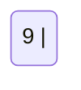

Add the new node as the first node of the list by making the NEXT part of the new node contain the address of **START**.

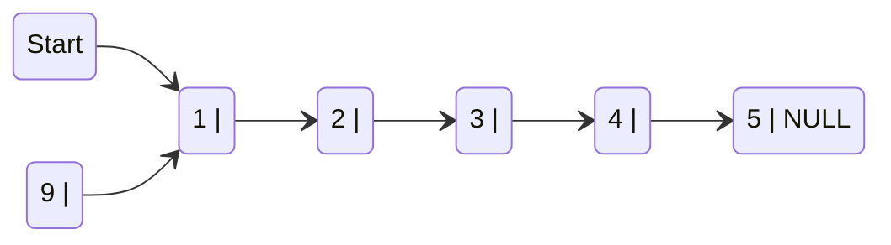

Now make START to point to the first node of the list.


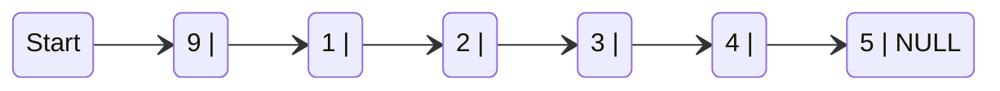

The code illustrates the algorithm for inserting a new node at the beginning of a linked list. In STEP 1, we check for available memory. If the memory is exhausted, an **OVERFLOW** message is printed; otherwise, we allocate space for the new node. The **DATA** part is set with the given **VAL**, and the next part is initialized with the address of the first node in the list, stored in **START**. As the new node becomes the first node (**START** node) of the list, the **START** pointer variable is updated to hold the address of **NEW_NODE**. 

```r
STEP 1: IF AVAIL = NULL
           Write OVERFLOW
           Go to STEP 7
        [END OF IF]
STEP 2: SET NEW_NODE = AVAIL
STEP 3: SET AVAIL = AVAIL NEXT
STEP 4: SET DATA = VAL
STEP 5: SET NEW_NODE NEXT = START
STEP 6: SET START = NEW_NODE
STEP 7: EXIT
```

> ***Note:** Algorithm to insert a new node at the beginning*

Note the following two critical steps:

```r
STEP 2: SET NEW_NODE = AVAIL
STEP 3: SET AVAIL = AVAIL -> NEXT
```

These steps allocate memory for the new node. In C, there are functions like $malloc()$, alloc, and $calloc()$ which automatically do the memory allocation on behalf of the user.

#

**Deleting a Node from a Linked List**

In this section, we will discuss the deletion of a node from an already existing linked list, concentrating on a particular deletion case. While I will demonstrate a specific instance of deletion, for a comprehensive understanding of various deletion scenarios, I recommend consulting additional sources outlined in the guide.

While we will focus on demonstrating one specific case, there are three methods for deleting a node in a linked list, wich are:

- **CASE 1:** The first node is deleted.
- **CASE 2:** The last node is deleted.
- **CASE 3:** The node after a given node is deleted

Before diving into the algorithms for these deletion cases, let's touch on a crucial term: $UNDERFLOW$. $UNDERFLOW$ occurs when attempting to delete a node from an empty linked list, signified by conditions like **START** = **NULL** or no more nodes to delete. Upon deletion, the occupied memory is released, returned to the free pool for reuse by other programs. In all deletion cases, we adjust the **AVAIL** pointer to point to the most recently vacated address.

**Deleting the First Node from a Linked List**

Consider the linked list below. When we want to delete a node from the beginning of the list, then the following changes will be done in the linked list.

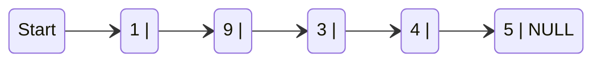

Make START to point to the next node in sequence.

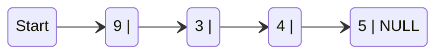


In the code below, shows the algorithm to delete the first node from a linked list. Initially, we verify the existence of the linked list in STEP 1 by checking if **START** = **NULL**. If there are no nodes, the control transfers to the last statement of the algorithm. In the presence of nodes, we employ a pointer variable **PTR**, initialized to point to the first node using **START**. Proceeding to STEP 3, **START** is updated to point to the next node in sequence, and the memory occupied by the initially pointed node (**PTR**) is freed and returned to the free pool.


```r
STEP 1: IF START = NULL
           Write UNDERFLOW
           Go to STEP 5
        [END OF IF]
STEP 2: SET PTR = START
STEP 3: SET START = START NEXT
STEP 4: FREE PTR
STEP 5: EXIT
```

> ***Note:** Algorithm to delete the first node*

#

**In addition to the Single Linked List discussed earlier, we will now introduce three more data structures related to Linked Lists.**

**Please note that for the purpose of this introductory guide, we recommend referring to the cited sources at the end of the document for more in-depth information. Thank you.**

#

**CIRCULAR LINKED LISTs**

In a circular linked list, the last node contains a pointer to the first node of the list. We can have a circular singly linked list as well as a circular doubly linked list. While traversing a circular linked list, we can begin at any node and traverse the list in any direction, forward or backward, until we reach the same node where we started. Thus, a circular linked list has no beginning and no ending.

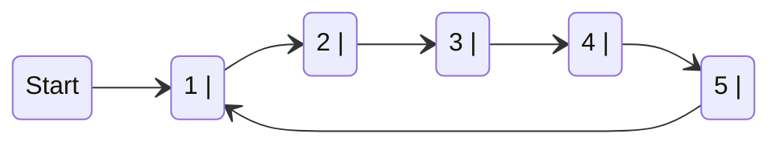

> ***Note:** Circular Linked List*

The only downside of a circular linked list is the complexity of iteration. Note that there are no NULL values in the NEXT part of any of the nodes of list.

#

**DOUBLY LINKED LISTS**

A doubly linked list or a two-way linked list is a more complex type of linked list which contains a pointer to the next as well as the previous node in the sequence. Therefore, it consists of three parts—data, a pointer to the next node, and a pointer to the previous node.

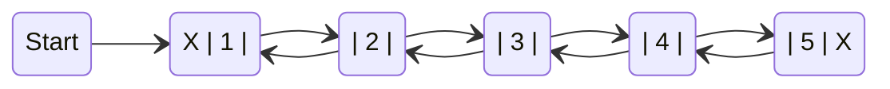

> ***Note:** Doubly Linked List*

In C, the structure of a doubly linked list can be given as

```c
struct node
{
  struct node *prev;
  int data;
  struct node *next;
};
```

The PREV field of the first node and the NEXT field of the last node will contain NULL. The PREV field is used to store the address of the preceding node, which enables us to traverse the list in the
backward direction.

Thus, we see that a doubly linked list calls for more space per node and more expensive basic operations. However, a doubly linked list provides the ease to manipulate the elements of the list as it maintains pointers to nodes in both the directions (forward and backward). The main advantage of using a doubly linked list is that it makes searching twice as efficient. 

#

**CIRCULAR DOUBLY LINKED LISTs**

A circular doubly linked list, or circular two-way linked list, is a more intricate type of linked list featuring pointers to both the next and previous nodes in the sequence. Unlike a doubly linked list, the circular doubly linked list doesn't have NULL in the previous field of the first node and the next field of the last node. Instead, the next field of the last node stores the address of the first node (START), and the previous field of the first node stores the address of the last node.

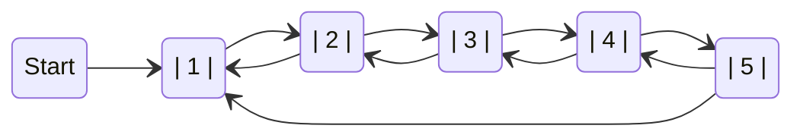

> ***Note:** Circular doubly Linked List*

Since a circular doubly linked list contains three parts in its structure, it calls for more space per node and more expensive basic operations. However, a circular doubly linked list provides the ease to manipulate the elements of the list as it maintains pointers to nodes in both the directions (forward and backward). The main advantage of using a circular doubly linked list is that it makes search operation twice as efficient.

## Stacks

A stack, a crucial data structure, organizes its elements in a specific order. To illustrate this concept, consider a stack of plates where each plate is stacked on top of another. Similar to removing plates from the top of the pile, a stack allows adding and removing elements exclusively from the topmost position.

In essence, a stack is a linear data structure that follows the Last-In-First-Out (LIFO) principle. This means that the element inserted last is the first one to be removed.

```mermaid
	stateDiagram-v2
		
```

## Queues


## Trees


## Sorting and Searching Algorithms


## Advanced Data Structures

## Best Practices and Efficiency

Best practices and efficiency are paramount in the world of programming. Adhering to established conventions and adopting efficient coding techniques not only enhances the quality of your code but also contributes to overall software performance. In this topic, we'll explore  guidelines and strategies that developers can employ to write better, more efficient code.

**Code optimization**

Code optimization is a fundamental practice for developers aiming to enhance the performance and efficiency of their programs. Instead of settling for solutions that merely work, code optimization strives to make these solutions faster, more efficient, and sometimes even more elegant. In this topic, we'll explore some techniques and concepts that can be applied to optimize code in programming languages, with a focus on improving performance.

One of the simplest ways to optimize code is by eliminating redundancies. Whether it's unnecessary variables, duplicate loops, or operations that can be simplified, removing redundancies can result in cleaner and more efficient code. Let's consider an example in C:

```c
// Non-optimized version
#include <stdio.h>

int calculate_rectangle_area(int length, int width) {
  int area = length * width;
  return area;
}

// Optimized version
#include <stdio.h>

int calculate_rectangle_area_optimized(int length, int width) {
  return length * width;
}
```

In the optimized version, we've eliminated the variable area, simplifying the code without compromising readability.

#

**Efficient Use of Data Structures:**
The proper choice of data structures can have a significant impact on code performance. For instance, if many search operations are needed, a dictionary (or map) might be more efficient than a list. Let's consider an example in C:
 
**Non-optimized Version**
```c
#include <stdio.h>
#include <string.h>

int main()
{
  char* names[] = {"Alice", "Bob", "Charlie"};
  int index_bob = -1;

  for (int i = 0; i < 3; ++i) {
    if (strcmp(names[i], "Bob") == 0)
    {
      index_bob = i;
      break;
    }
  }

  if (index_bob != -1) 
    printf("Bob found at position %d\n", index_bob);
  else
    printf("Bob not found\n");

  return 0;
}
```

**Optimized Version**

```c
#include <stdio.h>

int main()
{
  char* names[] = {"Alice", "Bob", "Charlie"};

  for (int i = 0; i < 3; ++i) {
    if (strcmp(names[i], "Bob") == 0) {
      printf("Bob found at position %d\n", i);
      return 0;
  }
}

  printf("Bob not found\n");
  return 0;
}
```

In the optimized version, we've replaced the array with a loop that utilizes the efficient *strcmp* function for string comparison.

Code optimization is a balance between performance and readability. By applying techniques such as eliminating redundancies and choosing data structures wisely, developers can create faster and more efficient programs. However, it's crucial to remember that premature optimization can compromise code clarity, so it's advisable to focus on critical areas for improvement.

#

**Proper choice of Data Structures**

Selecting the right data structures is a crucial aspect of writing efficient and effective code. Making proper choices ensures that your program runs smoothly and performs well. In this section, we'll explore the significance of choosing the right data structures for different programming scenarios, emphasizing how it impacts the overall efficiency of your code.

**Choosing Based on Operations:**

One key consideration when selecting a data structure is the type of operations your program needs to perform frequently. For instance, if you need fast insertion and deletion, a linked list might be more suitable than an array. Let's illustrate this with a simple C example:

**Array Implementation**
```c
#include <stdio.h>

int main() {
  int array[5] = {1, 2, 3, 4, 5};
  // Array is fixed in size, making insertion and deletion less efficient

  // Code for array operations...
  return 0;
}
```

**Linked List Implementation**
```c

#include <stdio.h>

struct Node
{
  int data;
  struct Node* next;
};

int main()
{
  struct Node* head = NULL;
  // Linked list allows dynamic insertion and deletion

  // Code for linked list operations...
  return 0;
}

```

In this example, the choice between an array and a linked list depends on the frequent operations anticipated.

#

**Consideration for Search and Retrieval:**

If your program requires fast search and retrieval, choosing the right data structure becomes crucial. For instance, a binary search tree can provide efficient searching compared to a simple array. Here's a simple C illustration:

**Array Implementation**
```c
#include <stdio.h>

int main() {
  int array[5] = {1, 2, 3, 4, 5};
  // Searching in an array requires linear traversal

  // Code for array search...
  return 0;
}
```

**Binary Search Tree Implementation**
```c
#include <stdio.h>

struct Node
{
  int data;
  struct Node* left;
  struct Node* right;
};

int main()
{
  struct Node* root = NULL;
  // Binary search tree allows efficient searching

  // Code for tree search...
  return 0;
}
```

The choice of a binary search tree facilitates faster search operations compared to a simple array.

Properly selecting data structures based on the nature of your program's operations is a key factor in achieving code efficiency. It ensures that your code performs optimally and meets the specific needs of your application. Keep in mind the trade-offs associated with each data structure to make informed decisions for your programming tasks.

---

## Conclusion

#### Reference

- TENENBAUM, Aaron M. ; LANGSAM, Yedidyah ; AUGENSTEIN, Moshe J. **Data Structures Using C**. Facsimile Edition. Pearson, 1989.
- CORMEN, Thomas H. ; LEISERSON, Charles E. ; RIVEST, Ronald L. ; STEIN, Clifford. **Introduction to Algorithms**. 4th Edition. MIT Press, 2022.
- THAREJA, Reema. **Data Structures Using C**. 2nd Edition. Oxford University Press, 2014.


<!-- 
# Study Guide: Data Structures in C


## 8. Stacks and Queues
- Concept of stacks and queues.
- Implementation of stacks and queues in C.

## 9. Trees
- Introduction to trees.
- Binary search trees.
- Tree traversal.

## 10. Sorting and Searching Algorithms
- Sorting algorithms (e.g., Bubble Sort, Quick Sort).
- Searching algorithms (e.g., Binary Search).

## 11. Advanced Data Structures (Optional)
- Graphs and their representations.
- Hash tables (hash tables).
- Balanced data structures (e.g., AVL trees).

!-->
