---

## Algorithms: Their Key Role in Computing

In this chapter, we aim to demystify algorithms. What exactly are algorithms, and why is it worthwhile to delve into their intricacies? How do algorithms differentiate themselves amidst the various computer technologies? This chapter wil answer these questions.

### Algorithms

Informally, an ***algorithm*** is any well-defined computational procedure that takes some value, or set of values, as ***input*** and produces some value, or set of values, as ***output*** in a finite amount of time. An algorithm is thus a sequence of computational steps that transform the input into the output.

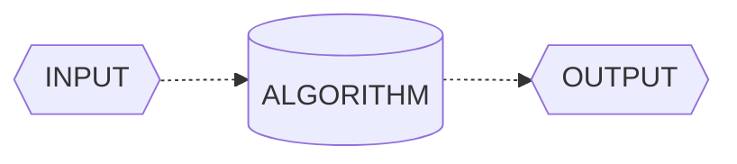

Therefore, an algorithm serve as a tool for solving a ***well-specified computational problem***. The statement of the problem specifies in general terms the desired *input/output* relationship for problem instances. The algorithm describes a specific computational procedure for achieving that *input/output* relationship for all problem instances. 

As an example, suppose that you need to *sort a sequence of numbers into increasing order*. Here is how we formally define the ***sorting problem***: 

**INPUT:**  
**A sequence of *n* numbers  $\langle a_{1}, \\, a_{2}, \\, ... \\,,\\, a_{n}  \rangle$**.

**OUTPUT:**   
**A permutation or reordering $\langle a_{1}^{\prime}\\, ,\\, a_{2}^{\prime}\\,,\\, ... \\,,\\, a_{n}^{\prime} \rangle$ of the input sequence such that $a_{1}^{\prime} \leq \\, a_{2}^{\prime} \leq \\, a_{n}^{\prime}.$**

Thus, given the input sequence $\langle 52, \\, 28, \\, 4, \\, 12, \\, 12, \\, 36 \rangle$, a  ***correct sorting algorithm*** returns as output the sequence $\langle 4, \\, 12, \\, 12, \\, 28, \\, 36, \\, 52 \rangle$. 

#

Such an input sequence is called an ***instance*** of the ***sorting problem***. In general, an ***instance of a problem*** consists of the input (satisfying whatever **constraints** are imposed in the problem statement) needed to compute a solution to the problem.

> ***Note:** A constraint problem occurs when the wrong units (e.g.,Fahrenheit instead of Celsius) are input for a temperature conversion algorithm.*

Because many programs use it as an intermediate step, sorting is a fundamental operation in **Computer Science**. As a result, you have a large number of good sorting algorithms at your disposal. Which algorithm is best for a given application depends on several factors, including *item count*, *initial sorting*, *value constraints*, *computer architecture*, and *storage device type* (e.g., main memory or disks), among others.

An algorithm for a ***computational problem*** is ***correct*** if, for every problem instance provided as input, it ***halts*** - *its computing in finite time* - and outputs the correct solution to the problem instance. An ***incorrect*** algorithm might not halt at all on some input instances, or it might halt with an incorrect answer. 

> ***Note:** Surprisingly, incorrect algorithms can have their utility, especially when their error rate is manageable.*

#

**What Kinds of Problems are Solved by Algorithms?**

Algorithms are the unsung heroes of the digital age, silently working behind the scenes to tackle a multitude of problems across various domains. Practical applications of algorithms are ubiquitous and include the following examples: 

- **Social Media Recommendation Algorithms:** Think about how social media platforms like Facebook or Instagram suggest friends to connect with or posts to engage with. These recommendation algorithms analyze your past interactions and those of others to present content and connections tailored to your interests. For instance, when Facebook suggests reconnecting with an old friend you haven't seen in years, it's driven by algorithms mining data on mutual friends, shared interests, and past interactions.

- **Uber's Ride-Matching Algorithm:** When you book a ride through Uber, an algorithm is at work behind the scenes to optimize your journey. Uber's ride-matching algorithm considers various factors like your pickup location, destination, driver availability, and real-time traffic data to calculate the quickest and most cost-effective route. This ensures you get to your destination efficiently and at a fair price, all thanks to complex algorithms.

- **Netflix Recommendation Engine:** Ever wondered how Netflix knows exactly what TV shows and movies you'll love? Netflix's recommendation engine employs powerful algorithms that analyze your viewing history, genre preferences, and even the viewing habits of users with similar tastes. It then suggests personalized content that keeps you binge-watching. For instance, when Netflix suggests a new series that becomes your favorite, it's the result of these recommendation algorithms.

**Algorithms as A Technology**

In a hypothetical scenario where computers possessed infinite processing speed and memory came at no cost, *would you have any reason to study algorithms?* Surprisingly, the answer is **yes**. Even in such a scenario, you would still like to be certain that your solution method terminates and does so with the correct answer. 

In a world of infinitely fast computers, any method that leads to the correct solution would do. While you would still uphold the principles of good ***software engineering*** — *ensuring that your implementation is well-designed and meticulously documented* — the primary criterion for choosing a method would likely be **simplicity and ease of implementation**.

Despite their impressive speeds, computers are not infinitely fast. Time, as a computing resource, is bounded and therefore, exceedingly precious. Although the saying goes, *Time is money*, while well-known, falls short in emphasizing the true value of time; it is even more precious than money itself. Money can be regained after being spent, but once time is expended, it is irrevocably lost.

Memory, on the other hand, may seem relatively inexpensive, but it is **neither infinite nor free**. It is crucial to exercise prudence in selecting algorithms that utilize time and space resources efficiently. **In other words, even with vast computing power and memory at your disposal, the art of algorithm design remains essential, as it ensures that you maximize the utility of your finite resources.**

#

**Efficiency**

Different algorithms devised to solve the same problem often differ dramatically in their efficiency. These differences can be much more significant than differences due to hardware and software. Two common ****sorting algorithms***, **Insertion Sort** and **Merge Sort**, offer a striking contrast in terms of efficiency.

**Insertion Sort**, with its simple and intuitive nature, offers a basic way to sort a collection of elements. On the other hand, **Merge Sort** employs a more sophisticated *divide and conquer* strategy to efficiently sort large datasets. To understand the profound difference in efficiency between these two algorithms, we turn to mathematical analysis.

Efficiency in sorting algorithms can be quantified through their ***time complexity***, often expressed using **Big O** notation. The time complexity provides a mathematical representation of how an algorithm's runtime scales concerning the size of the input data.

**Insertion Sort Efficiency:**
Insertion sort operates with a time complexity of $O(n^2)$ in the worst case. This quadratic growth signifies that as the input size (n) increases, the time required to sort the data grows quadratically. It can be represented as:

$$T_{i}(n) = k_{i} \times n^2$$

$T_{i}(n) \textit{represents the time taken by insertion sort for an input of size n, and } k_{i} \textit{ is another constant factor}$

**Merge Sort Efficiency:**
Merge sort, in contrast, exhibits a time complexity of $O(n \times \log_2(n))$ for all cases, including the worst case. This indicates a more efficient growth rate as the input size increases. It can be represented as:

$$T_{m}(n) = k_{m} \times n \times \log_2(n)$$

$T_{m}(n) \textit{represents the time taken by merge sort for an input of size n, and } k_{m} \textit{ is another constant factor}$

#

Let's illustrate the difference in efficiency using a practical example. We will compare the sorting efficiency of two computers. 

Let's consider the specifications of each computer: **Computer A** operates at an impressive rate of *10 billion instructions per second*. In stark contrast, **Computer B** executes instructions at a much slower pace, managing only *10 million instructions per second*. Consequently, **Computer A** outpaces **Computer B** *by a factor of 1000* in terms of raw computing power.

To accentuate this difference further, let's assume that **Computer A** benefits from the expertise of a highly skilled programmer who codes an optimized version of the insertion sort algorithm in machine language. This finely-tuned code operates at a complexity of $2 \times n^2$ instructions to sort a dataset of n numbers.

On the other hand, **Computer B** takes a different route. Here, an average programmer has implemented the merge sort algorithm using a high-level language with an inefficient compiler. This results in a code with a time complexity of $50 \times n \times \log_2(n)$ instructions to sort the same dataset.

**How long will it take for each computer to sort this 10 million-number dataset?**

$$\text{Computer A (Insertion Sort):}$$

$$T_{i}(10^7) = \frac{k_{i} \times n^2}{10^{10}} \rightarrow \frac{2 \times (10^7)^2}{10^{10}} \\: \frac{ \text{instructions}}{\text{instructions / sec}} = 20.000 \text{ seconds} \approx 5,5 \text{ hours}$$

<br>

$$\text{Computer B (Merge Sort):}$$

$$T_{m}(10^7) = \frac{k_{m} \times n \times \log_2(n)}{10^7} \rightarrow \frac{50 \times 10^7 \times \log_2(10^7)}{10^{7}} \\: \frac{ \text{instructions}}{\text{instructions / sec}} \approx 1.162,5 \text{ seconds} \approx  19,375 \text{ minutes}$$

Here, it becomes evident that as the input size increases, the *efficiency difference* between Insertion Sort and Merge Sort becomes increasingly pronounced. Merge Sort's linearithmic ( $O(n \times \log_2(n) )$ ) complexity allows it to maintain a consistent advantage over Insertion Sort, especially when dealing with large datasets.

**Algorithms and other Technologies**

In computing, algorithms are as crucial as hardware and advanced technologies. Even in the age of machine learning and data science, algorithms underpin most operations, from hardware design to user interfaces and networking. 

Efficient algorithms are essential, especially as computers tackle larger problems. A solid understanding of algorithms remains a defining trait of skilled programmers, enhancing their capabilities in the ever-evolving world of computing.

#

**Analyzing Algorithms**

Analyzing an algorithm involves predicting the resources it requires, such as *memory*, *communication bandwidth*, *energy consumption*, and most commonly, ***computational time***. By evaluating multiple candidate algorithms for a problem, we can identify the *most efficient one*, often eliminating inferior alternatives. This process requires a model of the technology on which the algorithm runs, including the associated resources and their costs.

The **RAM** **(Random-Access Machine)** model is the primary framework for *algorithm analysis*. In this model, instructions execute sequentially with constant time for each operation, closely resembling real computers. It covers *common instructions*, *data types*, and *control flow*. While it simplifies some real-world complexities, like *memory hierarchy*, it offers reliable performance predictions. Analyzing algorithms in the **RAM** model can be challenging, requiring mathematical tools, but it aids in selecting efficient algorithms for various tasks.

**Worst-Case, Average-Case, Best-Case, and Amortized Time Complexity**

**Worst-Case Running Time:** This denotes the behavior of an algorithm with respect to the **worst possible case** of the input instance. The *worst-case running time* of an algorithm is an ***upper bound*** on the running time for any input. Therefore, having the knowledge of worst-case running time gives us an assurance that the algorithm will never go beyond this time limit.

**Average-Case Running Time:** The *average-case running time* of an algorithm is an estimate of the running time for an ***average*** input. It specifies the expected behavior of the algorithm when the input is randomly drawn from a given distribution. Average-case running time assumes that all inputs of a given size are equally likely.

**Best-Case Running Time:** The term ***best-case performance*** is used to analyze an algorithm under optimal conditions. For example, the best case for a simple linear search on an array occurs when the desired element is the first in the list. However, while developing and choosing an algorithm to solve a problem, we hardly base our decision on the best-case performance. It is always recommended to improve the ***average performance*** and the ***worst-case performance*** of an algorithm.

**Amortized Running Time:** Amortized running time refers to the time required to perform a sequence of (related) operations averaged over all the operations performed. Amortized analysis guarantees the average performance of each operation in the worst case.

### Asymptotic Notation

When we analyze algorithms for large inputs, we focus on their ***asymptotic efficiency*** – *how their running time scales as input size approaches infinity*. In practice, algorithms with superior asymptotic efficiency are usually the best choice, except for exceptionally small inputs. This approach helps us understand the long-term performance characteristics of algorithms.

**$O$-Notation**

$O$-Notation characterizes an *upper bound* on the ***asymptotic*** behavior of a function. In other words, it says that a function grows no faster than a certain rate, based on the highest-order term.

Consider, for example, the function $f(x) = 3n^3 - 2n^2 + 5n + 1$ . Its highest-order term is $3n^3$, and so we say that this function’s rate of growth is $n^3$. Because this function grows no faster than $n^3$ , we can write that it is $O(n^3)$. More generally, it is $O(n^c)$ for any constant $c \gg 3$. Here is the formal definition of $O$-Notation. 

For a given function $g(n)$, we denote by $O(g(n))$ (*pronounced big-oh of g of n*) the *set of functions*):

$$O(g(n)) = \\{ f(n) : \text{ there exist positive constants c and } n_{0} \text{ such that }  0 \leq f(n) \leq cg(n), \forall \text{  n } \geq n_{o} \\}$$

#

A function $f(n)$ belongs to the set $O(g(n))$ if there exists a ***positive constant*** $c$ such that $f(n) \leq cg(n)$ for sufficiently large $n$.

The definition of $O(g(n))$ requires that every function $f(n)$ in the set $O(g(n))$ be ***asymptotically nonnegative***: $f(n)$ must be nonnegative whenever $n$ is sufficiently large. (An ***asymptotically positive*** function is one that is positive for all
sufûciently large $n$.). 

Consequently, the function $g(n)$ itself must be ***asymptotically nonnegative***, or else the set $O(g(n))$ is **empty**. We therefore assume that every function used within $O$-Notationis ***asymptotically nonnegative***. 

You might be surprised that we defined $O$-notation in terms of sets. Indeed, you might expect that we would write $f(n) \in O(g(n))$ to indicate that $f(n)$ belongs to the set $O(g(n))$. Instead, we usually write $f(n) = O(g(n))$ and say
$f(n)$ is big-oh of $g(n)$ to express the same notion. 

Let’s explore an example of how to use the formal definition of $O$-Notation to justify our practice of discarding lower-order terms and ignoring the constant coefficient of the highest-order term: 

We'll show that $f(x) = 4n^2 + 100n + 500 = O(n^2)$. 

We need to find positive constants $c$ and $n_0$ such that $f(x) = 4n^2 + 100n\leq O(n^2)$ for all $n \geq n_0$. 

By definition, we have:

$$0 \leq 4n^2 + 100n\leq cn^2$$

Dividing both sides of the inequality by $n^2$ yields: 

$$0 \leq 4 + \frac{100}{n} \leq c$$ 

Now to determine the value of $c$, we see that $4 + \frac{100}{n}$ is maximum when $n = 1$. Therefore, $c = 104$.

To determine the value of $n_0$:

$$0 \leq 4 + \frac{100}{n_0} \leq 104$$ 

$$-4{n_0} \leq 100 \leq 100{n_0}$$ 

This implies, $n_0 = 1$. Hence, $0 \leq 4n^2 + 100n \leq n^2 \\: \forall \text{  n } \geq n_{0} = 1 \\}$


#

**$\Omega$-Notation**

$\Omega$-Notation characterizes a *lower bound* on the ***asymptotic*** behavior of a function. In other words, it says that a function grows at *least as fast* as a certain rate, based on the ***highest-order term***. 

Because the ***highest-order term*** in the function $f(x) = 7n^3 + 100n^2 - 20n + 6$ grows at least as fast as $n^3$, this function is $\Omega(n^3)$. This function is also $\Omega(n^2)$ and $\Omega(n)$. More generally, it is $\Omega(n^c)$ for any constant $c \leq 3$. 

Just as $O$-notation provides an ***asymptotic upper bound*** on a function, $\Omega$-Notation provides an ***asymptotic lower bound***. For a given function $g(n)$, we denote by $\Omega(g(n))$ (*pronounced big-omega of g of n*) the set of functions 

$$\Omega(g(n)) = \\{ f(n) : \text{ there exist positive constants c and } n_{0} \text{ such that }  0 \leq cg(n) \leq f(n), \forall \text{  n } \geq n_{o} \\}$$

#

Now let’s show that $f(x) = 4n^2 + 100n + 500$ is $\Omega(n^2)$. We need to find positive constants $c$ and $n_0$ such that $f(x) = 4n^2 + 100n + 500 \leq cn^2$ for all $n \geq n_0$. As before, we divide both sides by $n^2$: 

$$4 + \frac{100}{n} + \frac{500}{n^2} \leq c$$

This inequality holds when $n_0$ is any positive integer, and we can choose $c = 4$.

What if we had a small coefficient for the $n^2$ term? The function would still be $\Omega(n^2)$. For example, let’s show that $f(x) = n^2/100 + 100n + 500$ is $\Omega(n^2)$. Dividing by $n^2$ gives: 

$$\frac{1}{100} + \frac{100}{n} + \frac{500}{n^2} \leq c$$ 

We can choose any value for $n_0$ that is at least 10,005 and find a positive value for $c$. For example, when $n_0 = 10,005$, we can choose $c = 2.49 \times 10^{-9}$. If we select a larger value for $n_0$, we can also increase $c$. For example, if $n_0 = 100,000$, then we can choose $c = 0.0089$. The higher the value of $n_0$, the closer to the coefficient $\frac{1}{100}$ we can choose $c$.

#

**$\Theta$-Notation**

$\Theta$-Notation characterizes a *tight bound* on the ***asymptotic behavior*** of a function. It says that a function grows *precisely at a certain rate*, based once again on the ***highest-order*** term. Put another way, $\Theta$-Notation characterizes the rate of growth of the function to within a **constant factor from above** and to within a **constant factor from below**. 

These two constant factors *don't need to be equal*. If you can show that a function is both $O(f(n))$ and $\Omega(f(n))$ for some function $f(n)$, then you have shown that the function is $\Theta(f(n))$. For example, $f(x) = 7n^3 + 100n^2 - 20n + 6$ it's a $\Theta(n^3)$

For a given function $g(n)$, we denote by $\Theta(g(n))$ (*theta of g of n*) the set of functions

$$\Theta(g(n)) = \\{ f(n) : \text{ there exist positive constants } c_1 \text{ and }c_2 \text{ and } n_{0} \text{ such that }  0 \leq c_{1}g(n) \leq f(n) \leq c_{2}g(n), \forall \text{ n } \geq n_{o} \\}$$

#

For all values of n at and to the right of $n_0$, the value of $f(n)$ lies at or above $c_{1}g(n)$ and at or below $c_{2}g(n)$. In other words, for all $n \geq n_0$, the function $f(n)$ is equal to $g(n)$ to within constant factors. The definitions of $O$-, $\Omega$-, and  $\Theta$-Notations lead to the following theorem.

For any two functions $f(n)$ and $g(n)$, we have $f(n) = \Theta(g(n))$ if and only if

$$f(n) = O(g(n)) \text{ and } f(n) = \Omega(g(n))$$

<br>

## Understanding the Fundamentals of Data Structures

In this chapter, we explore data structures, the essential components of computer science. What are data structures, and why are they crucial for efficient algorithms? How do they impact the world of technology and problem-solving? Let's demystify data structures and discover their profound significance.

### Data Structures

For many problems, the ability to formulate an ***efficient algorithm*** depends on being able to organize the data in an appropriate manner. The term *data structure* is used to denote a particular way of organizing data for particular types of operation.

Data structures are like organizational tools in programming, defining how data is stored and handled. They come in various forms, each tailored for specific tasks. Examples include *arrays*, *trees*, and *graphs*. These structures are vital for crafting efficient solutions in coding.
 

**Why are They Important in Programming?**

A program should undoubtedly give correct results, but along with that it should also run **efficiently**. A program is said to be efficient when it executes in *minimum time* and with *minimum memory space*. In order to write efficient programs we need to apply certain ***data management*** concepts.

The concept of data management is a complex task that includes activities like *data collection*, *organization of data into appropriate structures*, and *developing and maintaining routines for quality assurance*. A data structure is basically a group of data elements that are put together under one name, and which defines a particular way of ***storing*** and ***organizing data*** in a computer so that it can be used efficiently

Specific data structures are essential ingredients of many efficient algorithms as they enable the programmers to manage huge amounts of data easily and efficiently. Some formal design methods and programming languages emphasize data structures and the algorithms as the key organizing factor in software design. This is because **representing information is fundamental to computer science**. The primary goal of a program or software is not to perform calculations or operations but to *store* and *retrieve information* as fast as possible.

**Choosing the Right Data Structure**

In the world of problem-solving, choosing the right data structure is a fundamental step toward achieving *efficient solutions*. To gauge efficiency, we examine if a solution not only meets the problem's needs but also operates effectively within set **resource constraints**, including ***storage space*** and ***processing time***. And the best solution is the one that requires fewer resources than known alternatives. The ultimate goal is to minimize resource usage, particularly in terms of time, while still adhering to other resource limits.

In today's programming landscape, writing code extends beyond problem-solving; it's about crafting ***efficient solutions***. To accomplish this, programmers embark on a process of problem analysis, where they establish **clear performance objectives**. Subsequently, they meticulously select the data structure that best suits the task at hand.

However, in some cases, program designers lacking a solid grasp of data structure concepts may bypass this crucial analysis phase. Instead, they opt for a data structure they're familiar with. Unfortunately, this choice may not align with the specific problem, potentially leading to subpar performance, such as sluggish operation speeds.

Conversely, if a program meets its performance goals with a data structure that is simple to use, then it makes no sense to apply another complex data structure just to exhibit the programmer’s skill. When selecting a data structure to solve a problem, the following steps must be performed.

1. **Analysis of the problem to determine the basic operations that must be supported.**
2. **Quantify the resource constraints for each operation.**
3. **Select the Data Structure that best meets these requirements.**

> ***Note:** In the approach above, the first concern is the data and the operations that are to be performed on them. The second concern is the representation of the data, and the final concern is the implementation of that representation.*

C language supports various data structure types, each with its unique characteristics. Some structures allow adding data items only at the beginning, while others permit insertion at any position. Some enable sequential data access, while others facilitate random access. So, selection of an appropriate data structure for the problem is a crucial decision and may have a major impact on the performance of the program.

#

**Operations On Data Structures**

This section discusses the different operations that can be performed on the various data structures previously mentioned.

**Traversing:** It means to access each data item exactly once so that it can be processed. For example, to print the names of all the students in a class.

**Searching:** It's used to locate data items that may or may not be present in the given collection, satisfying a given constraint. For example, to find the names of all the students who secured 100 marks in mathematics.

**Inserting:** It is used to add new data items to the given list of data items. For example, to add the details of a new student who has recently joined the course.

**Deleting:** It means to remove (*delete*) a particular data item from the given collection of data items. For example, to delete the name of a student who has left the course.

**Sorting:** Data items can be arranged in some order like *ascending order* or *descending order* depending on the type of application. For example, calculating the top three winners by arranging the participants’ scores in descending order and then extracting the top three.**

**Merging:** Lists of two sorted data items can be combined to form a single list of sorted data items.

Frequently, multiple operations need to be applied simultaneously in a given situation. For instance, consider the scenario where we need to delete the details of a student with the name "X". In this case, we must first conduct a search within the list of students to determine whether the record of "X" exists and, if so, identify its location. Subsequently, we can proceed to delete the details from that specific location.

#

**Classification of Data Structures**

Classification of Data Structures categorizes them based on their organization and functionality, helping programmers choose the right tool for specific tasks. These categories include *Linear*, *Non-Linear* data structures, each suited to distinct data manipulation requirements. 

**Data structures are generally categorized into two classes: *Primitive* and *Non-Primitive* Data Structures.**

**Primitive and Non-Primitive Data Structures**  
Primitive Data Structures are the fundamental data types which are supported by a programming language. Some basic data types are *integer*, *real*, *character*, and *boolean*. The terms ***data type***, ***basic data type***, and ***primitive data type*** are often used interchangeably. 

Non-Primitive data structures, on the other hand, are constructed using primitive data types. They encompass complex structures such as *linked lists*, *stacks*, *trees*, and *graphs*. Non-Primitive data structures can be categorized into two primary types: **Linear Structures**, which follow a linear progression, and **Non-Linear Structures**, characterized by their more intricate relationships between elements.

**Linear and Non-Linear Structures**  
If data elements within a structure are organized in a sequential manner, it falls into the category of Linear data structures. Well-known examples encompass arrays, *linked lists*, *stacks*, and *queues*. Linear structures can be stored in memory using two approaches: ***contiguous memory locations*** to maintain a direct linear relationship between elements or ***linked structures*** where connections establish the linear order.

Conversely, when data elements are not arranged in a sequential order, the structure is classified as Non-Linear. Non-Linear data structures lack adjacency relationships among their elements, making them suitable for more complex scenarios. Examples of Non-Linear structures include *trees* and *graphs*, which allow for versatile data organization and retrieval.


## Data Types in C

A data type determines the set of values that a data item can take and the operations that can be performed on it.

**Integers, Floating-point, and Characters.**

The C language classifies variables based on the type of data they can hold, ensuring efficient memory usage and precise operations. Thus, C provides fundamental types such as integers, characters, and floating-point numbers, offering versatility in data representation.

For instance, the **char** data type is of **one byte** and is used to store *single characters*. Note that C does not provide any data type for ***storing text***, this is because text is made up of individual characters.


| Data Type       | Description                | Size (in bytes) | Range                                                   |
|-----------------|----------------------------|:-------------------------:|---------------------------------------------------------|
| **int**           | Integer                         | 4                   | $\pm \\: -2.147 \times 10^9  \text{ to } \pm \\: 2.147 \times 10^9$                        |
| **char**          | Character                       | 1                   | $-128 \text{ to } 127$  (or $0 \text{ to } 255$ for unsigned char)      |
| **float**         | Single-Precision Floating Point | 4                   |  $\pm  \\: 1.2 \times 10^{-38} \text{ to } \pm \\: 3.4 \times 10^{38}$            |
| **double**        | Double-Precision Floating Point | 8                   |  $\pm  \\: 2.2 \times 10^{-308} \text{ to } \pm \\: 1.8 \times 10^{308}$           |

> **Note:* In addition, C also supports four modifiers — two sign specifiers (***signed*** and ***unsigned***) and two size specifiers (***short*** and ***long***).*

These ranges provide a general idea of the value limits for each of the principal data types in C. However, it's important to note that the actual range may vary depending on the specific system and compiler.

**Data Type Compatibility**

Data type compatibility is a vital concept, especially in languages like C, where precise control over data representation and memory management is crucial. It essentially deals with how different data types interact with each other in a program. It governs how variables of various types can be used together, ensuring that operations are carried out correctly and safely.

**Example of Data Type Compatibility:**

Let's consider a simple example to illustrate data type compatibility in C:

```c
#include <stdio.h>

int main(void)
{
int integerVariable = 42;
double doubleVariable = 3.14159265359;

double result = integerVariable + doubleVariable;

printf("Result:" %lf\n, result);

return 0;
}
```

In this C program, we have an **int** variable and a **double** variable. We want to add these two variables together and store the result in the result variable, which is also of type double.

Here's what's happening in terms of data type compatibility:

- The int variable is implicitly converted to a double when it's added to ***doubleVariable***. This is an example of implicit type conversion to ensure that both operands have a compatible type for the addition operation.
- The result of the addition, which is a double, is then stored in the result variable.
- Finally, we print the result using the %lf format specifier because it's of type double.

This example demonstrates how data type compatibility allows for operations involving different data types. C's rules for type conversion ensure that the code compiles and produces the expected result without requiring explicit type casting. 

> [!NOTE]
> For more reference about Data Types and The C Language, check my [Student Guide - The C Language](https://github.com/artghieri/Student-Guide-The-C-Language/blob/main/guide.md)

## Arrays

In this chapter, we will discuss arrays. An *array* is a user-defined data type that stores related information together. All the information stored in an *array* belongs to the **same data type**. So, in this chapter, we will learn how arrays are defined, declared, initialized, and accessed. We will also discuss the different operations that can be performed on array elements and the different types of arrays such as two-dimensional arrays, multi-dimensional arrays, and sparse matrices.

**An Array as a Concept**

Consider a situation in which we have 20 students in a class and we have been asked to write a program that reads and prints the marks of all the 20 students. 

Now to read the values of these 20 variables, we must have 20 read statements. Similarly, to print the value of these variables, we need 20 write statements. If it is just a matter of 20 variables, then it might be acceptable for the user to follow this approach. But would it be possible to follow this approach if we have to read and print the marks of students,

- **In the entire course (say 100 students)**
- **In the entire college (say 500 students)**
- **In the entire university (say 10,000 students)**

The answer is no, definitely **not**! To process a large amount of data, we need a data structure known as an ***array***.

An array is a collection of similar data elements. These data elements have the same data type. The elements of the array are stored in consecutive memory locations and are referenced by an index (also known as the *subscript*). The subscript is an ordinal number which is used to identify an element of the array.

```c
#include <stdio.h>  

int main(void)  
{
// Declare an integer array named "students" with 5 elements and initialize it with these values.
int students[5] = {10, 8, 7, 5, 10};  

// Print the value of the element at index 2 (third element) of the "students" array.
printf("%d", students[2]);  
return 0;  
}
```

#


**Declaration and Initialization of Arrays.**

In programming, every variable must be declared before it is used, and the same concept applies to array variables. Before using an array, it must be declared. Declaring an array involves specifying the following information:

- **Data Type**: This indicates the kind of values the array can store, such as *int*, *char*, *float*, or *double*.
- **Name**: An identifier used to uniquely identify the array.
- **Size**: The maximum number of elements that can be stored in the array.

**Arrays are declared using the following syntax:**

```sql
datatype name[size];
```

The data type can be either*int*, *char*, *float*, *double* or any other valid data type. The number within brackets indicates the *size* of the array.  
For example, if we declare:

```sql
int marks[5];
```

Then the statement declares marks to be an array **containing 10 elements**. In C, the array index starts from zero. The first element will be stored in **marks[0]**, second element in **marks[1]**, and so on. Therefore, the ***last element***, that is the 5th element, will be stored in **marks[9]**. 

> ***Note:** Note that 0, 1, 2, 3 written within square brackets are the subscripts.*

**In the memory, each element of the array will be stored as shown:**

<table>
  <tr>
    <td style="text-align:center; background-color:#3498db; color:white; width: 120px; height: 80px; font-size: 10px;">1st</td>
    <td style="text-align:center; background-color:#3498db; color:white; width: 120px; height: 80px; font-size: 10px;">2nd</td>
    <td style="text-align:center; background-color:#3498db; color:white; width: 120px; height: 80px; font-size: 10px;">3rd</td>
    <td style="text-align:center; background-color:#3498db; color:white; width: 120px; height: 80px; font-size: 10px;">4th</td>
    <td style="text-align:center; background-color:#3498db; color:white; width: 120px; height: 80px; font-size: 10px;">5th</td>
  </tr>
</table>

#

**Accessing Elements of an Array.**

To access all the elements, we must use a loop. In other words, we can access all the elements of an array by incrementing the value of the subscript into the array within a loop.

```c
// Declare an integer array named "marks" with a size of 5 elements
int marks[5];

// Initialize each element of the "marks" array to 0 using a loop
for (int i = 0; i < 5; ++i)
{
    marks[i] = 0;
}
```

> ***Note:** The subscript must be an integral value or an expression that evaluates to an integral value.*

The first element of the array **marks[5]** can be accessed by writing **marks[0**]. To process all the elements of the array, we use a loop that accesses each individual element of the array and sets its value to 0. 

In the for loop, first, the value of **marks[0]** is set to 0, then the value of the ***index*** i is incremented, and the next value, **marks[1**], is set to 0. This procedure continues until all 5 elements of the array are set to 0.

**Array marks after executing the code given:**

<table>
  <tr>
    <td style="text-align:center; background-color:#3498db; color:white; width: 120px; height: 80px; font-size: 10px;">0</td>
    <td style="text-align:center; background-color:#3498db; color:white; width: 120px; height: 80px; font-size: 10px;">0</td>
    <td style="text-align:center; background-color:#3498db; color:white; width: 120px; height: 80px; font-size: 10px;">0</td>
    <td style="text-align:center; background-color:#3498db; color:white; width: 120px; height: 80px; font-size: 10px;">0</td>
    <td style="text-align:center; background-color:#3498db; color:white; width: 120px; height: 80px; font-size: 10px;">0</td>
  </tr>
</table>


> ***Note:** There is no single statement that can read, access, or print all the elements of an array. To do this, we have to use a loop to execute the same statement with different index values.*


**Storing Values in Arrays**

When declaring an array, we allocate space for its elements without storing values. Three methods exist for storing values in an array: initializing elements during declaration, inputting values for individual elements from the keyboard, or assigning values to individual elements.

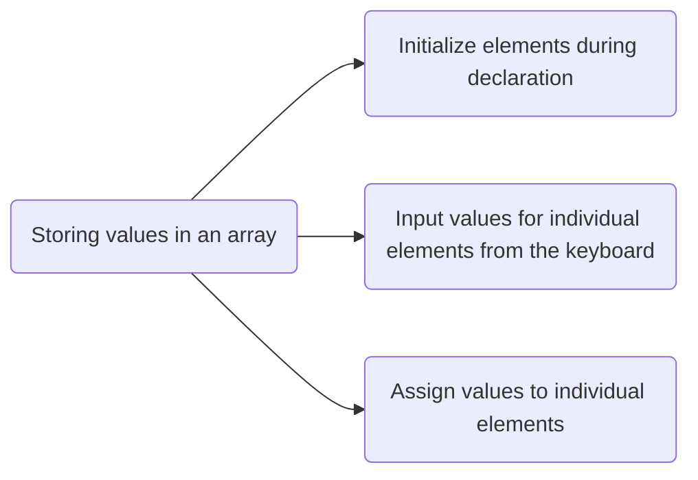

**Initializing Arrays During Declaration**

Arrays can be initialized at the time of declaration, just like any other variable. When initializing an array, you must provide a value for every element within the array. This is done by specifying the values within curly braces, separated by commas, in the following format:

```sql
type array_name[size] = {list of values};
```

It's important to ensure that the number of values matches the number of elements in the array; specifying more values than there are elements will result in a compiler error.

```sql
int marks[5] = {90, 82, 78, 95, 88};
```

In this example, an array named marks is declared with enough space to store five elements. The first element, **marks[0]**, is assigned the value 90, the second element, **marks[1]**, is assigned 82, and so on. 

**Inputting Values from the Keyboard**

Arrays can be initialized by inputting values from the keyboard using loops, such as **while/do–while** or **for** loops. 

```c
int i, marks[10];
i = 0;

while (i < 10)
{
  printf("Enter a value for element %d: ", i);
  
  scanf("%d", &marks[i]); // Input value for the current element
  i++;  // Increment index i
}
```

For instance, a loop iterates through the array elements, starting from index 0 and inputting values for each element. This process continues for arrays with indices ranging from 0 to 9. 

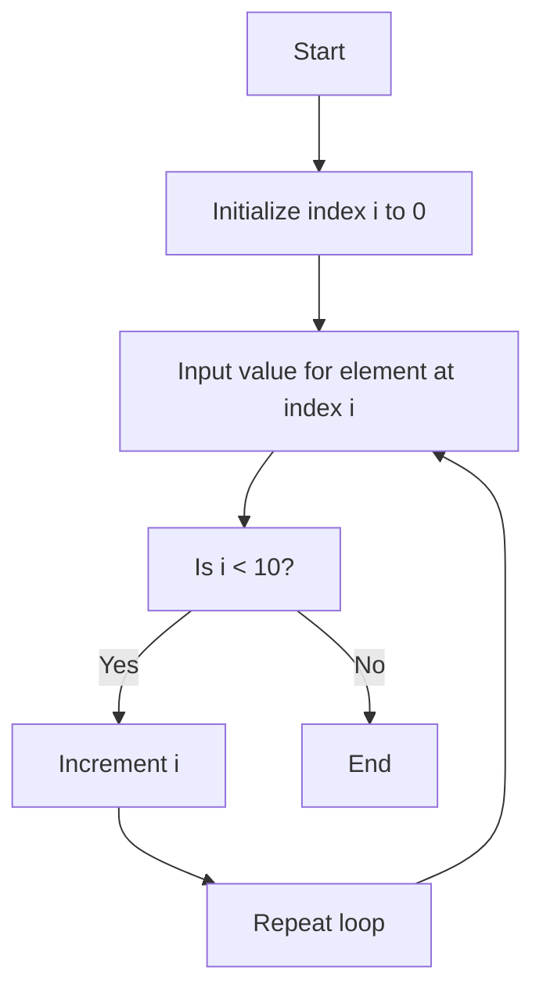

**Assigning Values to Individual Elements**

The third method involves assigning values to individual elements of the array using the assignment operator. You can assign any value that matches the data type of the array to an individual array element.

```sql
marks[0] = 10
```

To copy the contents of one array into another, you must copy the value of each individual element from the first array to the corresponding element in the second array.

```c
#include <stdio.h>

int main()
{
int firstArray[5] = {1, 2, 3, 4, 5};
int secondArray[5];

// Copy the values from firstArray to secondArray
for (int i = 0; i < 5; i++)
  secondArray[i] = firstArray[i];
return 0;
}
```

In this example, the loop accesses each element of the first array and simultaneously assigns its value to the corresponding element of the second array. The index value i is incremented to access the next element in succession

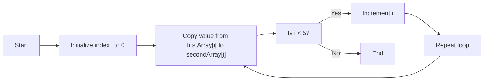

> ***Note:** It's important to note that we cannot assign one array directly to another array, even if the two arrays have the same type and size.* 

#

**Common Operations on Arrays.**

There are a number of operations that can be preformed on arrays. These operations include:

- **Traversal:** Iterating through all elements of the array to perform an operation on each.
- **Search:** Looking for a particular value within the array.
- **Insertion:** Adding a new element into the array.
- **Deletion:** Removing an element from the array.
- **Sorting:** Arranging the elements of the array in a specific order.
- **Merging:** Combining two or more arrays into a single array.
- **Copying:** Creating a copy of an array with the same or different size.  

> [!NOTE]
> For more reference, check ["Operations on array in C"](https://www.studymite.com/blog/operation-on-arrays-in-c-1).

**Two-Dimensional Arrays**

Up until now, our discussions have focused on **one-dimensional arrays**. These arrays are organized *linearly* in a *single direction*. However, in certain situations, we encounter the need to store data in a more structured manner, resembling grids or tables.

This is where the concept of one-dimensional arrays extends into **two-dimensional data structures**. A two-dimensional array is defined using two *subscripts*: the first subscript indicates the **row**, and the second denotes the **column**. In the world of programming, a two-dimensional array is essentially treated as an array of one-dimensional arrays.


| &nbsp;&nbsp;&nbsp;&nbsp;&nbsp;&nbsp;&nbsp;&nbsp;&nbsp;&nbsp;&nbsp;&nbsp;&nbsp;&nbsp;&nbsp;&nbsp;&nbsp;&nbsp;&nbsp;&nbsp;&nbsp; | &nbsp;&nbsp;&nbsp;&nbsp;&nbsp;&nbsp;&nbsp;&nbsp;&nbsp;&nbsp;&nbsp;&nbsp;&nbsp;&nbsp;&nbsp;&nbsp;&nbsp;&nbsp;&nbsp;&nbsp;&nbsp; | &nbsp;&nbsp;&nbsp;&nbsp;&nbsp;&nbsp;&nbsp;&nbsp;&nbsp;&nbsp;&nbsp;&nbsp;&nbsp;&nbsp;&nbsp;&nbsp;&nbsp;&nbsp;&nbsp;&nbsp;&nbsp; | &nbsp;&nbsp;&nbsp;&nbsp;&nbsp;&nbsp;&nbsp;&nbsp;&nbsp;&nbsp;&nbsp;&nbsp;&nbsp;&nbsp;&nbsp;&nbsp;&nbsp;&nbsp;&nbsp;&nbsp;&nbsp; |
|:-----------:|:-----------:|:-------------:|:-------------:|
| &nbsp;&nbsp;&nbsp;&nbsp;&nbsp;&nbsp;&nbsp;&nbsp;&nbsp;&nbsp;&nbsp;&nbsp;&nbsp;&nbsp;&nbsp;&nbsp;&nbsp;&nbsp;&nbsp;&nbsp;&nbsp; | &nbsp;&nbsp;&nbsp;&nbsp;&nbsp;&nbsp;&nbsp;&nbsp;&nbsp;&nbsp;&nbsp;&nbsp;&nbsp;&nbsp;&nbsp;&nbsp;&nbsp;&nbsp;&nbsp;&nbsp;&nbsp; |  &nbsp;&nbsp;&nbsp;&nbsp;&nbsp;&nbsp;&nbsp;&nbsp;&nbsp;&nbsp;&nbsp;&nbsp;&nbsp;&nbsp;&nbsp;&nbsp;&nbsp;&nbsp;&nbsp;&nbsp;&nbsp; | &nbsp;&nbsp;&nbsp;&nbsp;&nbsp;&nbsp;&nbsp;&nbsp;&nbsp;&nbsp;&nbsp;&nbsp;&nbsp;&nbsp;&nbsp;&nbsp;&nbsp;&nbsp;&nbsp;&nbsp;&nbsp; |
| &nbsp;&nbsp;&nbsp;&nbsp;&nbsp;&nbsp;&nbsp;&nbsp;&nbsp;&nbsp;&nbsp;&nbsp;&nbsp;&nbsp;&nbsp;&nbsp;&nbsp;&nbsp;&nbsp;&nbsp;&nbsp; | &nbsp;&nbsp;&nbsp;&nbsp;&nbsp;&nbsp;&nbsp;&nbsp;&nbsp;&nbsp;&nbsp;&nbsp;&nbsp;&nbsp;&nbsp;&nbsp;&nbsp;&nbsp;&nbsp;&nbsp;&nbsp; |  &nbsp;&nbsp;&nbsp;&nbsp;&nbsp;&nbsp;&nbsp;&nbsp;&nbsp;&nbsp;&nbsp;&nbsp;&nbsp;&nbsp;&nbsp;&nbsp;&nbsp;&nbsp;&nbsp;&nbsp;&nbsp; | &nbsp;&nbsp;&nbsp;&nbsp;&nbsp;&nbsp;&nbsp;&nbsp;&nbsp;&nbsp;&nbsp;&nbsp;&nbsp;&nbsp;&nbsp;&nbsp;&nbsp;&nbsp;&nbsp;&nbsp;&nbsp; |

**Declaring Two-dimensional Arrays**

Any array must be declared before being used. The declaration statement tells the compiler the name of the array, the data type of each element in the array, and the size of each dimension. 

**A two-dimensional array is declared as:**

```sql
datatype array_name[row_size][column_size];
```

For example, if we want to store the marks obtained by three students in five different subjects, we can declare a two-dimensional array as:

```c
int marks[3][4];
```

In the above statement, a two-dimensional array called marks has been declared that has 3 rows and 4 columns. The first element of the array is denoted by **marks[0][0]**, the second element as **marks[0][1]**, and so on. Here, **marks[0][0]** stores the marks obtained by the first student in the first subject, **marks[1][0]** stores the marks obtained by the second student in the first subject.

This two-dimensional array can store a grid of data, making it suitable for situations where you need to organize information in rows and columns.

| | Collumn 0 | Collumn 1 | Collumn 2 |
| :--: | :--: | :--: | :--: | 
| Row 0 | [0][0] | [0][1] | [0][2] |
| Row 1 | [1][0] | [1][1] | [1][2] |
| Row 2 | [2][0] | [2][1] | [2][2] |

Although we have shown a ***two-dimensional array***, in the memory, these elements actually will be stored **sequentially**. There are two ways of storing a two-dimensional array in the memory. The first way is the **row major order** and the second is the **column major order**. Let us see how the elements of a 2D array are stored in a row major order. 

Here, the elements of the first row are stored before the elements of the second and third rows. That is, the elements of the array are stored row by row where n elements of the first row will occupy the first n locations.

<table>
  <tr>
      <td>(0,0)</td>
      <td>(0,1)</td>
      <td>(0,2)</td>
      <td>(0,3)</td>
      <td>(1,0)</td>
      <td>(1,1)</td>
      <td>(1,2)</td>
      <td>(1,3)</td>
      <td>(2,0)</td>
      <td>(2,1)</td>
      <td>(2,2)</td>
      <td>(2,3)</td>
  </tr>
</table>

> ***Note:** Elements of a 3 x 4 2D array in row major order*

However, when we store the elements in a column major order, the elements of the first column are stored before the elements of the second and third column. That is, the elements of the array are stored column by column where m elements of the first column will occupy the first m locations. 
   
<table>
  <tr>
      <td>(0,0)</td>
      <td>(1,0)</td>
      <td>(2,0)</td>
      <td>(3,0)</td>
      <td>(0,1)</td>
      <td>(1,1)</td>
      <td>(2,1)</td>
      <td>(3,1)</td>
      <td>(0,2)</td>
      <td>(1,2)</td>
      <td>(2,2)</td>
      <td>(3,2)</td>
  </tr>
</table>

> ***Note:** Elements of a 4 x 3 2D array in column major order*

**Initializing Two-dimensional Arrays**

Like in the case of other variables, declaring a two-dimensional array only reserves space for the array in the memory. No values are stored in it. A two-dimensional array is initialized in the same way as a one-dimensional array is initialized. For example:

```c
int marks[2][3] = { {90,87,78}, {68, 62, 71} };
```

In the above example, each row is defined as a one-dimensional array of three elements that are enclosed in braces. Note that the commas are used to separate the elements in the row as well as to separate the elements of two rows.

**Operations On Two-Dimensional Arrays**

Two-dimensional arrays can be used to implement the mathematical concept of matrices. In mathematics, a matrix is a grid of numbers organized into rows and columns. Using two-dimensional arrays, we can perform the following operations on an $m \times n$ matrix:

**Transpose:** The transpose of an $m \times n$ $matrix A$ is a new $matrix B$ with dimensions $n \times m$, where each element $B_{(i \times j)}$ of $B$ is equal to the element $A_{(j \times i)}$ of $A$.

$$B_{(i \times j)} = A_{(j \times i)}$$

**Sum:** Two matrices that are compatible with each other can be added together, storing the result in the third matrix. Two matrices are said to be compatible when they have the same number of rows and columns. The elements of two matrices can be added by writing:
$$C_{(j \times i)} = A_{(j \times i)} + B_{(i \times j)}$$

**Difference:** Two matrices that are compatible with each other can be subtracted, storing the result in the third matrix. Two matrices are said to be compatible when they have the same number of rows and columns. The elements of two matrices can be subtracted by writing:
$$C_{(j \times i)} = A_{(j \times i)}- B_{(i \times j)}$$

**Product:** Two matrices can be multiplied with each other if the number of columns in the first matrix is equal to the number of rows in the second matrix. Therefore, $matrix A_{m \times n}$ can be multiplied with a $matrix B_{p \times q}$ if $n = p$. The dimension of the product matrix is a $matrix C_{m \times q}$ The elements of two matrices can be multiplied by writing:
$$C_{(j \times i)}= Σ(A_{(j \times i)} * B_{(i \times j)}) \\: for \\: k = 1 \\: to \\: n$$


## Multi-Dimensional Arrays

A multi-dimensional array in simple terms is an array of arrays. As we have one index in a onedimensional array, two indices in a two-dimensional array, in the same way, we have $n$ indices in an n-dimensional array or multi-dimensional array. 

Conversely, an n–dimensional array is specified using $n$ indices. An n-dimensional $m_1 \times m_2 \times m_3 \times \cdots \times m_n$ array is a collection of $m_1 \times m_2 \times m_3 \times \cdots \times m_n$ elements. In a multi-dimensional array, a particular element is specified by using n subscripts as $A[I_1][I_2][I_3]...[I_n]$, where:

$$I_1 <= M_1 \\: , \\: I_2 <= M_2 \\: , \\: I_3 <= M_3 \\: , \\:  ... \\: I_n <= M_n$$

A multi-dimensional array can contain as many indices as needed and as the requirement of memory increases with the number of indices used. However, in practice, we hardly use more than three indices in any program. 

> ***Note:** A multi-dimensional array is declared and initialized the same way we declare and initialize one- and two-dimensional arrays.*

For instance, consider a three-dimensional array defined as int $A[2][2][2]$. Calculate the number of elements in the array. Also, show the memory representation of the array in the row major order and the column major order.

A three-dimensional array consists of pages. Each page, in turn, contains m rows and n columns

**Row Major Order**
<table>
  <tr>
    <td>(0,0,0)</td>
    <td>(0,0,1)</td>
    <td>(0,1,0)</td>
    <td>(0,1,1)</td>
    <td>(1,0,0)</td>
    <td>(1,0,1)</td>
    <td>(1,1,0)</td>
    <td>(1,1,1)</td>
  </tr>
</table>

**Column Major Order**

<table>
  <tr>
    <td>(0,0,0)</td>
    <td>(0,1,0)</td>
    <td>(0,0,1)</td>
    <td>(0,1,1)</td>
    <td>(1,0,0)</td>
    <td>(1,1,0)</td>
    <td>(1,0,1)</td>
    <td>(1,1,1)</td>
  </tr>
</table>

The three-dimensional array will contain $2 \times 2 \times 2 = 8$ elements.

## Sparse Matrices

Sparse matrix is a matrix that has large number of elements with a zero value. In order to efficiently utilize the memory, specialized algorithms and data structures that take advantage of the sparse structure should be used. If we apply the operations using standard matrix structures and algorithms to sparse matrices, then the execution will slow down and the matrix will consume large amount of memory. Sparse data can be easily compressed, which in turn can significantly reduce memory usage.

**There are two principal types of sparse matrices:**

In a lower-triangular matrix, $A_{(i \times j)} = 0$ where $i < j$. $A_n n \times n$ lower-triangular matrix A has **one non-zero** element in the first row, two non-zero elements in the second row and likewise n non-zero elements in the nth row. 

<table>
  <tr>
      <td>5</td> <!-- Non-zero element -->
      <td>0</td> <!-- Zero element -->
      <td>0</td> <!-- Zero element -->
  </tr>
  <tr>
      <td>3</td> <!-- Non-zero element -->
      <td>7</td> <!-- Non-zero element -->
      <td>0</td> <!-- Zero element -->
  </tr>
  <tr>
      <td>1</td> <!-- Non-zero element -->
      <td>4</td> <!-- Non-zero element -->
      <td>9</td> <!-- Non-zero element -->
  </tr>
</table>

In an upper-triangular matrix, $A_{(i \times j)} = 0$ where $i > j$. $A_n n \times n$ upper-triangular matrix A has **n non-zero** elements in the first row, n–1 non-zero elements in the second row and likewise one non-zero element in the nth row.

<table>
  <tr>
      <td>5</td> <!-- Non-zero element -->
      <td>3</td> <!-- Non-zero element -->
      <td>1</td> <!-- Non-zero element -->
  </tr>
  <tr>
      <td>0</td> <!-- Zero element -->
      <td>7</td> <!-- Non-zero element -->
      <td>4</td> <!-- Non-zero element -->
  </tr>
  <tr>
      <td>0</td> <!-- Zero element -->
      <td>0</td> <!-- Zero element -->
      <td>9</td> <!-- Non-zero element -->
  </tr>
</table>


## Structures

A structure is quite similar to a record, as it helps organize and store related information about an entity. Think of a structure as a custom data type that allows you to group various pieces of information, even if they have different data types, into one package. Unlike an array, which can only handle data of the same type, a structure gives you the flexibility to combine variables of different data types. 

In simpler terms, it's like having a container for multiple variables, each with its own data type and a unique name for easy access within the structure.

**Declaration of Structures.**

A structure is declared using the keyword ***struct*** followed by the structure name. All the variables of the structure are declared within the structure. A structure type is generally declared by using
the following syntax:

```c
struct struct-name
{
  dataype variable-name
  (...)
}
```

For instance, in scenarios involving **2D graphics** or **geometry**, you often need to manage points with both horizontal **(x)** and vertical **(y)** coordinates. To streamline this process, you can create a C structure called Point. This structure combines the x and y coordinates into a single data type, simplifying the handling of 2D spatial data in your program.

```c
struct Point
{
    double x;
    double y;
};
```

Now the structure has become a ***user-defined data type***. Each variable name declared within a structure is called a **member** of the structure. The structure declaration, however, does not allocate any memory or consume storage space. It just gives a template that conveys to the C compiler how the structure would be laid out in the memory and also gives the details of member names. 

Like any other data type, memory is allocated for the structure when we declare a variable of the structure.

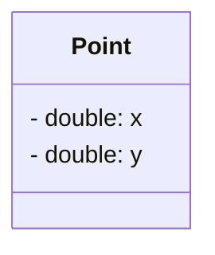

> ***Note:** Template of the Point Struct*

For example, we can define a variable of Point by writing:

```c
struct Point p

// Here, struct Point is a data type and p is a variable.
```

> ***Note:** Structure type and variable declaration of a structure can be either local or global depending on their placement in the code*

Last but not the least, structure member names and names of the structure follow the same rules as laid down for the names of ordinary variables. However, care should be taken to ensure that the name of structure and the name of a structure member should not be the same. 

**Typedef Declarations**

The **typedef** (derived from type definition) keyword enables the programmer to create a new data type name by using an existing data type. By using typedef, no new data is created, rather an alternate name is given to a known data type. The general syntax of using the typedef keyword is given as: 

```c
typedef existing_data_type new_data_type;
```

Note that typedef statement does not occupy any memory; it simply defines a new type. When we precede a struct name with the typedef keyword, then the struct becomes a new type. It is used to make the construct shorter with more meaningful names for types already defined by C or for types that you have declared. For example, consider the following declaration:

```c
typedef struct Point
{
  double x;
  double y;
}
```

Now that you have preceded the structure’s name with the typedef keyword, student becomes a new data type. Therefore, now you can straightaway declare the variables of this new data type
as you declare the variables of type int, float, char, double, etc. To declare a variable of structure Point, you may write:

```c
Point p;
```

#

**Initializing and Accessing Structures Members.**

A structure can be initialized in the same way as other data types are initialized. Initializing a structure means assigning some constants to the members of the structure. The initializers are enclosed in braces and are separated by commas. However, care must be taken to ensure that the initializers match their corresponding types in the structure definition.

The general syntax to initialize a structure variable is as follows:

```c
struct Point
{
  double x;
  double y;
}p = {1.0, 2.5}, q = {3.7};
```

```c
struct Point
{
  double x;
  double y;
};

struct Point p = {1.0, 2.5};
struct Point q = {3.7};
```

This is a illustration of how the values will be assigned to individual fields of the structure:

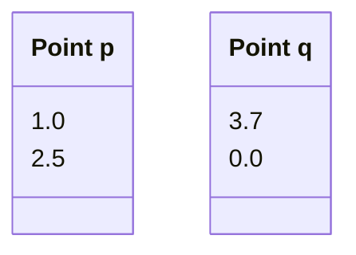

When all the members of a structure are not initialized, it is called partial initialization. In case of partial initialization, first few members of the structure are initialized and those that are
uninitialized are assigned default values.

#

Each member of a structure can be used just like a normal variable, but its name will be a bit longer. A structure member variable is generally accessed using a '.' (dot) operator. The syntax
of accessing a structure or a member of a structure can be given as:

```julia
struct_var.member_name
```

The dot operator is used to select a particular member of the structure. For example, to assign values to the individual data members of the structure variable **p**:

```julia
p.x = 4.5;
p.y = 1.9;
```

To input values for data members of the structure variable **p**:

```c
scanf("%lf", &(p.x));
```

Similarly, to print the values of structure variable **p**:

```c
printf("%lf\n", p.x);
```

Memory is allocated only when we declare the variables of the structure. In other words, the memory is allocated only when we instantiate the structure. In the absence of any variable, structure
definition is just a template that will be used to reserve memory when a variable of type struct is declared.

Once the variables of a structure are defined, we can perform a few operations on them. For example, we can use the assignment operator (=) to assign the values of one variable to another.

**Self-Referenced Structures**

Self-referential structures are those structures that contain a reference to the data of its same type. That is, a self-referential structure, in addition to other data, contains a pointer to a data that is
of the same type as that of the structure. For example, consider the structure node given below.

```c
struct node
{
  int val;
  struct node *next;
};
```

Here, the structure node will contain two types of data: an integer val and a pointer next. You must be wondering why we need such a structure. Actually, self-referential structure is the foundation
of other data structures. We will be using them throughout this guide and their purpose will be clearer to you when we discuss linked lists, trees, and graphs.


## Pointers

Every variable in C has a name and a value associated with it. When a variable is declared, a specific block of memory within the computer is allocated to hold the value of that variable. The size of the allocated block depends on the data type.

Consider the following statement.

```c
int x;
```

When this statement executes, the compiler sets aside **2 bytes of memory** to hold the value 10. It also sets up a symbol tabl in which it adds the symbol **x** and the **relative address in the memory** where those 2 bytes were set aside. Thus, every variable in C has a value and also a **memory location (commonly known as address) associated with it**.

Actually, **pointers are nothing but memory addresses**. A pointer is a variable that contains the memory location of another variable. Therefore, a pointer is a variable that represents the **location of a data item**, such as a variable or an array element. Pointers are frequently used in C*, as they have a number of *useful applications. These applications include:

- Pointers are used to pass information back and forth between functions.
- Pointers enable programmers to return multiple data items from a function via function arguments.
- Pointers provide an alternate way to access the individual elements of an array.
- Pointers are used to pass arrays and strings as function arguments (discussed in subsequent chapters).
- Pointers are used to create complex data structures, such as trees, linked lists, linked stacks, linked queues, and graphs.
- Pointers are used for the dynamic memory allocation of a variable (refer to Appendix A for memory allocation in C programs).

**Declaring Pointer Variables**

The general syntax of declaring pointer variables can be given as below.

```c
dataype *ptr_name;
```

Here, ***data_type*** is the data type of the value that the pointer will point to. For example,

```c
int *ptr;
```

In each of the above statements, a pointer variable is declared to point to a variable of the specified data type. It's worth noting that all pointers, even if they point to different data types, will occupy the same amount of space in memory. However, the exact amount of space they occupy depends on the platform where the code is executed

```c
int x, *ptr;

x = 10;
ptr = &x;
```

In the above statement, **ptr** is the name of the pointer variable. The **\*** informs the compiler that **ptr** is a pointer variable and the int specifies that it will store the address of an integer variable.

An integer pointer variable, therefore, *points to* an integer variable. In the last statement, **ptr** is assigned the address of **x**. The **&** operator retrieves the ddress of **x**, and copies that to the contents of the pointer **ptr**.

We can 'dereference' a pointer, meaning we can access the value of the variable it points to by using the unary * operator, as in *ptr. For example, *ptr = 10 assigns the value 10 to the variable pointed to by ptr, which in this case is equivalent to setting the value of x to 10.

```c
#include <stdio.h>

int main()
{
  int num, *pnum;
  pnum = &num;

  printf("\n Enter the number : ");
  scanf("%d", &num);
  printf("\n The number that was entered is : %d", *pnum);
  return 0;
}
```

**Output**

```julia
Enter the number : 10
The number that was entered is : 10
```

#

**Null Pointers**

In some cases, we may prefer to have a null pointer which is a special pointer value and does not point to any value. This means that a null pointer does not point to any valid memory address.

To declare a **null pointer**, you may use the predefined constant **NULL** which is defined in several standard header files including **<stdio.h>**, **<stdlib.h>**, and **<string.h>**. After including any of these files in your program, you can write

```c
int *ptr = NULL;
```

You can always check whether a given pointer variable stores the address of some variable or contains **NULL** by writing,

```c
if (ptr == NULL)
{
  statement block;
}
```

**Pointer to Pointers**

The pointers in turn point to data or even to other pointers. To declare pointers to pointers, just add an asterisk * for each level of reference

**For example, consider the following code:**

```c
int x;
int *px, **ppx;

int x = 10;
px = &x;
ppx = &px;
```

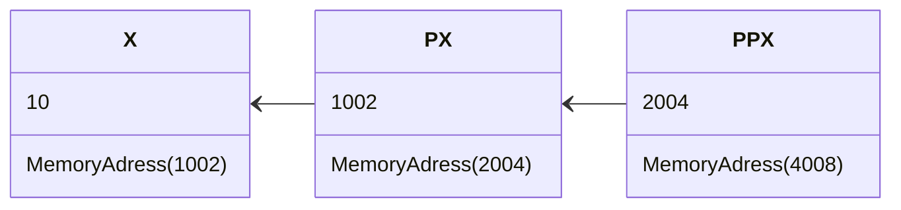

## Recursion

A *Recursive Function* is defined as a function that calls itself to solve a **smaller version of its task until a final call is made** which does not require a call to itself. Since a recursive function
repeatedly calls itself, it makes use of the system stack to temporarily store the return address and local variables of the calling function. Every recursive solution has two major cases:

- ***Base case***, in which the problem is simple enough to be solved directly without making any further calls to the same function.
- ***Recursive case***, in which first the problem at hand is divided into simpler sub-parts. Second the function calls itself but with sub-parts of the problem obtained in the first step. Third, the
result is obtained by combining the solutions of simpler sub-parts.

Therefore, recursion is defining large and complex problems in terms of smaller and more easily solvable problems. In recursive functions, a complex problem is defined in terms of simpler problems and the simplest problem is given explicitly. 

Let us take an example of calculating factorial of a number. To calculate $n!$, we multiply the number with factorial of the number that is 1 less than that number. 

$$n! = n \\ \times \\ (n–1)!$$

Let us say we need to find the value of $5!$

$$5! = 5 \\ \times \\ 4 \\ \times \\ 3 \\ \times \\ 2 \\ \times \\ 1 = 120$$

Similarly, we can further expand and rephrase the sentence from above as follows:
	
|  **Problem**							|  **Solution** |
| :---								| :---	|
|  $5!$								| $5 \\ \times \\ 4 \\ \times \\ 3 \\ \times \\ 2 \\ \times \\ 1$ |
|  $5 \\ \times \\ 4!$						| $5 \\ \times \\ 4 \\ \times \\ 3 \\ \times \\ 2 \\ \times \\ 1$ |	
|  $5 \\ \times \\ 4 \\ \times 3!$				| $5 \\ \times \\ 4 \\ \times \\ 3 \\ \times \\ 2 \\ \times \\ 1$ |			
|  $5 \\ \times \\ 4 \\ \times \\ 3 \\ \times 2!$		| $5 \\ \times \\ 4 \\ \times \\ 3 \\ \times \\ 2 \\ \times \\ 1$ |		
|  $5 \\ \times \\ 4 \\ \times \\ 3 \\ \times 2 \\ \times 1! $	| $5 \\ \times \\ 4 \\ \times \\ 3 \\ \times \\ 2 \\ \times \\ 1$ |

> ***Note:** The factorial of 0 and 1 is defined to be 1.*

Now if you look at the problem carefully, you can see that we can write a recursive function to calculate the factorial of a number. Every recursive function must have a base case and a recursive case. For the factorial function:

- ***Base case*** is when $n = 1$, because if $n = 1$, the result will be $1$ as $1! = 1$.
- ***Recursive case*** of the factorial function will call itself but with a smaller value of n, this case can be given as:

$$factorial(n) = n \\ \times \\ factorial (n–1)$$

#

 **Recursive Factorial**

Factorial is a mathematical operation that calculates the product of all positive integers up to a given number. It is denoted by the symbol "!" and is often used in permutations, combinations, and other mathematical computations. 

The combination of factorials and recursion provides an elegant and efficient way to calculate factorials, breaking down the problem into simpler sub-problems until reaching the base case. 

Here's a brief example in C demonstrating the calculation of factorial using recursion:

 ```c
#include <stdio.h>

// Recursive function to calculate factorial
int factorial(int n)
{
	if (n == 0 || n == 1)
		return 1;
	else
		return n * factorial(n - 1);
}

int main(void)
{
	int number;
	
	// Ask the user for a positive integer
	printf("Enter a positive integer: ");
	scanf("%d", &number);
	
	// Check if the number is non-negative
	if (number < 0)
		printf("Please enter a non-negative number.\n");
	else 
		// Call the factorial function and display the result
		printf("The factorial of %d is %d\n", number, factorial(number));
	return 0;
}
```

From the above example, let us analyse the steps of a recursive program

- Specify the base case which will stop the function from making a call to itself.
- Check to see whether the current value being processed matches with the value of the base case. If yes, process and return the value.
- Divide the problem into smaller or simpler sub-problems. 
- Call the function from each sub-problem. 
- Combine the results of the sub-problems.
- Return the result of the entire problem.

In summary, the program employs a recursive approach to compute the factorial of the user-provided number and then displays the result.

#

**Fibonacci Series**

The *Fibonacci Series* is a sequence of numbers where each number is the sum of the two preceding ones, usually starting with 0 and 1. This sequence was introduced to the Western world by the Italian mathematician **Leonardo Fibonacci** in his 1202 book *Liber Abaci* but the sequence had been previously described in Indian mathematics.

The Fibonacci sequence begins with 0 and 1, and each subsequent number in the sequence is the sum of the two preceding ones. Mathematically, it can be defined by the recurrence relation:

$$F(n)= F(n−1) + F(n−2)$$

Where $F(0) = 0$ and $F(1) = 1$. The Fibonacci sequence is **infinite**, and it goes: $0, 1, 1, 2, 3, 5, 8, 13, 21, 34$, and so on.

In computer science, the Fibonacci sequence is often used as an illustrative example for recursion and dynamic programming, as the computation of Fibonacci numbers can be efficiently optimized using these techniques. 

In summary, the Fibonacci sequence is defined by the formula  $F(n) = F(n−1 )+ F(n−2)$ with two base cases, reflecting the division of every problem into two smaller problems.

$$
\ F(n) =
  \begin{cases}
    0								  & \quad \text{if } n = 0\\
    1        				  & \quad \text{if } n = 1\\
	  F(n-1) + F(n-2)   & \quad \text{otherwise }\\
  \end{cases}
\
$$

The following C code demonstrates how to calculate the Fibonacci series using a recursive approach.

```c
#include <stdio.h>

// Recursive function to calculate Fibonacci number at a given position
int fibonacci(int n)
{
  if (n <= 1)
    return n;
  else
    return fibonacci(n - 1) + fibonacci(n - 2);
}

int main(void)
{
  int terms;
	
  // User input for the number of terms in the Fibonacci series
  printf("Enter the number of terms in the Fibonacci series: ");
  scanf("%d", &terms);

  // Check if the input is non-negative
  if (terms < 0)
    printf("Please enter a non-negative integer.\n");
  else
  {
  // Display the Fibonacci series using recursion
  printf("Fibonacci series up to term %d:\n", terms);
  for (int i = 0; i < terms; ++i) {
    printf("%d, ", fibonacci(i));
  }
  printf("\n");
 }
 return 0;
}
```
#

### Types of Recursion

Recursion is a technique that breaks a problem into one or more sub-problems that are similar to the original problem. Any recursive function can be characterized based on:

- Whether the function calls itself directly or indirectly (*direct* or *indirect recursion*)
- Whether any operation is pending at each recursive call (*tailrecursive* or *not*)
- The structure of the calling pattern (*linear* or *tree-recursive*).

**Direct Recursion**

A function is said to be *directly* recursive if it explicitly calls itself. 

```c
int function(int n)
{
  if (n == 0)
    return n;
  else
    return (function(n–1));
}
```

**Indirect Recursion**

A function is said to be *indirectly* recursive if it contains a call to another function which ultimately calls it.

```c
int functionA(int n)
{
  if (n == 0)
    return n;
  else
    return functionB(n);
}

int functionB(int x)
{
  return functionA(x–1);
} 
```

**Tail Recursion**

A recursive function is said to be *tail* recursive if no operations are pending to be performed when the recursive function returns to its caller. when the called function returns, the returned value
is immediately returned from the calling function. 

Tail recursive functions are highly desirable because they are much more efficient to use as the amount of information that has to be stored on the system stack is independent of the number of recursive calls.

```c
int factorialA(n)
{
  return factorialB(n, 1);
}

int factorialB(int n, int res)
{
  if (n == 1)
    return res;
  else
    return factorialB(n–1, n*res);
}
```

Whenever there is a pending operation to be performed, the function becomes non-tail recursive. In such a non-tail recursive function, information about each pending operation must be stored, so the
amount of information directly depends on the number of calls. As shown in this example:

```c
int factorial(int n)
{
  if (n == 1)
    return 1;
  else
  return (n * factorial(n–1));
} 
```

In the code, $factorialB$  function preserves the syntax of $factorialA(n)$. Here the recursion occurs in the $factorialB$ function and not in $factorialA(n)$ function.

Carefully observe that $factorialB$ has no pending operation to be performed on return from recursive calls. The value computed by the recursive call is simply returned without any modification. So in this case, the amount of information to be stored on the system stack is constant (only the values of $n$ and res need to be stored) and is independent of the number of recursive calls. 

#

**Recursion versus Iteration**

Recursion is more of a top-down approach to problem solving in which the original problem is divided into smaller sub-problems. On the contrary, iteration follows a bottom-up approach that
begins with what is known and then constructing the solution step by step. 

Recursion is an excellent way of solving complex problems especially when the problem can be defined in recursive terms. For such problems, a recursive code can be written and modified in a much simpler and clearer manner. 

However, recursive solutions are not always the best solutions. In some cases, recursive programs may require substantial amount of run-time overhead. Therefore, when implementing a recursive solution, there is a trade-off involved between the time spent in constructing and maintaining the program and the cost incurred in running-time and memory space required for the execution of the program. 

Whenever a recursive function is called, some amount of overhead in the form of a run time stack is always involved. Before jumping to the function with a smaller parameter, the original parameters, the local variables, and the return address of the calling function are all stored on the system stack. Therefore, while using recursion a lot of time is needed to first push all the information on the stack when the function is called and then again in retrieving the information stored on the stack once the control passes back to the calling function.

To conclude, one must use recursion only to find solution to a problem for which no obvious iterative solution is known. To summarize the concept of recursion, let us briefly discuss the pros
and cons of recursion.

The advantages of using a recursive program include the following:

- Recursive solutions often tend to be shorter and simpler than non-recursive ones.
- Code is clearer and easier to use.
- Recursion works similar to the original formula to solve a problem.
- Recursion follows a divide and conquer technique to solve problems.
- In some (limited) instances, recursion may be more efficient.

The drawbacks/disadvantages of using a recursive program include the following:

- For some programmers and readers, recursion is a difficult concept.
- Recursion is implemented using system stack. If the stack space on the system is limited, recursion to a deeper level will be difficult to implement.
- Aborting a recursive program in midstream can be a very slow process.
- Using a recursive function takes more memory and time to execute as compared to its nonrecursive counterpart.
- It is difficult to find bugs, particularly while using global variables.

The advantages of recursion pay off for the extra overhead involved in terms of time and space required. 

#

**Before we move on to the next topic in this document, it's important to communicate a relevant decision regarding the purpose of this guide.**

**In the upcoming sections, we will delve into the main Abstract Data Types (ADTs), highlighted throughout the guide as essential for its construction. As emphasized in the description, this guide serves as an introductory foundation.**

**The following topics will be covered succinctly. For a deeper understanding of the mentioned data structures, I recommend referring to the reference works cited in this document. Thank you for your understanding.**

## Linked Lists 

We have studied that an array is a linear collection of data elements in which the elements are stored in consecutive memory locations. While declaring arrays, we have to specify the size of the array, which will restrict the number of elements that the array can store. For example, if we declare an array as int $marks[10]$, then the array can store a maximum of $10$ data elements but not more than that. 

But what if we are not sure of the number of elements in advance? Moreover, to make efficient use of memory, the elements must be stored randomly at any location rather than in consecutive locations. So, there must be a data structure that removes the restrictions on the maximum number of elements and the storage condition to write efficient programs.

Linked list is a data structure that is free from the aforementioned restrictions. A *linked list* does not store its elements in consecutive memory locations and the user can add any number of elements to it. However, unlike an array, a linked list does not allow random access of data. Elements in a linked list can be accessed only in a sequential manner. But like an array, insertions and deletions can be done at any point in the list in a constant time.

**Basic Terminologies**

A linked list is a linear collection of data elements known as *nodes*. Functioning as a fundamental data structure, it serves as a foundational component for implementing various data structures like stacks, queues, and their derivatives. Conceptually, a linked list resembles a sequence of nodes, akin to a train, where each node comprises data fields and a pointer to the subsequent node.

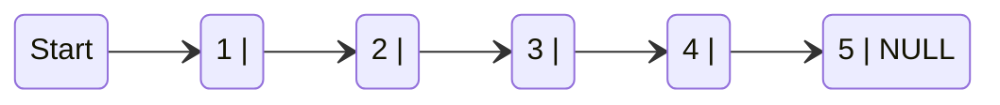

We can see a linked list in which every node contains two parts, an integer and a pointer to the next node. The left part of the node which contains data may include a simple data type, an array, or a structure. The right part of the node contains a pointer to the next node (or address of the next node in sequence). The last node will have no next node connected to it, so it will store a special value called $NULL$. 

While programming, we usually define $NULL$ as $–1$. Hence, a $NULL$ pointer denotes the end of the list. Since in a linked list, every node contains a pointer to another node which is of the same type, it is also called a *self-referential data type*.

Linked lists contain a pointer variable $START$ that stores the address of the first node in the list. We can traverse the entire list using START which contains the address of the first node; the next
part of the first node in turn stores the address of its succeeding node. Using this technique, the individual nodes of the list will form a chain of nodes. If $START = NULL$, then the linked list is empty
and contains no nodes.

In C, we can implement a linked list using the following code:

```c
struct node
{
  int data;
  struct node *next;
};
```

> ***Note:** Linked lists provide an efficient way of storing related data and perform basic operations such as
insertion, deletion, and updation of information at the cost of extra space required for storing address of the
next node.*

In order to form a linked list, we need a structure called *node* which has two fields, **DATA** and **NEXT**. **DATA** will store the information part and **NEXT** will store the address of the next node in sequence.

In the table, we can see that the variable START is used to store the address of the first node. Here, in this example, START = 1, so the first data is stored at address 1, which is H. The
corresponding **NEXT** stores the address of the next node, which is 4. So, we will look at address 4 to fetch the next data item.

The second data element obtained from address 4 is E. Again, we see the corresponding **NEXT** to go to the next node. From the entry in the **NEXT**, we get the next address, that is 7, and
fetch L as the data. We repeat this procedure until we reach a position where the **NEXT** entry contains –1 or NULL, as this  would denote the end of the linked list. When we traverse **DATA** and **NEXT** in this manner, we finally see that the linked list in the above example stores characters that when put together form the word **HELLO**.


|		 	 |	**Data**	 	 |	**Next**	  |
|	:---	 	 	 | :--- | :---	|
|	1	 	 	 | 	H	 |	4		|
|	2	 	 	 | 		 |			|
|	3	 	 	 | 		 |			|
|	4	 	   | 	E	 |	7		|
|	5	 	 	 | 		 |			|
|	6    	 | 		 |			|
|	7	 	 	 | 	L	 |	8		|
|	8	 	 	 | 	L	 |	10		|
| 9		 	 | 		 |			|
|	10	 	 | 	O	 |	-1		|

> ***Note:** The Memory Adress 1 corresponds to the START, pointing to the first element of the linked list in the memory*

Note that this table shows a chunk of memory locations which range from 1 to 10. The shaded portion contains data for other applications. Remember that the nodes of a linked list need not be in consecutive memory locations. In our example, the nodes for the linked list are stored at addresses 1, 4, 7, 8, and 10.

#

**Linked Lists versus Arrays**

Arrays and linked lists, both linear data structures, exhibit key distinctions. Linked lists, in contrast to arrays, do not demand contiguous memory locations and lack random data access, relying on sequential access. Nevertheless, both structures share the efficiency of constant-time insertions and deletions.

A notable advantage of linked lists lies in their dynamic flexibility, enabling the addition of an arbitrary number of elements. In contrast, arrays, when declared with a fixed size, such as int $marks[20]$, are limited to storing a predefined maximum of $20$ data elements. Linked lists thus offer adaptability without the constraints associated with fixed-size arrays.

|   |   Roll No   |   Name   |   Aggregate   |   Next   |   Grade        |
|:-:|:-----------:|:--------:|:-------------:|:--------:|:--------------:|
| 1 |      S01     |    Ram   |       78      |     6    |  Distinction   |
| 2 |      S02     |  Shyam   |       64      |    14    | First division |
| 3 |      S03     |  Mohit   |       89      |    17    |  Outstanding   |
| 4 |      S04     |  Rohit   |       77      |     2    |  Distinction   |
| 5 |      S05     |  Varun   |       86      |     1    |  Outstanding   |
| 6 |      S06     |  Karan   |       65      |    12    | First division |
| 7 |      S07     |  Veena   |       54      |    –1    | Second division|
| 8 |      S08     |  Meera   |       67      |     4    | First division |
| 9 |      S09     |  Krish   |       45      |    13    | Third division |
|10 |      S10     |  Kusum   |       91      |    11    |  Outstanding   |
|11 |      S11     |  Silky   |       72      |     7    | First division |
|12 |      S12     | Monica   |       75      |     1    |  Distinction   |
|13 |      S13     | Ashish   |       63      |    19    | First division |
|14 |      S14     | Gaurav   |       61      |     -    | First division |

> ***Note:** Students’ Linked list*

Thus, linked lists provide an efficient way of storing related data and performing basic operations such as insertion, deletion, and updation of information at the cost of extra space required for storing the address of next nodes.

#

**Memory Allocation and De-allocation for a Linked List**

In the representation of a linked list in memory, adding a node involves locating free space, which is then utilized to store the relevant information. For instance, consider the linked list with student roll numbers, Biology marks, and a **NEXT** field storing the address of the next node. If a new student joins and takes the same test, their marks need to be recorded in the linked list. The empty spaces indicates free space, offering 4 available memory locations. When nodes are deleted, the operating system manages the transition of memory status from occupied to available. While the detailed mechanism is beyond the scope of this book, as a programmer, your responsibility is to handle code for insertions and deletions in the list. The computer autonomously maintains a list of free memory cells known as the free pool.

<table>

<tr>
  <td>
  
|   | Roll No | Marks | Next |
|---|---------|-------|------|
| 1 |   S01   |   78  |   2  |
| 2 |   S02   |   84  |   3  |
| 3 |   S03   |   45  |   5  |
| 4 |         |       |      |
| 5 |   S05   |   98  |   7  |
| 6 |         |       |      |
| 7 |   S07   |   55  |   8  |
| 8 |   S08   |   34  |  10  |
| 9 |         |   |      |
|10 |   S10   |   90|  11  |
|11 |   S11   |   87|  12  |
|12 |   S12   |   86|  13  |
|13 |   S13   |   67|  15  |
|14 |         |       |      |
|15 |   S15   |   56    |  -1  |

</td>
<td>

|   | Roll No | Marks | Next |
|---|---------|-------|------|
| 1 |   S01   |   78  |   2  |
| 2 |   S02   |   84  |   3  |
| 3 |   S03   |   45  |   5  |
| 4 |   S12   |   45  |  -1  |
| 5 |   S05   |   98  |   7  |
| 6 |         |       |      |
| 7 |   S07   |   55  |   8  |
| 8 |   S08   |   34  |  10  |
| 9 |         |       |      |
|10 |   S10   |   90  |  11  |
|11 |   S11   |   87  |  12  |
|12 |   S12   |   86  |  13  |
|13 |   S13   |   67  |  15  |
|14 |         |       |      |
|15 |   S15   |   56  |   4  |

</td></tr> 
</table>

> ***Note:** (left) Students’ linked list and (right) linked list after the insertion of new student’s record*

Deleting a node or an entire linked list involves releasing the occupied space back to the free pool for potential reuse by other programs. The operating system handles this task during idle CPU periods or when programs face memory shortages. It scans through memory cells, marking those in use and adding the unused ones to the free pool. This process, known as garbage collection, ensures efficient memory utilization. In the next section, we are going to explore one of the most common types of linked lists used as a basis for other structures.

# 

**SINGLY LINKED Lists**

A singly linked list is the simplest type of linked list in which every node contains some data and a pointer to the next node of the same data type. By saying that the node contains a pointer to the next node, we mean that the node stores the address of the next node in sequence. A singly linked list allows traversal of data only in one way. 


**Traversing a Linked List**

Traversing a linked list means accessing the nodes of the list in order to perform some processing on them. Remember a linked list always contains a pointer variable **START** which stores the address of the first node of the list. End of the list is marked by storing $NULL$ or $–1$ in the **NEXT** field of the last node. For traversing the linked list, we also make use of another pointer variable PTR which points to the node that is currently being accessed. The algorithm to traverse a linked list is shown below.

```r
STEP 1: [INITIALIZE] SET PTR = START
STEP 2: Repeat Steps 3 and 4 while PTR != NULL
STEP 3:        Apply Process to PTR DATA
STEP 4:        SET PTR = PTR NEXT
        [END OF LOOP]
STEP 5: EXIT
```

> ***Note:** Algorithm for traversing a linked list*

In this algorithm, we first initialize **PTR** with the address of **START**. So now, **PTR** points to the first node of the linked list. Then in STEP 2, a while loop is executed which is repeated till PTR processes the last node, that is until it encounters $NULL$. In STEP 3, we apply the process to the current node, that is, the node pointed by **PTR**. In STEP 4, we move to the next node by making the **PTR** variable point to the node whose address is stored in the NEXT field. 

Let us now write an algorithm to count the number of nodes in a linked list. To do this, we will traverse each and every node of the list and while traversing every individual node, we will increment the counter by 1. Once we reach $NULL$, that is, when all the nodes of the linked list have been traversed, the final value of the counter will be displayed.

```r
STEP 1: [INITIALIZE] SET COUNT = 0
STEP 2: [INITIALIZE] SET PTR = START
STEP 3: Repeat Steps 4 and 5 while PTR != NULL
STEP 4:        SET COUNT = COUNT + 1
STEP 5:        SET PTR = PTR->NEXT
        [END OF LOOP]
STEP 6: Write COUNT
STEP 7: EXIT
```

> ***Note:** Algorithm to print the number of nodes in a linked list*

**Searching for a Value in a Linked List**

Searching a linked list means to find a particular element in the linked list. As already discussed, a linked list consists of nodes which are divided into two parts, the information part and the next part. So searching means finding whether a given value is present in the information part of the node or not. If it is present, the algorithm returns the address of the node that contains the value

```r
STEP 1: [INITIALIZE] SET PTR = START
STEP 2: Repeat Step 3 while PTR != NULL
STEP 3:        IF VAL = PTR DATA
                  SET POS = PTR
                  Go To STEP 5
               ELSE
                  SET PTR = PTR NEXT
               [END OF IF]
        [END OF LOOP]
STEP 4: SET POS = NULL
STEP 5: EXIT
```

> ***Note:** Algorithm to search a linked list*

In STEP 1, we initialize the pointer variable **PTR** with **START** that contains the address of the first node. In STEP 2, a while loop is executed which will compare every node’s **DATA** with **VAL** for which the search is being made. If the search is successful, that is, **VAL** has been found, then the address of that node is stored in **POS** and the control jumps to the last statement of the algorithm. However, if the search is unsuccessful, **POS** is set to $NULL$ which indicates that **VAL** is not present in the linked list.

# 

**Inserting a New Node in a Linked List**

In this section, we will explore the addition of a new node to an existing linked list, focusing on a specific insertion case. While I will specifically demonstrate one instance of insertion, for a comprehensive understanding of various insertion scenarios, I encourage you to refer to additional sources provided in the guide.

While we will focus on demonstrating one specific case, there are four methods for adding a new node to an existing linked list, wich are:

- **CASE 1:** The new node is inserted at the beginning.
- **CASE 2:** The new node is inserted at the end.
- **CASE 3:** The new node is inserted after a given node.
- **CASE 4:** The new node is inserted before a given node.

Before we describe the algorithms to perform insertions in the first case, let us first discuss an important term called $OVERFLOW$. Overflow is a condition that occurs when **AVAIL** = **NULL** or no
*free memory cell* is present in the system. When this condition occurs, the program must give an appropriate message.

**Inserting a Node at the Beginning of a Linked List**

Suppose we want to add a new node with data 9 and add it as the first node of the list. Then the following changes will be done in the linked list.


Allocate memory for the new node and initialize its DATA part to 9.

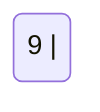

Add the new node as the first node of the list by making the NEXT part of the new node contain the address of **START**.

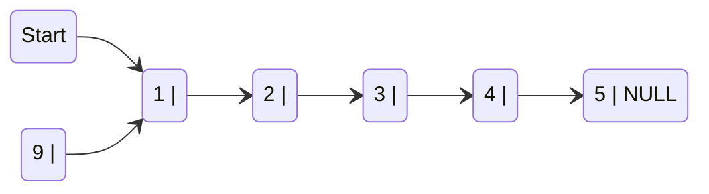

Now make START to point to the first node of the list.


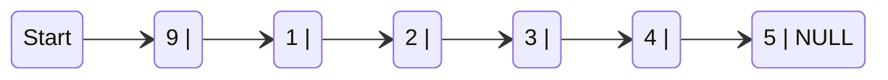

The code illustrates the algorithm for inserting a new node at the beginning of a linked list. In STEP 1, we check for available memory. If the memory is exhausted, an **OVERFLOW** message is printed; otherwise, we allocate space for the new node. The **DATA** part is set with the given **VAL**, and the next part is initialized with the address of the first node in the list, stored in **START**. As the new node becomes the first node (**START** node) of the list, the **START** pointer variable is updated to hold the address of **NEW_NODE**. 

```r
STEP 1: IF AVAIL = NULL
           Write OVERFLOW
           Go to STEP 7
        [END OF IF]
STEP 2: SET NEW_NODE = AVAIL
STEP 3: SET AVAIL = AVAIL NEXT
STEP 4: SET DATA = VAL
STEP 5: SET NEW_NODE NEXT = START
STEP 6: SET START = NEW_NODE
STEP 7: EXIT
```

> ***Note:** Algorithm to insert a new node at the beginning*

Note the following two critical steps:

```r
STEP 2: SET NEW_NODE = AVAIL
STEP 3: SET AVAIL = AVAIL -> NEXT
```

These steps allocate memory for the new node. In C, there are functions like $malloc()$, alloc, and $calloc()$ which automatically do the memory allocation on behalf of the user.

#

**Deleting a Node from a Linked List**

In this section, we will discuss the deletion of a node from an already existing linked list, concentrating on a particular deletion case. While I will demonstrate a specific instance of deletion, for a comprehensive understanding of various deletion scenarios, I recommend consulting additional sources outlined in the guide.

While we will focus on demonstrating one specific case, there are three methods for deleting a node in a linked list, wich are:

- **CASE 1:** The first node is deleted.
- **CASE 2:** The last node is deleted.
- **CASE 3:** The node after a given node is deleted

Before diving into the algorithms for these deletion cases, let's touch on a crucial term: $UNDERFLOW$. $UNDERFLOW$ occurs when attempting to delete a node from an empty linked list, signified by conditions like **START** = **NULL** or no more nodes to delete. Upon deletion, the occupied memory is released, returned to the free pool for reuse by other programs. In all deletion cases, we adjust the **AVAIL** pointer to point to the most recently vacated address.

**Deleting the First Node from a Linked List**

Consider the linked list below. When we want to delete a node from the beginning of the list, then the following changes will be done in the linked list.

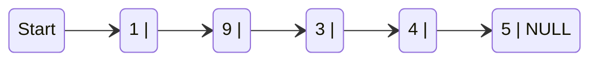

Make START to point to the next node in sequence.

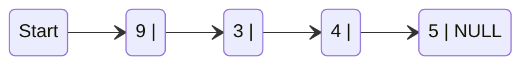


In the code below, shows the algorithm to delete the first node from a linked list. Initially, we verify the existence of the linked list in STEP 1 by checking if **START** = **NULL**. If there are no nodes, the control transfers to the last statement of the algorithm. In the presence of nodes, we employ a pointer variable **PTR**, initialized to point to the first node using **START**. Proceeding to STEP 3, **START** is updated to point to the next node in sequence, and the memory occupied by the initially pointed node (**PTR**) is freed and returned to the free pool.


```r
STEP 1: IF START = NULL
           Write UNDERFLOW
           Go to STEP 5
        [END OF IF]
STEP 2: SET PTR = START
STEP 3: SET START = START NEXT
STEP 4: FREE PTR
STEP 5: EXIT
```

> ***Note:** Algorithm to delete the first node*

#

**In addition to the Single Linked List discussed earlier, we will now introduce three more data structures related to Linked Lists.**

**Please note that for the purpose of this introductory guide, we recommend referring to the cited sources at the end of the document for more in-depth information. Thank you.**

#

**CIRCULAR LINKED LISTs**

In a circular linked list, the last node contains a pointer to the first node of the list. We can have a circular singly linked list as well as a circular doubly linked list. While traversing a circular linked list, we can begin at any node and traverse the list in any direction, forward or backward, until we reach the same node where we started. Thus, a circular linked list has no beginning and no ending.

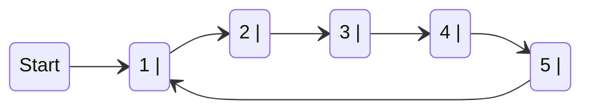

> ***Note:** Circular Linked List*

The only downside of a circular linked list is the complexity of iteration. Note that there are no NULL values in the NEXT part of any of the nodes of list.

#

**DOUBLY LINKED LISTS**

A doubly linked list or a two-way linked list is a more complex type of linked list which contains a pointer to the next as well as the previous node in the sequence. Therefore, it consists of three parts—data, a pointer to the next node, and a pointer to the previous node.

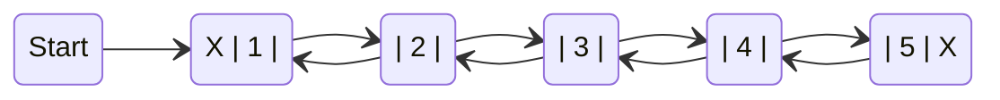

> ***Note:** Doubly Linked List*

In C, the structure of a doubly linked list can be given as

```c
struct node
{
  struct node *prev;
  int data;
  struct node *next;
};
```

The PREV field of the first node and the NEXT field of the last node will contain NULL. The PREV field is used to store the address of the preceding node, which enables us to traverse the list in the
backward direction.

Thus, we see that a doubly linked list calls for more space per node and more expensive basic operations. However, a doubly linked list provides the ease to manipulate the elements of the list as it maintains pointers to nodes in both the directions (forward and backward). The main advantage of using a doubly linked list is that it makes searching twice as efficient. 

#

**CIRCULAR DOUBLY LINKED LISTs**

A circular doubly linked list, or circular two-way linked list, is a more intricate type of linked list featuring pointers to both the next and previous nodes in the sequence. Unlike a doubly linked list, the circular doubly linked list doesn't have NULL in the previous field of the first node and the next field of the last node. Instead, the next field of the last node stores the address of the first node (START), and the previous field of the first node stores the address of the last node.

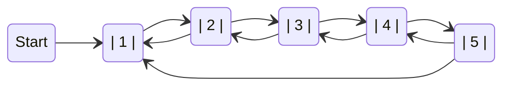

> ***Note:** Circular doubly Linked List*

Since a circular doubly linked list contains three parts in its structure, it calls for more space per node and more expensive basic operations. However, a circular doubly linked list provides the ease to manipulate the elements of the list as it maintains pointers to nodes in both the directions (forward and backward). The main advantage of using a circular doubly linked list is that it makes search operation twice as efficient.

## Stacks

A stack is a fundamental data structure that organizes its elements in a sequential manner. To illustrate the concept of stacks, consider a stack of plates where each plate is stacked on top of another. When removing a plate, you start with the topmost one. Consequently, adding and removing elements (plates) is restricted to the topmost position.

In the realm of data structures, a stack is a linear structure that adheres to the same principle—elements are added and removed exclusively from one end known as the **TOP**. This characteristic gives rise to the term **LIFO** (Last-In-First-Out), signifying that the element inserted last is the first one to be taken out.

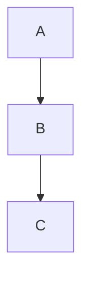

The system stack plays a crucial role in guaranteeing the correct execution order of functions. Stacks find extensive applications in scenarios where the sequence of processing holds utmost significance, particularly when certain operations need to be deferred until specific conditions are met.

The implementation of stacks can be accomplished through either arrays or linked lists. Subsequent sections will delve into the details of both array and linked list implementations of stacks.

#

### Array Representation of Stacks

In the computer's memory, stacks can be depicted as a linear array. Each stack is equipped with a variable denoted as $TOP$, responsible for preserving the address of the uppermost element within the stack. This position serves as the point for adding or removing elements. Another variable, named $MAX$, is utilized to store the maximum capacity of the stack, indicating the maximum number of elements it can accommodate.

If $TOP$ is set to $NULL$, it signifies an empty stack. Conversely, if $TOP$ equals $MAX–1$, it indicates that the stack has reached its full capacity. (The usage of $MAX–1$ is due to array indices commencing from 0.)

<div align = "center">
  <table>
      <tr>
          <td>A</td>
          <td>AB</td>
          <td>ABC</td>
          <td>ABCD</td>
          <td>ABCDE</td>
      </tr>
      <tr>
        <th>0</th>
        <th>1</th>
        <th>2</th>
        <th>3</th>
        <th>4</th>
      </tr>
  </table>
</div>

> ***Note:** Stack*

The stack shows that $TOP = 4$, so insertions and deletions will be done at this position.

#

### Operations on a Stack

| Operation | Description                                                    |
|----------|--------------------------------------------------------------|
| $Push$     | This operation involves adding an element to the top of the stack. |
| $Pop$      | The pop operation entails removing the element from the top of the stack. |
| $Peek$     | The peek operation returns the value of the uppermost element present in the stack. |

#

**Push Operation**

The push operation is used to insert an element into the stack. The new element is added at the topmost position of the stack. However, before inserting the value, we must first check if $TOP = MAX–1$, because if that is the case, then the stack is full and no more insertions can be done. If an attempt is made to insert a value in a stack that is already full, an OVERFLOW message is printed. Consider the stack given below.

<div align = "center">
  <table>
      <tr>
          <td>1</td>
          <td>2</td>
          <td>3</td>
          <td>4</td>
          <td>5</td>
          <td></td>
          <td></td>
      </tr>
      <tr>
        <th>0</th>
        <th>1</th>
        <th>2</th>
        <th>3</th>
        <th>4</th>
        <th>5</th>
        <th>6</th>
      </tr>
  </table>
</div>

> ***Note:** TOP = 4*

To insert an element with value 6, we first check if $TOP = MAX–1$. If the condition is false, then we increment the value of $TOP$ and store the new element at the position given by stack[TOP]. Thus, the updated stack becomes as shown below.

<div align = "center">
  <table>
      <tr>
          <td>1</td>
          <td>2</td>
          <td>3</td>
          <td>4</td>
          <td>5</td>
          <td>6</td>
          <td></td>
      </tr>
      <tr>
        <th>0</th>
        <th>1</th>
        <th>2</th>
        <th>3</th>
        <th>4</th>
        <th>5</th>
        <th>6</th>
      </tr>
  </table>
</div>

> ***Note:** Stack after Insertion*

#

Below is a concise algorithm detailing the steps for performing the operation of inserting an element into a stack. By following these steps, one can gain an understanding of the efficient and organized functioning of this fundamental process in data structures.

```r
STEP 1: IF TOP = MAX-1
          PRINT OVERFLOW
        [END OF IF]
STEP 2: SET TOP = TOP + 1
STEP 3: SET STACK[TOP] = VALUE
STEP 4: END
```

> ***Note:** Algorithm to insert an element in a stack*

In STEP 1, we initially check for the OVERFLOW condition. In STEP 2, TOP is incremented so that it points to the next location in the array. Finally, in STEP 3, the value is stored in the stack at the location pointed to by $TOP$.

These steps describe the process of inserting an element into the stack. First, we ensure there is available space, avoiding overflow. Then, we move the reference to the next valid position in the stack, and finally, we store the value at that position. This algorithm is crucial for maintaining proper order and control in a stack data structure.

#

**Pop Operation**

The pop operation is employed to remove the uppermost element from the stack. Prior to deletion, it is crucial to verify if $TOP = NULL$ because if this condition holds true, it signifies that the stack is empty, rendering further deletions impossible. If an attempt is made to delete a value from an already empty stack, an UNDERFLOW message is displayed.

<div align = "center">
  <table>
      <tr>
          <td>1</td>
          <td>2</td>
          <td>3</td>
          <td>4</td>
          <td>5</td>
          <td>6</td>
          <td></td>
      </tr>
      <tr>
        <th>0</th>
        <th>1</th>
        <th>2</th>
        <th>3</th>
        <th>4</th>
        <th>5</th>
        <th>6</th>
      </tr>
  </table>
</div>

To delete the topmost element, we first check if $TOP = NULL$. If the condition is false, then we decrement the value pointed by $TOP$. Thus, the updated stack becomes as shown below.

<div align = "center">
  <table>
      <tr>
          <td>1</td>
          <td>2</td>
          <td>3</td>
          <td>4</td>
          <td>5</td>
          <td></td>
          <td></td>
      </tr>
      <tr>
        <th>0</th>
        <th>1</th>
        <th>2</th>
        <th>3</th>
        <th>4</th>
        <th>5</th>
        <th>6</th>
      </tr>
  </table>
</div>

> ***Note:** Stack after Deletion*

As represented earlier, upon analyzing the stack before and after the execution of the pop operation, we observe that before the operation, $TOP$ equals 5, and after the operation, the variable is updated to $TOP = 4$.

#

This algorithm outlines the systematic steps involved in efficiently removing elements from the stack, offering a clear understanding of this fundamental operation within data structures.

```r
STEP 1: IF TOP = NULL
          PRINT UNDERFLOW
        [END OF IF]
STEP 2: SET VAL = STACK[TOP]
STEP 3: SET TOP = TOP - 1
STEP 4: END
```

> ***Note:** Algorithm to delete an element from a stack*

In STEP 1, the initial action involves checking for the presence of the UNDERFLOW condition. Following this initial check, the algorithm progresses to STEP 2. In STEP 2, the value stored at the location in the stack, pointed to by the $TOP$ variable, is retrieved and stored in the variable VAL. Finally, in STEP 3, the $TOP$ variable is decremented, representing the adjustment of the stack pointer. These steps collectively outline a process for managing underflow conditions, retrieving a value from the stack, and updating the stack pointer accordingly.

#

**Peek Operation**

Peek is an operation that returns the value of the topmost element of the stack without deleting it from the stack.

```r
STEP 1: IF TOP = NULL
          PRINT STACK IS EMPTY
          Goto STEP 3
STEP 2: RETURN STACK[TOP]
STEP 3: END
```

> ***Note:** Algorithm for peek operation*

However, the Peek operation first checks if the stack is empty, i.e., if $TOP = NULL$, then an appropriate message is printed, else the value is returned. Consider the stack given below.

<div align = "center">
  <table>
      <tr>
          <td>1</td>
          <td>2</td>
          <td>3</td>
          <td>4</td>
          <td>5</td>
          <td></td>
          <td></td>
      </tr>
      <tr>
        <th>0</th>
        <th>1</th>
        <th>2</th>
        <th>3</th>
        <th>4</th>
        <th>5</th>
        <th>6</th>
      </tr>
  </table>
</div>

Here, the Peek operation will return 5, as it is the value of the topmost element of the stack.

#

### Linked Representation of Stacks

Creating a stack using an array is a straightforward technique, but it comes with a limitation - the array must be predefined with a fixed size. If the stack is small or its maximum size is known beforehand, this array implementation can be efficient. However, when the array size is undeterminable in advance, an alternative approach, the linked representation, is preferred.

The linked representation of a stack with n elements incurs a storage requirement of $O(n)$, and the typical time complexity for operations is $O(1)$.

In a linked stack, each node consists of two parts - one for storing data and the other for storing the address of the next node. The $START$ pointer of the linked list serves as the $TOP$. 

All insertions and deletions occur at the node pointed to by TOP. If $TOP = NULL$, it indicates that the stack is empty.

```mermaid
classDiagram
    direction LR
    A --> B
    B --> C
    C --> D
    class A["TOP"]{
        9
        next()
    }
    class B["Stack B"]{
        4
        next()
    }
    class C["Stack C"]{
        1
        next()
    }
    class D["Stack D"]{
        5
        NULL()
    }
```

> ***Note:** Linked Stack*

#

### Operations on a Linked Stack

A linked stack supports all the three stack operations, that is, push, pop, and peek.

**Push Operation**

The push operation is used to insert an element into the stack. The new element is added at the topmost position of the stack.

```mermaid
classDiagram
    direction LR
    A --> B
    B --> C
    C --> D
    class A["TOP"]{
        3
        next()
    }
    class B["Stack B"]{
        4
        next()
    }
    class C["Stack C"]{
        1
        next()
    }
    class D["Stack D"]{
        5
        NULL()
    }
```

> ***Note:** Linked Stack*

To insert an element with value 9, we first check if $TOP = NULL$. If this is the case, then we allocate memory for a new node, store the value in its $DATA$ part and $NULL$ in its $NEXT$ part. 

The new node will then be called $TOP$. However, if $TOP != NULL$, then we insert the new node at the beginning of the linked stack and name this new node as $TOP$. 

```mermaid
classDiagram
    direction LR
    E --> A
    A --> B
    B --> C
    C --> D
    class E["TOP"]{
        9
        next()
    }
    class A["Stack A"]{
        3
        next()
    }
    class B["Stack B"]{
        4
        next()
    }
    class C["Stack C"]{
        1
        next()
    }
    class D["Stack D"]{
        5
        NULL()
    }
```

> ***Note:** Linked Stack after inserting a new node*

#

This algorithm outlines the systematic steps involved in efficiently adding elements to a stack implemented as a linked structure. By following these steps, one can gain a clear understanding of the organized and dynamic nature of this fundamental operation within linked stack data structures.

```r
STEP 1: Allocate memory for the new node and name it as NEW_NODE
STEP 2: SET NEW_NODE DATA = VAL
STEP 3: IF TOP = NULL
          SET NEW_NODE NEXT = NULL
          SET TOP = NEW_NODE
        ELSE
          SET NEW_NODE NEXT = TOP
          SET TOP = NEW_NODE
        [END OF IF]
STEP 4: END
```

> ***Note:** Algorithm to insert an element in a Linked Stack*

In STEP 1, memory is allocated for the new node. Moving to STEP 2, the $DATA$ part of the new node is initialized with the value to be stored in the node. In STEP 3, we check if the new node is the first node of the linked list. This is done by checking if $TOP$ equals $NULL$. If the IF statement evaluates to true, then $NULL$ is stored in the $NEXT$ part of the node, and the new node is called $TOP$. However, if the new node is not the first node in the list, then it is added before the first node of the list (that is, the $TOP$ node) and termed as $TOP$.

#

**Pop Operation**

The pop operation is used to delete the topmost element from a stack. However, before deleting the value, we must first check if $TOP = NULL$, because if this is the case, then it means that the stack is empty and no more deletions can be done. If an attempt is made to delete a value from a stack that is already empty, an UNDERFLOW message is printed.

```mermaid
classDiagram
    direction LR
    E --> A
    A --> B
    B --> C
    C --> D
    class E["TOP"]{
        9
        next()
    }
    class A["Stack A"]{
        3
        next()
    }
    class B["Stack B"]{
        4
        next()
    }
    class C["Stack C"]{
        1
        next()
    }
    class D["Stack D"]{
        5
        NULL()
    }
```

> ***Note:** Linked Stack*

In case $TOP != NULL$, then we will delete the node pointed by $TOP$, and make $TOP$ point to the second element of the linked stack.

```mermaid
classDiagram
    direction LR
    A --> B
    B --> C
    C --> D
    class A["TOP"]{
        3
        next()
    }
    class B["Stack B"]{
        4
        next()
    }
    class C["Stack C"]{
        1
        next()
    }
    class D["Stack D"]{
        5
        NULL()
    }
```

> ***Note:** Linked stack after deletion of the topmost element*

#

This algorithm outlines the systematic steps involved in efficiently removing elements from a stack implemented as a linked structure. 

```r
STEP 1: IF TOP = NULL
          PRINT "UNDERFLOW"
          Goto STEP 5
        [END OF IF]
STEP 2: SET PTR = TOP
STEP 3: SET TOP = TOP->NEXT 
STEP 4: FREE PTR
STEP 5: END
```

> ***Note:** Algorithm to delete an element from a Linked Stack*

In STEP 1, we first check for the UNDERFLOW condition. In STEP 2, we use a pointer $PTR$ that points to $TOP$. In STEP 3, $TOP$ is made to point to the next node in sequence. In STEP 4, the memory occupied by $PTR$ is given back to the free pool.

#

### Applications of Stacks

Stacks, a fundamental data structure, find widespread applications across various computational challenges. Their simplicity and efficiency make them valuable tools in problem-solving scenarios, including:

| Application                   | Description                                                                                      |
|-------------------------------|--------------------------------------------------------------------------------------------------|
| **Reversing a List**          | Utilizing stacks to efficiently reverse the order of elements in a list.                           |
| **Parentheses Checker**       | Employing stacks for verifying the balance of parentheses in mathematical expressions.            |
| **Expression Conversion**     | Leveraging stacks to convert mathematical expressions between infix, postfix, and prefix notations.|
| **Tower of Hanoi**            | Using stacks to solve the Tower of Hanoi problem, a classic recursive challenge with specific rules.|

These applications showcase the adaptability of stacks in addressing a range of computational tasks, making them a cornerstone in algorithmic problem-solving.

## Queues

Let us explain the concept of queues using the analogies given below:

- People moving on an escalator. The people who got on the escalator first will be the first one to step out of it.
- People waiting for a bus. The first person standing in the line will be the first one to get into the bus.
- Cars lined at a toll bridge. The first car to reach the bridge will be the first to leave.

In all these examples, we see that the element at the first position is served first. Same is the case with queue data structure. A queue is a **FIFO** (*First-In*, *First-Out*) data structure in which the element that is inserted first is the first one to be taken out. The elements in a queue are added at one end called the $REAR$ and removed from the other end called the $FRONT$.

Queues can be implemented by using either arrays or linked lists. In this section, we will see how queues are implemented using each of these data structures.

#

### Array Representation of Queues

Queues can be easily represented using linear arrays. As stated earlier, every queue has *front* and *rear* variables that point to the position from where deletions and insertions can be done, respectively. 

<div align = "center">
  <table>
      <tr>
          <td>17</td>
          <td>33</td>
          <td>9</td>
          <td>75</td>
          <td>55</td>
          <td>48</td>
          <td></td>
          <td></td>
          <td></td>
          <td></td>
      </tr>
      <tr>
        <th>0</th>
        <th>1</th>
        <th>2</th>
        <th>3</th>
        <th>4</th>
        <th>5</th>
        <th>6</th>
        <th>7</th>
        <th>8</th>
        <th>9</th>
      </tr>
  </table>
</div>

> ***Note:** Queue*

#

### Operations on Queue

These operations are fundamental for manipulating and managing elements in a queue, ensuring the *First In, First Out* order.

| Operation         | Description                                               |
|-------------------|-----------------------------------------------------------|
| $Enqueue (Insert)$  | Adds an element to the end of the queue.                   |
| $Dequeue (Remove)$  | Removes the element at the front of the queue.             |
| $Front$             | Retrieves the element at the front without removing it.   |
| $IsEmpty$           | Checks if the queue is empty.                              |
| $Size$              | Returns the number of elements in the queue.               |

#

**Enqueue Operation**

In this example, $FRONT = 0$ and $REAR = 5$. Suppose we want to add another element with value 81, then $REAR$ would be incremented by 1 and the value would be stored at the position pointed by $REAR$. 

<div align = "center">
  <table>
      <tr>
          <td>17</td>
          <td>33</td>
          <td>9</td>
          <td>75</td>
          <td>55</td>
          <td>48</td>
          <td></td>
          <td></td>
          <td></td>
          <td></td>
      </tr>
      <tr>
        <th>0</th>
        <th>1</th>
        <th>2</th>
        <th>3</th>
        <th>4</th>
        <th>5</th>
        <th>6</th>
        <th>7</th>
        <th>8</th>
        <th>9</th>
      </tr>
  </table>
</div>

The queue after addition would be as shown. Here, $FRONT = 0$ and $REAR = 6$. Every time a new element has to be added, we repeat the same procedure

<div align = "center">
  <table>
      <tr>
          <td>17</td>
          <td>33</td>
          <td>9</td>
          <td>75</td>
          <td>55</td>
          <td>48</td>
          <td>81</td>
          <td></td>
          <td></td>
          <td></td>
      </tr>
      <tr>
        <th>0</th>
        <th>1</th>
        <th>2</th>
        <th>3</th>
        <th>4</th>
        <th>5</th>
        <th>6</th>
        <th>7</th>
        <th>8</th>
        <th>9</th>
      </tr>
  </table>
</div>

> ***Note:** Queue after insertion of a new element*

However, before inserting an element in a queue, we must check for overflow conditions. An *overflow* will occur when we try to insert an element into a queue that is already full. When $REAR = MAX – 1$, where $MAX$ is the size of the queue, we have an overflow condition. Note that we have written $MAX – 1$ because the index starts from 0.

#

This algorithm illustrates the procedure for inserting an element into a queue. 

In STEP 1, we first check for the overflow condition. In STEP 2, we check if the queue is empty. In case the queue is empty, then both $FRONT$ and $REAR$ are set to zero, so that the new value can be stored at the 0th location. 

Otherwise, if the queue already has some values, then $REAR$ is incremented so that it points to the next location in the array. In STEP 3, the value is stored in the queue at the location pointed by $REAR$.

```r
STEP 1: IF REAR = MAX-1
          Write OVERFLOW
          Goto STEP 4
          [END OF IF]
STEP 2: IF FRONT = -1 and REAR = -1
          SET FRONT = REAR = 0
        ELSE
          SET REAR = REAR + 1
        [END OF IF]
STEP 3: SET QUEUE[REAR] = NUM
STEP 4: EXIT
```

> ***Note:** Algorithm to insert an element in a queue*

#

**Dequeue Operation**

If we want to delete an element from the queue, then the value of $FRONT$ will be incremented. Deletions are done from only this end of the queue. 

<div align = "center">
  <table>
      <tr>
          <td>17</td>
          <td>33</td>
          <td>9</td>
          <td>75</td>
          <td>55</td>
          <td>48</td>
          <td>81</td>
          <td></td>
          <td></td>
          <td></td>
      </tr>
      <tr>
        <th>0</th>
        <th>1</th>
        <th>2</th>
        <th>3</th>
        <th>4</th>
        <th>5</th>
        <th>6</th>
        <th>7</th>
        <th>8</th>
        <th>9</th>
      </tr>
  </table>
</div>

> ***Note:** Queue before deletion of an element*

The queue after deletion will be as shown below. Here, $FRONT = 1$ and $REAR = 6$.


<div align = "center">
  <table>
      <tr>
          <td></td>
          <td>33</td>
          <td>9</td>
          <td>75</td>
          <td>55</td>
          <td>48</td>
          <td>81</td>
          <td></td>
          <td></td>
          <td></td>
      </tr>
      <tr>
        <th>0</th>
        <th>1</th>
        <th>2</th>
        <th>3</th>
        <th>4</th>
        <th>5</th>
        <th>6</th>
        <th>7</th>
        <th>8</th>
        <th>9</th>
      </tr>
  </table>
</div>

> ***Note:** Queue after deletion of an element*

Similarly, before deleting an element from a queue, we must check for underflow conditions. An underflow condition occurs when we try to delete an element from a queue that is already empty. 

If $FRONT = –1$ and $REAR = –1$, it means there is no element in the queue. 

#

This algorithm illustrates the procedure to delete an element from a queue. 

In STEP 1, we check for underflow condition. An underflow occurs if $FRONT = –1$ or $FRONT > REAR$. However, if queue has some values, then $FRONT$ is incremented so that it now points to the next value in the queue.

```r
STEP 1: IF FRONT = -1 OR FRONT > REAR
          Write UNDERFLOW
        ELSE
          SET FRONT = FRONT+1
        [END OF IF]
STEP 2: EXIT
````

> ***Note:** Algorithm to delete an element from a queue*

#

### Linked Representation of Queues

We have seen how a queue is created using an array. Although this technique of creating a queue is easy, its drawback is that the array must be declared to have some fixed size. If we allocate space for 50 elements in the queue and it hardly uses 20–25 locations, then half of the space will be wasted. And in case we allocate fewer memory locations for a queue that might end up growing large, a lot of re-allocations will have to be done, thereby creating a lot of overhead and consuming a lot of time.

In case the queue is a very small one or its maximum size is known in advance, then the array implementation of the queue gives an efficient implementation. But if the array size cannot be determined in advance, the other alternative, i.e., the linked representation is used. 

The storage requirement of linked representation of a queue with n elements is $O(n)$, and the typical time requirement for operations is $O(1)$.

```mermaid
classDiagram
    direction LR
    A --> B
    B --> C
    C --> D
    class A["FRONT"]{
        7
        next()
    }
    class B["NODE"]{
        9
        next()
    }
    class C["NODE"]{
        3
        next()
    }
    class D["REAR"]{
        5
        NULL()
    }
```

> ***Note:** Linked Queue*

In a linked queue, every element has two parts: one that stores the data and another that stores the address of the next element. The $START$ pointer of the linked list is used as $FRONT$. Here, we will also use another pointer called $REAR$, which will store the address of the last element in the queue. All insertions will be done at the rear end, and all deletions will be done at the front end. If $FRONT = REAR = NULL$, then it indicates that the queue is empty.

#

### Operations on Linked Queues

A queue has two basic operations: *insert* and *delete* - enqueue and dequeue. The insert operation adds an element to the end of the queue, and the delete operation removes an element from the front or the start of the queue. Apart from this, there is another operation peek which returns the value of the first element of the queue

#

**Enqueue Operation**

The insert operation is used to insert an element into a queue. The new element is added as the last element of the queue.

```mermaid
classDiagram
    direction LR
    A --> B
    B --> C
    C --> D
    class A["FRONT"]{
        7
        next()
    }
    class B["NODE"]{
        2
        next()
    }
    class C["NODE"]{
        3
        next()
    }
    class D["REAR"]{
        5
        NULL()
    }
```

To insert an element with value 9, we first check if $FRONT = NULL$. If the condition holds, then the queue is empty. So, we allocate memory for a new node, store the value in its data part and $NULL$ in its next part. 

The new node will then be called both front and rear. However, if $FRONT != NULL$, then we will insert the new node at the rear end of the linked queue and name this new node as rear.

```mermaid
classDiagram
    direction LR
    A --> B
    B --> C
    C --> D
    D --> E
    class E["REAR"]{
        9
        NULL()
    }
    class A["FRONT"]{
        7
        next()
    }
    class B["NODE"]{
        2
        next()
    }
    class C["NODE"]{
        3
        next()
    }
    class D["NODE"]{
        5
        next()
    }
```

> ***Note:** Linked Queue after inserting a new node*

#

This algorithm illustrates the procedure for inserting an element into a linked queue. 

In STEP 1, the memory is allocated for the new node. In STEP 2, the $DATA$ part of the new node is initialized with the value to be stored in the node. In STEP 3, we check if the new node is the first node of the linked queue. 

This is done by checking if $FRONT = NULL$. If this is the case, then the new node is tagged as $FRONT$ as well as $REAR$. Also, $NULL$ is stored in the $NEXT$ part of the node (which is also the $FRONT$ and the $REAR$ node). 

However, if the new node is not the first node in the list, then it is added at the $REAR$ end of the linked queue (or the last node of the queue).

```r
STEP 1: Allocate memory for the new node and name it as PTR
STEP 2: SET PTR->DATA = VAL
STEP 3: IF FRONT = NULL
          SET FRONT = REAR = PTR
          SET FRONT->NEXT = REAR->NEXT = NULL
        ELSE
          SET REAR->NEXT = PTR
          SET REAR = PTR
          SET REAR->NEXT = PTR
        [END OF IF]
STEP 4: END
```

> ***Note:** Algorithm to insert an element in a linked queue*

#

**Dequeue Operation**

The delete operation in a queue is employed to remove the element that was first inserted, identified by the address stored in the $FRONT$ pointer. However, a critical check is performed before the actual deletion: we must verify if $FRONT$ is equal to $NULL$. If this condition holds true, it indicates that the queue is empty, rendering further deletions impossible. Any attempt to delete a value from an already empty queue results in an underflow, and an appropriate underflow message is printed in such cases. This ensures that the delete operation is executed cautiously, preventing errors caused by attempting to delete from an empty queue.

```mermaid
classDiagram
    direction LR
    A --> B
    B --> C
    C --> D
    class A["FRONT"]{
        7
        next()
    }
    class B["NODE"]{
        2
        next()
    }
    class C["NODE"]{
        3
        next()
    }
    class D["REAR"]{
        5
        NULL()
    }
```

To delete an element, we first check if $FRONT = NULL$. If the condition is false, then we delete the first node pointed by FRONT. The $FRONT$ will now point to the second element of the linked queue.

```mermaid
classDiagram
    direction LR
    B --> C
    C --> D
    class B["FRONT"]{
        2
        next()
    }
    class C["NODE"]{
        3
        next()
    }
    class D["REAR"]{
        5
        NULL()
    }
```

> ***Note:** Linked Queue after deletion of an element*

#

This algorithm illustrates the procedure for deleting an element from a linked queue.

In STEP 1, we first check for the underflow condition. If the condition is true, then an appropriate message is displayed, otherwise in STEP 2, we use a pointer $PTR$ that points to $FRONT$. 

In STEP 3, FRONT is made to point to the next node in sequence. In STEP 4, the memory occupied by $PTR$ is given back to the free pool.

```r
STEP 1: IF FRONT = NULL
          Write "Underflow"
          Go to STEP 5
        [END OF IF]
STEP 2: SET PTR = FRONT
STEP 3: SET FRONT = FRONT->NEXT
STEP 4: FREE PTR
STEP 5: END
```

> ***Note:** Algorithm to insert an element in a linked queue*

#

### Types of Queues


1. **Common Queue (Queue):**
   - **Characteristics:**
     - Follows the order of arrival of elements.
     - The first element to be inserted is the first to be removed (FIFO - First In, First Out).

2. **Priority Queue:**
   - **Characteristics:**
     - Each element has an associated priority.
     - Elements are removed from the queue based on their priority, where higher-priority elements are removed first.
     - Useful in situations where processing elements according to their importance is necessary.

3. **Circular Queue:**
   - **Characteristics:**
     - Has a ring structure, where the last element is connected to the first, forming a cycle.
     - After reaching the last element, the next insertion occurs at the beginning of the queue.
     - Avoids space wastage, as new elements can replace old ones when the queue is full.

4. **Double-ended Queue (Deque):**
   - **Characteristics:**
     - Allows addition and removal of elements at both the beginning and end of the queue.
     - Can be used as a common queue, stack, or priority queue, offering flexibility.

These are just some of the commonly used queues. The choice of queue type depends on the specific requirements of the problem being solved.

#

### Application of Queues

1. **Resource Management:**
   - Queues are widely used as waiting lists for a single shared resource such as a printer, disk, or CPU. This ensures that tasks are processed in the order they are received, following the First In, First Out (FIFO) principle.

2. **Asynchronous Data Transfer:**
   - Queues are utilized to transfer data asynchronously between two processes, where data may not be received at the same rate as it is sent. This is commonly seen in IO buffers, pipes, file IO, and sockets, where the sender and receiver operate independently.

3. **Media Player Playlists:**
   - In media players like MP3 players, portable CD players, and iPods, queues are employed as buffers for playlists. They help manage the order in which songs are played and provide a seamless experience for the user.

4. **Jukebox Playlists:**
   - Queues are used in jukebox playlists to add songs to the end of the list and play them from the front. This ensures that songs are played in the order they were added, creating a queue-like behavior.

5. **Operating System Interrupt Handling:**
   - In operating systems, queues play a crucial role in handling interrupts. When a real-time system can be interrupted (e.g., by a mouse click), it is essential to process these interrupts immediately. Using a FIFO queue ensures that interrupts are handled in the order of their arrival, maintaining a fair and sequential execution.

These examples illustrate the versatility of queues as a fundamental data structure in computer science and various applications. They are essential for managing resources, facilitating communication between processes, and ensuring orderly execution of tasks.


## Trees


## Sorting and Searching Algorithms

In computer science, Sorting and Searching Algorithms are pivotal, shaping the efficiency of data organization and retrieval. Sorting algorithms meticulously arrange data for optimized access, while searching algorithms act as precision tools, swiftly locating specific elements. The commonly used orders are numerical and alphabetical. This chapter delves into various techniques for searching and sorting arrays of numbers or characters.

**Introduction to Searching**

Searching involves determining the presence of a specific value in an array. A successful search provides the location of the value in the array, while an unsuccessful search prompts an appropriate message. Two common methods for searching arrays are *linear search* and *binary search*. The choice between them depends on the organization of values within the array. For instance, if the array is sorted in ascending order, *binary search* is more efficient in terms of complexity.

#

**Linear Search**

Linear search, also known as sequential search, is a straightforward method for finding a specific value in an array. It involves comparing the target value with each element of the array sequentially until a match is found. Linear search is commonly employed for searching unordered lists of elements, where data elements are not sorted. 

For instance, consider the following array:

```c
int A[] = { 10, 8, 2, 7, 3, 4, 9, 1, 6, 5};
```


If the value to be searched is VAL = 7, the linear search determines whether '7' is present in the array. If yes, it returns the position of its occurrence, here, POS = 3 (index starting from 0).

Linear Search, also known as sequential search, stands out as a simple yet fundamental approach for finding a specific value within an array. This method is particularly useful for searching through unordered lists where data elements are not sorted. Let's explore the concept through an example using the C programming language.

```r
LINEAR_SEARCH(A, N, VAL)
  STEP 1: [INITIALIZE] SET POS=-1
  STEP 2: [INITIALIZE] SET I=1
  STEP 3: Repeat STEP 4 while I <= N
  STEP 4:   IF A[I] = VAL
              SET POS = I
              PRINT POS
              Go to STEP 6
          [END OF IF]
        [END OF LOOP]
  STEP 6: EXIT
```

> ***Note:** Algorithm for Linear Search*

In STEPS 1 and 2 of the algorithm, we initialize the values of POS and I. In STEP 3, a while loop is executed until I is less than N (total number of elements in the array). In STEP 4, a check is made to see if a match is found between the current array element and VAL. If a match is found, then the position of the array element is printed; else, the value of I is incremented to match the next element with VAL. However, if all the array elements have been compared with VAL and no match is found, then it means that VAL is not present in the array.

**Complexity of Linear Search Algorithm**

The Linear search algorithm operates in $O(n)$ time, where n represents the number of elements in the array. The best-case scenario occurs when VAL is equal to the first element of the array, resulting in only one comparison. Conversely, the worst-case scenario unfolds when VAL is either not present in the array or equal to the last element, requiring n comparisons in both instances. However, the efficiency of the linear search algorithm can be enhanced when applied to a sorted array.

```c
// Here is a example of a program using the Linear Search technique.
#include <stdio.h>

int linearSearch(int arr[], int n, int val)
{
  int pos = -1; // Initialize POS to -1 (not found)
  int i = 0;    // Initialize I to 0

  while (i < n) {
    // Check if the current element matches VAL
    if (arr[i] == val) {
      pos = i; // Update POS if a match is found
      break;   // Exit the loop
    }

    i++; // Move to the next element
  }

  return pos; // Return the final position (or -1 if not found)
}

int main()
{
  int A[] = {10, 8, 2, 7, 3, 4, 9, 1, 6, 5};
  int val = 7;

  int result = linearSearch(A, sizeof(A) / sizeof(A[0]), val);

  if (result != -1)
    printf("Element %d found at index %d\n", val, result);
  else
    printf("Element %d not found in the array\n", val);

  return 0;
}
```

#

**Binary Search**

Binary search is a highly efficient searching algorithm designed for use with a sorted list. To illustrate its mechanics, let's draw an analogy with a telephone directory. When searching for a specific name, we open the directory from the middle and decide whether to explore the first or second part based on our comparison. This process continues, resembling how we navigate through a directory until we find the desired name.

Take another analogy with a dictionary. Opening it in the middle, we compare the first word on the page with the target word. Depending on the comparison result, we proceed to the first or second half of the dictionary. This iterative process continues until we locate the desired word. The binary search employs a similar mechanism.

Now, let us consider how this mechanism is applied to search for a value in a sorted array declared below. 

```c
int A[ ] = {0, 1, 2, 3, 4, 5, 6, 7, 8, 9, 10};
```

Consider the array A[] is declared and initialized as above and the value to be searched is VAL = 9. 

The algorithm will proceed in the following manner:

| **Iteration** | **BEG** | **END** | **MID** | **A[MID]** | **Comparison Result**        |
|-----------|-----|-----|-----|--------|---------------------------|
| Initial   | 0   | 10  | 5   | A[5] = 12 | A[5] > VAL (9)          |
| 1         | 0   | 4   | 2   | A[2] = 6  | A[2] < VAL (9)          |
| 2         | 3   | 4   | 3   | A[3] = 8  | A[3] < VAL (9)          |
| 3         | 4   | 4   | 4   | A[4] = 10 | A[4] > VAL (9)          |
| 4         | 4   | 3   | -   | -        | Value Found at A[4]      |

Binary Search is an algorithm used for efficiently finding a target value in a sorted array. The process starts with the entire array, and two pointers, $BEG$ and $END$, are initialized to the indices of the first and last elements. The midpoint $MID$ of the array is calculated as the average of $BEG$ and $END$.

In each iteration, the algorithm compares the value at the midpoint, $A[MID]$, with the target value ($VAL$). If they are equal, the search is successful, and the position of the element is returned. If $A[MID]$ is less than $VAL$, the search narrows to the right half of the array by updating $BEG$ to $MID + 1$. If $A[MID]$ is greater than $VAL$, the search narrows to the left half by updating $END$ to $MID - 1$.

This process is repeated iteratively until the target value is found or the search interval becomes empty (when $BEG$ surpasses $END$). If the target value is found, the algorithm returns its position; otherwise, it concludes that the value is not present in the array.

Binary Search is efficient because, with each iteration, it halves the search space, resulting in a logarithmic time complexity for sorted arrays.

In this algorithm, $BEG$ and $END$ define the search segment, with $MID$ initially calculated as $(BEG + END)/2$. The algorithm terminates when $A[MID] = VAL$, setting $POS = MID$ for a successful search. If $VAL$ is not equal to $A[MID]$, adjust $BEG$, $END$, and $MID$ based on the comparison:

- If $VAL < A[MID]$, update $END = MID – 1$.
- If $VAL > A[MID]$, update $BEG = MID + 1$.

The algorithm concludes when $END$ becomes less than $BEG$, indicating an unsuccessful search.

Let's dive into a step-by-step explanation of the binary search algorithm, unveiling its effectiveness in swiftly finding the desired element with minimal computational effort.

```r
BINARY_SEARCH(A, lower_bound, upper_bound, VAL)
STEP 1: [INITIALIZE] SET BEG = lower_bound, END = upper_bound, POS = -1
STEP 2: Repeat STEPS 3 and 4 while BEG <= END
STEP 3:     SET MID = (BEG + END) / 2
STEP 4:     IF A[MID] = VAL
              SET POS = MID
              PRINT POS
              Go to STEP 6
            ELSE IF A[MID] > VAL
              SET END = MID - 1
            ELSE
              SET BEG = MID + 1
            [END OF IF]
        [END OF LOOP]
STEP 5: IF POS = -1
          PRINT "VALUE IS NOT PRESENT IN THE ARRAY"
        [END OF IF]
STEP 6: EXIT

```

> ***Note:** Algorithm for Binary Search*

In STEP 1, initialize $BEG$, $END$, and $POS$. STEP 2 executes a while loop until $BEG$ is less than or equal to $END$. STEP 3 calculates $MID$. STEP 4 checks if $A[MID]$ equals $VAL$; if true, print $POS$ and exit. If not, adjust $END$ or $BEG$ based on $A[MID]$ and $VAL$. In STEP 5, if $POS = -1$, print a message indicating $VAL$ is not present before exiting.

**Complexity of Binary Search Algorithm**

The complexity of the Binary Search algorithm can be expressed as $f(n)$, where n is the number of elements in the array. This complexity is determined based on the number of comparisons made during the algorithm's execution. In the Binary Search algorithm, with each comparison, the size of the segment where the search has to be made is reduced by half. 

Therefore, to locate a particular value in the array, the total number of comparisons can be expressed as $2^{f(n)} > n$ or $f(n) = log_{2}n$.

```c
// Here is a example of a program using Binary Search
#include <stdio.h>

int binarySearch(int arr[], int low, int high, int key)
{
  while (low <= high) {
    int mid = low + (high - low) / 2;

    // Check if the key is present at the middle
    if (arr[mid] == key)
      return mid;

    // If key is greater, ignore the left half
    else if (arr[mid] < key)
      low = mid + 1;

    // If key is smaller, ignore the right half
    else
      high = mid - 1;
  }

  // If the key is not present in the array
  return -1;
}

int main()
{
  int arr[] = {2, 4, 6, 8, 10, 12, 14, 16, 18, 20};
  int n = sizeof(arr) / sizeof(arr[0]);
  int key = 12;

  // Perform Binary Search
  int result = binarySearch(arr, 0, n - 1, key);

  // Print the result
  if (result != -1)
    printf("Element %d found at index %d\n", key, result);
  else
    printf("Element %d not found in the array\n", key);

  return 0;
}
```

#

**Interpolation Search**

Interpolation search, also known as extrapolation search, is a technique for finding a specified value in a sorted array. It resembles searching for names in a telephone book or keys in an ordered book. Unlike binary search, where the list is divided in two halves each time, interpolation search adapts to the position of the desired value, making it more efficient for cases like finding a specific name near the extreme left in a telephone directory.

```r
INTERPOLATION_SEARCH(A, lower_bound, upper_bound, VAL)
STEP 1: [INITIALIZE] SET LOW = lower_bound, HIGH = upper_bound, POS = –1
STEP 2: Repeat STEPS 3 to 4 while LOW <= HIGH
STEP 3:     SET MID = LOW + (HIGH – LOW) × ((VAL – A[LOW]) / (A[HIGH] – A[LOW]))
STEP 4:     IF VAL = A[MID]
              POS = MID
              PRINT POS
              Go to STEP 6
            ELSE IF VAL < A[MID]
              SET HIGH = MID – 1
            ELSE
              SET LOW = MID + 1
          [END OF IF]
     [END OF LOOP]
STEP 5: IF POS = –1
          PRINT "VALUE IS NOT PRESENT IN THE ARRAY"
        [END OF IF]
STEP 6: EXIT
```

In each step of the interpolation search, the remaining search space for the value to be found is calculated. This calculation is based on the values at the bounds of the search space and the value to be searched. The value found at this estimated position is then compared with the value being searched for. If the two values are equal, then the search is considered complete.

If the values are unequal, the remaining search space is adjusted based on the comparison, narrowing it to the part before or after the estimated position. Interpolation search shares similarities with binary search, but the crucial difference lies in their approach to the remaining search space. Binary search consistently selects the middle value, discarding half based on a comparison between the value found at the estimated position and the target value. In contrast, interpolation search utilizes interpolation to approximate a nearby item before employing a linear search for the exact item's precise location.

**Complexity of Interpolation Search Algorithm**

When $n$ elements of a list to be sorted are uniformly distributed (average case), interpolation search makes about $log(log \\ n)$ comparisons. 

However, in the worst case, that is when the elements increase exponentially, the algorithm can make up to $O(n)$ comparisons.

```c
// Here is a example of a program using Interpolation Search.
#include <stdio.h>

// Interpolation Search function
int interpolationSearch(int arr[], int n, int target)
{
  int low = 0, high = n - 1;

  while (low <= high && target >= arr[low] && target <= arr[high])
  {
    // Estimate the position of target
    int pos = low + ((double)(high - low) / (arr[high] - arr[low])) * (target - arr[low]);

    if (arr[pos] == target)
      return pos; // Target found

    if (arr[pos] < target)
      low = pos + 1; // Search in the right half
    else
      high = pos - 1; // Search in the left half
  }

  return -1; // Target not found
}

// Driver program
int main()
{
  int arr[] = {2, 4, 6, 8, 10, 12, 14, 16, 18, 20};
  int n = sizeof(arr) / sizeof(arr[0]);
  int target = 14;

  int result = interpolationSearch(arr, n, target);

  if (result != -1)
    printf("Element %d found at index %d\n", target, result);
  else
    printf("Element %d not found in the array\n", target);

  return 0;
}
```

#

**Introduction To Sorting**

Sorting is the process of arranging elements in an array in a specific order, either ascending or descending. In ascending order, the elements follow the sequence $A[0] < A[1] < A[2] < ... < A[N].$ 

For instance, given the array:

```c
int A[] = {21, 34, 11, 9, 1, 0, 22};
```

The sorted array in ascending order would be:

```c
A[] = {0, 1, 9, 11, 21, 22, 34};
```

A sorting algorithm is a method that organizes elements in a list, whether in numerical, lexicographical, or user-defined order. Efficient sorting algorithms play a crucial role in optimizing other algorithms, such as search and merge algorithms, which rely on sorted lists for correct execution. Sorting is categorized into:

- **Internal Sorting:** Deals with sorting data stored in the computer's memory.
- **External Sorting:** Deals with sorting data stored in files, particularly useful when handling large datasets that cannot fit into memory.

**Sorting on Multiple Keys**

In real-world applications, there are scenarios where sorting arrays involves multiple keys, allowing for a more refined organization of records. This need arises when a single key is insufficient to uniquely identify a record. For instance, in a large organization, sorting employees might involve organizing them first by departments and then by names in alphabetical order. Other examples of sorting with multiple keys include:

- Telephone directories, where names are sorted by location, category (business or residential), and then alphabetically.  
- In a library, sorting information about books alphabetically based on titles and then by authors' names.  
- Sorting customers' addresses based on the city's name first and then the street.  

> ***Note:** Data records can be sorted based on a property. Such a component or property is called a sort key. A sort key can be defined using two or more sort keys. In such a case, the first key is called the primary sort key, the second is known as the secondary sort key, etc.*

Consider the data records given below:

| Name   | Department          | Salary   | Phone Number |
|--------|---------------------|----------|--------------|
| Janak  | Telecommunications   | 1000000  | 9812345678   |
| Raj    | Computer Science     | 890000   | 9910023456   |
| Aditya | Electronics          | 900000   | 7838987654   |
| Huma   | Telecommunications   | 1100000  | 9654123456   |
| Divya  | Computer Science     | 750000   | 9350123455   |

Now if we take department as the primary key and name as the secondary key, then the sorted order of records can be given as:

| Name   | Department          | Salary   | Phone Number |
|--------|---------------------|----------|--------------|
| Divya  | Computer Science     | 750000   | 9350123455   |
| Raj    | Computer Science     | 890000   | 9910023456   |
| Aditya | Electronics          | 900000   | 7838987654   |
| Huma   | Telecommunications   | 1100000  | 9654123456   |
| Janak  | Telecommunications   | 1000000  | 9812345678   |

Observe that the records are sorted based on department. However, within each department the records are sorted alphabetically based on the names of the employees.

#

**Practical Considerations for Internal Sorting**

Sort keys are fundamental to arranging records, allowing sorting in either ascending or descending order. Records may reside in a contiguous and randomly accessible structure like an array or a dispersed, sequentially accessible structure like a linked list. The sorting logic remains consistent across different data structures, with only implementation details varying. Performance analysis of sorting algorithms considers factors such as:

- Number of sort key comparisons
- Count of record movements
- Best-case performance
- Worst-case performance
- Average-case performance
- Stability, ensuring equivalent elements maintain their relative positions post-sorting.

#

**Bubble Sort**

Bubble Sort is a straightforward sorting method that iteratively moves the largest element to the highest index position in the array segment, specifically for arranging elements in ascending order. The algorithm compares consecutive adjacent pairs of elements, swapping them if the element at the lower index is greater. This process repeats until the unsorted elements are exhausted. The term "bubble sorting" is derived from elements 'bubbling' to the top of the list, ensuring the largest element is correctly positioned at the end after the first pass.

> ***Note:** If the elements are to be sorted in descending order, then in first pass the smallest element is moved to the highest index of the array.*

In the Bubble Sort algorithm, the outer loop iterates for the total number of passes, which is N–1. The inner loop is executed for every pass, but its frequency decreases with each pass as one element becomes correctly positioned. Therefore, for each pass, the inner loop is executed N–I times, where N is the number of elements in the array, and I is the pass count.

```r
BUBBLE_SORT(A, N)
STEP 1: Repeat STEP 2 for I = 1 to N-1
STEP 2: Repeat for J = 1 to N-I
STEP 3:     IF A[J] > A[J+1]
              SWAP A[J] and A[J+1]
            [END OF INNER LOOP]
       [END OF OUTER LOOP]
STEP 4: EXIT
```

> ***Note:** Algorithm for Bubble Sort*

**Complexity of Bubble Sort**

The complexity of the Bubble Sort algorithm depends on the number of comparisons made during the $N–1$ passes. The total number of comparisons can be expressed as:

$$ f(n) = (n – 1) + (n – 2) + (n – 3) + \ldots + 3 + 2 + 1 $$

Simplifying this, we get:

$$ f(n) = \frac{n \cdot (n – 1)}{2}$$

This leads to a complexity of $O(n^2)$, indicating that the time required to execute Bubble Sort is proportional to $n^2$, where $n$ is the total number of elements in the array.

```c
// Here is a example of a program using Bubble Sort
#include <stdio.h>

// Function to perform Bubble Sort
void bubbleSort(int arr[], int n)
{
  for (int i = 0; i < n - 1; i++)
  {
    // Last i elements are already sorted, no need to check them
    for (int j = 0; j < n - i - 1; j++)
    {
      // Traverse the array from 0 to n - i - 1
      // Swap if the element found is greater than the next element
      if (arr[j] > arr[j + 1])
      {
          int temp = arr[j];
          arr[j] = arr[j + 1];
          arr[j + 1] = temp;
      }
    }
  }
}

int main()
{
  int arr[] = {64, 34, 25, 12, 22, 11, 90};
  int n = sizeof(arr) / sizeof(arr[0]);

  // Call the Bubble Sort function
  bubbleSort(arr, n);

  // Print the sorted array
  printf("Sorted array: ");
  for (int i = 0; i < n; i++) {
    printf("%d ", arr[i]);
  }

  return 0;
}
```

#

**Merge Sort**

Merge Sort is a sorting algorithm that employs the divide, conquer, and combine paradigm. The process begins by dividing the n-element array into two sub-arrays, $A_1$ and $A_2$, each containing about half of the elements. If array A has zero or one element, it is considered sorted. However, if A contains more elements, it is divided into two sub-arrays, $A_1$ and $A_2$, each with about half of A's elements. 

*Conquer* involves recursively sorting the two sub-arrays using the merge sort algorithm, while *combine* merges the two sorted sub-arrays of size $n/2$ to produce the fully sorted array of $n$ elements.

Merge sort algorithm focuses on two main concepts to improve its performance (running time):
- A smaller list takes fewer steps and less time to sort than a larger list.
- The number of steps is relatively less, requiring less time to create a sorted list from two sorted lists than creating it using two unsorted lists.

The basic steps of the merge sort algorithm are as follows:
- If the array has a length of 0 or 1, it is already sorted.
- Otherwise, divide the unsorted array into two sub-arrays of about half the size.
- Use the merge sort algorithm recursively to sort each sub-array.
- Merge the two sub-arrays to form a single sorted list.


> ***Source:** (Thareja, 2014, Data Structures Using C, 2nd Edition, p. 443)*

The merge sort algorithm uses a function merge which combines the sub-arrays to form a sorted array. While the merge sort algorithm recursively divides the list into smaller lists, the merge algorithm conquers the list to sort the elements in individual lists. Finally, the smaller lists are merged to form one list.

```r
MERGE_SORT(ARR, BEG, END)
STEP 1: IF BEG < END
          SET MID = (BEG + END)/2
          CALL MERGE_SORT(ARR, BEG, MID)
          CALL MERGE_SORT(ARR, MID+1, END)
          MERGE(ARR, BEG, MID, END)
        [END OF IF]
STEP 2: END
```

The running time of merge sort in the average case and the worst case can be given as $O(n log \\ n)$. Although merge sort has an optimal time complexity, it needs an additional space of $O(n)$ for the temporary array TEMP.

> ***Note:** Algorithm for Merge Sort*

```c
// Here is a example of a program using Merge Sort
#include <stdio.h>

// Function to merge two subarrays of arr[].
// The first subarray is arr[l..m]
// The second subarray is arr[m+1..r]
void merge(int arr[], int l, int m, int r) {
    int i, j, k;
    int n1 = m - l + 1;
    int n2 = r - m;

    // Create temporary arrays
    int L[n1], R[n2];

    // Copy data to temporary arrays L[] and R[]
    for (i = 0; i < n1; i++)
        L[i] = arr[l + i];
    for (j = 0; j < n2; j++)
        R[j] = arr[m + 1 + j];

    // Merge the temporary arrays back into arr[l..r]
    i = 0;
    j = 0;
    k = l;
    while (i < n1 && j < n2) {
        if (L[i] <= R[j]) {
            arr[k] = L[i];
            i++;
        } else {
            arr[k] = R[j];
            j++;
        }
        k++;
    }

    // Copy the remaining elements of L[], if there are any
    while (i < n1) {
        arr[k] = L[i];
        i++;
        k++;
    }

    // Copy the remaining elements of R[], if there are any
    while (j < n2) {
        arr[k] = R[j];
        j++;
        k++;
    }
}

// Main function that implements Merge Sort
// arr[] is the array to be sorted,
// l is the left index, and r is the right index of the subarray to be sorted
void mergeSort(int arr[], int l, int r) {
    if (l < r) {
        // Calculate the middle point of the array
        int m = l + (r - l) / 2;

        // Recursively sort the left and right subarrays
        mergeSort(arr, l, m);
        mergeSort(arr, m + 1, r);

        // Merge the sorted subarrays
        merge(arr, l, m, r);
    }
}

// Utility function to print an array
void printArray(int A[], int size) {
    for (int i = 0; i < size; i++)
        printf("%d ", A[i]);
    printf("\n");
}

// Example program
int main() {
    int arr[] = {12, 11, 13, 5, 6, 7};
    int arr_size = sizeof(arr) / sizeof(arr[0]);

    printf("Original array:\n");
    printArray(arr, arr_size);

    // Apply Merge Sort
    mergeSort(arr, 0, arr_size - 1);

    printf("\nSorted array:\n");
    printArray(arr, arr_size);

    return 0;
}
```

#

**Quick Sort**

Quick sort, conceived by C. A. R. Hoare, stands as a prominent sorting algorithm, boasting $O(n \\ log \\ n)$ comparisons on average for an array of n elements. Yet, it faces a worst-case scenario with quadratic time complexity, denoted as $O(n^2)$. Its efficiency surpasses other $O(n \\ log \\ n)$ algorithms, primarily due to a well-optimized implementation that minimizes the likelihood of quadratic time. 

Often labeled as partition exchange sort, quick sort employs a divide-and-conquer strategy akin to merge sort, breaking a single unsorted array into two smaller sub-arrays.

The quick sort algorithm works as follows:

1. Choose a pivot element from the array.
2. Rearrange the array elements so that those less than the pivot precede it, and those greater come after (equal values can go either way). This step, known as the partition operation, ensures the pivot is in its final position.
3. Recursively sort the two resulting sub-arrays. One contains elements smaller than the pivot, and the other has elements greater than the pivot.

In recursion, like merge sort, the base case triggers when the array holds zero or one element, indicating its pre-sorted state. After each iteration, a single element (pivot) consistently reaches its final position. Consequently, with each cycle, the array requires sorting one less element.

The primary objective involves finding the pivot element, which effectively partitions the array into two halves. The steps below outline how to identify the pivot element, typically taking the first array element.

**Quick Sort Technique**

Quick sort works through the following steps:

1. Initialize the index variables $loc, left, and right$. Set $loc$ and $left$ to $0$, and $right$ to $n–1$ (where $n$ is the number of elements in the array).

2. Scan the array from right to left, starting from the element pointed to by right. Compare each element with the element at loc ($a[loc]$ should be less than $a[right]$).
   - (a) If $a[loc] < a[right]$, continue comparing until right becomes equal to loc, indicating the correct position for the pivot.
   - (b) If $a[loc] > a[right]$, interchange the two values and proceed to Step 3.
   - (c) Set loc = right.

3. Scan the array from left to right, starting from the element pointed to by left. Compare each element with the element at loc ($a[loc]$ should be greater than $a[left]$).
   - (a) If $a[loc] > a[left]$, continue comparing until left becomes equal to loc, indicating the correct position for the pivot.
   - (b) If $a[loc] < a[left]$, interchange the two values and return to Step 2.
   - (c) Set $loc = left$.

The quick sort algorithm makes use of a function *Partition* to divide the array into two sub-arrays.

```r
PARTITION(ARR, BEG, END, LOC)
STEP 1: [INITIALIZE] SET LEFT = BEG, RIGHT = END, LOC = BEG, FLAG =
STEP 2: Repeat STEPS 3 to 6 while FLAG =
STEP 3: Repeat while ARR[LOC] <= ARR[RIGHT] AND LOC != RIGHT
            SET RIGHT = RIGHT-1
        [END OF LOOP]
STEP 4: IF LOC = RIGHT
            SET FLAG = 1
          ELSE IF ARR[LOC] > ARR[RIGHT]
            SWAP ARR[LOC] with ARR[RIGHT]
            SET LOC = RIGHT
          [END OF IF]
STEP 5: IF FLAG =
            Repeat while ARR[LOC] >= ARR[LEFT] AND LOC != LEFT
              SET LEFT = LEFT+1
            [END OF LOOP]
STEP 6: IF LOC = LEFT
            SET FLAG = 1
          ELSE IF ARR[LOC] < ARR[LEFT]
            SWAP ARR[LOC] with ARR[LEFT]
            SET LOC = LEFT
          [END OF IF]
        [END OF IF]
STEP 7: [END OF LOOP]
STEP 8: END

QUICK_SORT(ARR, BEG, END)
STEP 1: IF BEG < END
          CALL PARTITION(ARR, BEG, END, LOC)
          CALL QUICK_SORT(ARR, BEG, LOC-1)
          CALL QUICK_SORT(ARR, LOC+1, END)
        [END OF IF]
STEP 2: END
```

> ***Note:** Algorithm for Quick Sort*


**Complexity of Quick Sort**

The complexity of Quick Sort in the average case is $O(n \\ log \\ n)$, where n is the number of elements in the array. The partitioning step, which iterates over the elements of the array once, takes $O(n)$ time.

In the best case, when the array is consistently divided into two nearly equal halves during partitioning, the recursive calls process sub-arrays of half the size. With a maximum of log n nested calls, the depth of the call tree is $O(log \\ n)$. As each level can have $O(n)$ elements, the overall time complexity is $O(n \\ log \\ n)$.

In the worst case, when the array is already sorted and the leftmost element is chosen as the pivot, Quick Sort has a time complexity of $O(n^2$). However, many implementations use randomized pivot selection, resulting in a consistent $O(n \\ log \\ n)$ time complexity.

**Pros and Cons of Quick Sort**

| **Pros of Quick Sort**                                      | **Cons of Quick Sort**                                                                  |
|------------------------------------------------------------|------------------------------------------------------------------------------------------|
| 1. Faster than bubble sort, selection sort, and insertion sort. | 1. Complexity and recursion make it more challenging to understand.                    |
| 2. Suitable for sorting arrays of small, medium, or large sizes.  | 2. Worst-case efficiency is $O(n^2)$ when the array is sorted.                             |
|                                                               | 3. Not a stable sorting algorithm (order of equal elements may not be preserved).        |


```c
// Here is a example of a program using Quick Sort
#include <stdio.h>

void swap(int* a, int* b) {
    int temp = *a;
    *a = *b;
    *b = temp;
}

int partition(int arr[], int low, int high) {
    int pivot = arr[high];
    int i = low - 1;

    for (int j = low; j <= high - 1; j++) {
        if (arr[j] <= pivot) {
            i++;
            swap(&arr[i], &arr[j]);
        }
    }

    swap(&arr[i + 1], &arr[high]);
    return i + 1;
}

void quick_sort(int arr[], int low, int high) {
    if (low < high) {
        int pi = partition(arr, low, high);

        quick_sort(arr, low, pi - 1);
        quick_sort(arr, pi + 1, high);
    }
}

int main() {
    int unsorted_array[] = {3, 1, 4, 1, 5, 9, 2, 6, 5, 3, 5};
    int n = sizeof(unsorted_array) / sizeof(unsorted_array[0]);

    printf("Unsorted Array: ");
    for (int i = 0; i < n; i++) {
        printf("%d ", unsorted_array[i]);
    }

    quick_sort(unsorted_array, 0, n - 1);

    printf("\nSorted Array: ");
    for (int i = 0; i < n; i++) {
        printf("%d ", unsorted_array[i]);
    }

    return 0;
}
```

## Advanced Data Structures

In the coding universe, we've got more than just the basics – enter advanced data structures. Imagine them as the superheroes of data management, like heaps, binary trees, AVL trees, and more. These aren't your run-of-the-mill arrays; they're the cool kids on the block, each with a unique superpower.

Think of heaps as the priority queuers, always putting things in order. Binary trees? They're like speed demons, making searches and insertions a breeze. AVL trees? The balancing acts of the data world, ensuring everything stays in check.

### Graphs and their Representations

A graph, as an abstract data structure, is the embodiment of the mathematical concept it's named after. Essentially, it's a collection of vertices (or nodes) and edges forming connections between these vertices. Unlike the structured parent-to-child relationship seen in trees, graphs thrive on complexity, allowing for a diverse range of relationships to flourish.

**Why are Graphs Useful?**

Graphs are widely used to model any situation where entities or things are related to each other in pairs. For example, the following information can be represented by graphs:

- Family trees in which the member nodes have an edge from parent to each of their children.

- Transportation networks in which nodes are airports, intersections, ports, etc. The edges can be airline flights, one-way roads, shipping routes, etc.

**Definition**

A graph G is defined as an ordered set $(V, E)$, where $V(G)$ represents the set of vertices and $E(G)$ represents the edges that connect these vertices. The example below shows a graph with $V(G) = {A, B, C, D and E}$ and $E(G) = {(A, B), (B, C), (A, D), (B, D), (D, E), (C, E)}$. Note that there are five vertices or nodes and six edges in the graph.

```mermaid
graph LR;
    A --- B
    A --- D
    B --- C
    B --- D
    C --- E
    D --- E
```

> ***Note:** Undirected Graph*

A graph can be directed or undirected. In an undirected graph, edges do not have any direction associated with them. That is, if an edge is drawn between nodes $A$ and $B$, then the nodes can be traversed from $A$ to $B$ as well as from $B$ to $A$. The first example shows an undirected graph because it does not give any information about the direction of the edges.

Now, the next example below shows a directed graph. In a directed graph, edges form an ordered pair. If there is an edge from $A$ to $B$, then there is a path from $A$ to $B$ but not from $B$ to $A$. The edge $(A, B)$ is said to initiate from node $A$ (also known as initial node) and terminate at node $B$ (terminal node).

```mermaid
graph LR;
    A --> B
    A --> D
    B --> C
    B --> D
    C --> E
    D --> E
```

> ***Note:** Directed Graph*

**Graph Terminology**

***Adjacent Nodes or Neighbours***  
For every edge, denoted as $e = (u, v)$, connecting nodes $u$ and $v$, the nodes u and v are the end-points and are said to be the adjacent nodes or neighbours.

***Degree of a Node***  
The degree of a node $u$, denoted as $deg(u)$, is the total number of edges containing the node u. If $deg(u) = 0$, it means that u does not belong to any edge, and such a node is known as an isolated node.

***Regular Graph***  
A regular graph is a graph where each vertex has the same number of neighbours. That is, every node has the same degree. A regular graph with vertices of degree $k$ is called a *k–regular graph* or a *regular graph of degree* $k$. 

```mermaid
graph TD
    subgraph "0-Regular Graph"
        A((0))
        B((1))
        C((2))
        D((3))
    end

    subgraph "1-Regular Graph"
        subgraph "Group 1"
            E((0))
            F((1))
        end
        subgraph "Group 2"
            G((2))
            H((3))
        end
        E --- F
        G --- H
    end

    subgraph "2-Regular Graph"
        subgraph "Group 1"
            I((0))
            J((1))
            K((2))
            J --- K
            I --- K
            I --- J
        end
        subgraph "Group 2"
            L((3))
            M((4))
            N((5))
            L --- M
            M --- N
            N --- L
        end
    end
```

***Path***  
A path $P$, written as $P = {v0, v1, v2, ..., vn}$, of length n from a node $u$ to $v$ is defined as a sequence of $(n+1)$ nodes. Here, $u = v0$, $v = vn$, and $vi–1$ is adjacent to $vi$ for $i = 1, 2, 3, ..., n$.

***Closed Path***  
A path $P$ is known as a closed path if the edge has the same end-points. That is, if $v0 = vn$.

***Simple Path***  
A path $P$ is known as a simple path if all the nodes in the path are distinct with an exception that $v_0$ may be equal to $v_n$. If $v_0 = v_n$, then the path is called a closed simple path.

***Cycle***  
A path in which the first and the last vertices are the same. A simple cycle has no repeated edges or vertices (except the first and last vertices).

***Connected Graph***  
A graph is said to be connected if for any two vertices $(u, v)$ in $V$ there is a path from $u$ to $v$. That is to say that there are no isolated nodes in a connected graph. A connected graph that does not have any cycle is called a tree. Therefore, a tree is treated as a special graph.

```mermaid
graph TD
    subgraph "(a) Multi-graph"
        A((A))
        B((B))
        C((C))
        D((D))
        E((E))
        A --- B
        A --- B  %% Duplicate edge
        A --- C
        B --- C
        C --- D
        D --- E
    end

    subgraph "(b) Tree"
        F((F))
        G((G))
        H((H))
        I((I))
        J((J))
        K((K))
        F --- G
        F --- H
        G --- I
        G --- J
        H --- K
    end

    subgraph "(c) Weighted Graph"
        L((L))
        M((M))
        N((N))
        O((O))
        P((P))
        L -->|4| M
        L -->|7| N
        M -->|2| O
        N -->|6| P
        O -->|3| P
    end

```

***Complete Graph***  
A graph $G$ is said to be complete if all its nodes are fully connected. That is, there is a path from one node to every other node in the graph. A complete graph has $n(n–1)/2$ edges, where $n$ is the number of nodes in $G$.

***Clique***  
In an undirected graph $G = (V, E)$, clique is a subset of the vertex set $C \subseteq V$, such that for every two vertices in $C$, there is an edge that connects two vertices.

***Labelled Graph or Weighted Graph***  
A graph is considered labelled when every edge is assigned some data. In the case of a weighted graph, the edges are assigned weights or lengths. The weight of an edge, denoted by $w(e)$, is a positive value indicating the cost of traversing the edge.

***Multiple Edges***  
Distinct edges connecting the same end-points are referred to as multiple edges. That is, $e = (u, v)$ and $e' = (u, v)$ are identified as multiple edges in $G$.

***Loop***  
An edge with identical end-points is termed a loop, denoted as $e = (u, u)$.

***Multi-graph***  
A graph featuring multiple edges and/or loops is termed a multi-graph. 

***Size of a Graph***  
The size of a graph corresponds to the total number of edges it encompasses.

#

***Directed Graphs***

A directed graph $G$, also known as a digraph, is a graph where each edge has an assigned direction. In a directed graph, an edge is represented as an ordered pair $(u, v)$ of nodes in $G$. For an edge $(u, v)$:

- The edge originates from node $u$ and concludes at node $v$.
- Node $u$ is termed the origin or initial point of the edge $(e)$, while node $v$ is known as the destination or terminal point of $e$.
- Node $u$ serves as the predecessor of $v$, and reciprocally, $v$ acts as the successor of $u$.
- Nodes $u$ and $v$ are considered adjacent to each other.

| Terminology                           | Description                                                                                                                |
|---------------------------------------|----------------------------------------------------------------------------------------------------------------------------|
| Out-degree of a node                  | The out-degree of a node $u$, denoted as $outdeg(u)$, is the count of edges originating from $u$.                          |
| In-degree of a node                   | The in-degree of a node $u$, denoted as $indeg(u)$, is the count of edges terminating at $u$.                                |
| Degree of a node                      | The degree of a node, denoted as $deg(u)$, is the sum of its in-degree and out-degree. Thus, $deg(u) = indeg(u) + outdeg(u)$.  |
| Isolated vertex                       | A vertex with degree zero, implying it is not an end-point of any edge.                                                     |
| Pendant vertex (leaf vertex)           | A vertex with degree one.                                                                                                  |
| Cut vertex                            | A vertex whose removal would disconnect the remaining graph.                                                              |
| Source                                | A node $u$ is a source if it has a positive out-degree but a zero in-degree.                                               |
| Sink                                  | A node $u$ is a sink if it has a positive in-degree but a zero out-degree.                                                 |
| Reachability                          | A node $v$ is reachable from node $u$ if there exists a directed path from $u$ to $v$.                                     |
| Strongly connected directed graph     | A digraph is strongly connected if there is a path between every pair of nodes.                                             |
| Unilaterally connected graph           | A digraph is unilaterally connected if there exists a path between any pair of nodes $u$, $v$ such that there is a path from $u$ to $v$ or a path from $v$ to $u$, but not both.    |
| Weakly connected digraph              | A directed graph is weakly connected if it is connected by ignoring the direction of edges.                                 |
| Parallel/Multiple edges               | Distinct edges which connect the same end-points are called multiple edges.                   |
| Simple directed graph                 | A directed graph $G$ is said to be a simple directed graph if and only if it has no parallel edges. However, a simple directed graph may contain cycles with an exception that it cannot have more than one loop at a given node.  |

#

**Transitive Closure of a Directed Graph**

A transitive closure of a graph is constructed to answer reachability questions. That is, is there a path from a node A to node E in one or more hops? A binary relation indicates only whether the node A is connected to node B, whether node B is connected to node C, etc. 

But once the transitive closure is constructed we can easily determine in $O(1)$ time whether node E is reachable from node A or not. Like the adjacency list, transitive closure is also stored as a matrix $T$, so if $T[1][5] = 1$, then node 5 can be reached from node 1 in one or more hops.

**Definition**  
For a directed graph G = (V,E), where V is the set of vertices and E is the set of edges, the transitive closure of G is a graph $G* = (V,E*)$. In $G$*, for every vertex pair $v$, $w$ in $V$ there is an edge $(v, w)$ in $E$* if and only if there is a valid path from $v$ to $w$ in $G$.

**Where and Why is it Needed?**  
Finding the transitive closure of a directed graph is an important problem in the following computational tasks:
- Transitive closure is used to find the reachability analysis of transition networks representing distributed and parallel systems.
- It is used in the construction of parsing automata in compiler construction.
- Recently, transitive closure computation is being used to evaluate recursive database queries (because almost all practical recursive queries are transitive in nature).

**Algorithm**

In order to determine the transitive closure of a graph, we define a matrix **t** where $T_{ij}^{k} = 1$, for $i, j, k = 1, 2, 3, ... n$ if there exists a path in $G$ from the vertex $i$ to vertex $j$ with intermediate vertices in the set $(1, 2, 3, ..., k)$ and 0 otherwise. That is, G* is constructed by adding an edge $(i, j)$ into $E*$ if and only if $T_{ij}^{k} = 1$. 

Look at equation below which shows the relation between $k$ and $T_{ij}$.

$$
Where k = 0
T^{0}_{ij} =
\begin{cases} 
0 & \text{if } (i, j) \text{ is not in } E \\
1 & \text{if } (i, j) \text{ is in } E 
\end{cases}
$$

$$ Where \\ k \\ \geq 1 \\ \\ T_{ij}^{k} = T_{ij}^{k-1} \\ V \\ ( \\ T_{ik}^{k-1} \\ \wedge \\ T_{kj}^{k-1} \\ ) $$

```r
TRANSITIVE_CLOSURE(A, T, n)
STEP 1: SET i=1, j=1, k=1
STEP 2: Repeat STEPS 3 and 4 while i <= n
STEP 3:   Repeat STEP 4 while j <= n
STEP 4:     IF (A[i][j] = 1)
              SET T[i][j] = 1
            ELSE
              SET T[i][j] = 0
              INCREMENT j
            [END OF LOOP]
          INCREMENT i
        [END OF LOOP]
STEP 5: Repeat STEPS 6 to 11 while k <= n
STEP 6:   Repeat STEPS 7 to 1 while i <= n
STEP 7:     Repeat STEPS 8 and 9 while j <= n
STEP 8:       SET T[i,j] = T[i][j] V ( T[i][k] T[k][j])
STEP 9:       INCREMENT j
            [END OF LOOP]
          INCREMENT i
          [END OF LOOP]
STEP 10: INCREMENT k
        [END OF LOOP]
STEP 12: END
```

> ***Note:**  Algorithm to find the transitive enclosure of a Graph G*

#

### BI-CONNECTED Components

A vertex $v$ of $G$ is called an articulation point if removing $v$ along with the edges incident on $v$ results in a graph that has at least two connected components. A bi-connected graph (shown in Fig. 13.10) is defined as a connected graph that has no articulation vertices. That is, a bi-connected graph is connected and non-separable, meaning that even if we remove any vertex from the graph, the resultant graph remains connected. By definition:

- A bi-connected undirected graph is a connected graph that cannot be broken into disconnected pieces by deleting any single vertex.
- In a bi-connected directed graph, for any two vertices $v$ and $w$, there are two directed paths from $v$ to $w$ which have no vertices in common other than $v$ and $w$.


> ***Source:** (Thareja, 2014, Data Structures Using C, 2nd Edition, p. 388)*

As for vertices, there is a related concept for edges. An edge in a graph is called a bridge if removing that edge results in a disconnected graph. Also, an edge in a graph that does not lie on a cycle is a bridge. This means that a bridge has at least one articulation point at its end, although it is not necessary that the articulation point is linked to a bridge. 

Look at the graph shown in Fig. 13.11. In the graph, CD and DE are bridges. Consider some more examples shown in Fig. 13.12.

#

### Representation of Graphs

Graphs can be stored in a computer's memory using three common methods:
- **Sequential Representation:** This involves utilizing an adjacency matrix.
- **Linked Representation:** This method employs an adjacency list to store the neighbors of a node through a linked list.
- **Adjacency Multi-List:** An extension of linked representation.

**Adjacency Matrix Representation**

An adjacency matrix is employed to depict the adjacency relationships among nodes in a graph. By definition, two nodes are considered adjacent if there exists an edge connecting them.

In a directed graph $G$, if node $v$ is adjacent to node $u$, there is assuredly an edge from $u$ to $v$. In other words, if $v$ is adjacent to $u$, traversing a single edge allows us to move from $u$ to $v$. For a graph $G$ with $n$ nodes, the adjacency matrix will be of dimensions $n \times n$.

In an adjacency matrix, rows and columns are labeled by graph vertices. An entry $a_{ij}$ in the matrix will contain 1 if vertices $v_i$ and $v_j$ are adjacent, and 0 if they are not. This relationship is summarized in Fig. 13.13.

As an adjacency matrix exclusively contains 0s and 1s, it is referred to as a bit matrix or a Boolean matrix. The entries in the matrix depend on the ordering of the nodes in $G$. Therefore, a change in the order of nodes will yield a different adjacency matrix. Figure 13.14 illustrates some graphs along with their corresponding adjacency matrices.

$$
a_{ij} =
\begin{cases}
    1 & \text{if } i \text{ is adjacent to } V_j \text{ (there is an edge } (V_i, V_j)) \\
    0 & \text{otherwise}
\end{cases}
$$


> ***Source:** (Thareja, 2014, Data Structures Using C, 2nd Edition, p. 388)*

**Conclusions from Adjacency Matrix Analysis:**

From the above examples, we can draw the following conclusions:

- For a simple graph (without loops), the adjacency matrix has 0s on the diagonal.
- The adjacency matrix of an undirected graph is symmetric.
- The memory use of an adjacency matrix is O($n^2$), where $n$ is the number of nodes in the graph.
- The number of 1s (or non-zero entries) in an adjacency matrix is equal to the number of edges in the graph.
- The adjacency matrix for a weighted graph contains the weights of the edges connecting the nodes.

Now, let us delve into the powers of an adjacency matrix. From the adjacency matrix $A^1$, we can conclude that an entry 1 in the $i$-th row and $j$-th column means that there exists a path of length 1 from $v_i$ to $v_j$. Now consider $A^2$, $A^3$, and $A^4$.

$$
(a_{ij})^2 = \sum a_{ik} \cdot a_{kj}
$$

Any entry $a_{ij} = 1$ if $a_{ik} = 1$ and $a_{kj} = 1$. That is, if there is an edge $(v_i, v_k)$ and $(v_k, v_j)$, then there is a path from $v_i$ to $v_j$ of length 2.

Similarly, every entry in the $i$-th row and $j$-th column of $A^3$ gives the number of paths of length 3 from node $v_i$ to $v_j$.

In general terms, every entry in the $i$-th row and $j$-th column of $A^n$ (where $n$ is the number of nodes in the graph) gives the number of paths of length $n$ from node $v_i$ to $v_j$. Consider a directed graph given in Fig. 13.15. Given its adjacency matrix $A$, let us calculate $A^2$, $A^3$, and $A^4$.


> ***Source:** (Thareja, 2014, Data Structures Using C, 2nd Edition, p. 389)*

$$
A^2 = A^1 \times A^1 = 
  \begin{bmatrix}
  0 & 1 & 1 & 0 \\
  0 & 0 & 1 & 1 \\
  1 & 0 & 0 & 1 \\
  1 & 0 & 0 & 0 \\
  \end{bmatrix}
  \times
  \begin{bmatrix}
  0 & 1 & 1 & 0 \\
  0 & 0 & 1 & 1 \\
  1 & 0 & 0 & 1 \\
  1 & 0 & 0 & 0 \\
  \end{bmatrix}
  \\ = \\
  \begin{bmatrix}
  0 & 0 & 1 & 2 \\
  1 & 1 & 0 & 1 \\
  1 & 1 & 2 & 1 \\
  0 & 0 & 1 & 2 \\
  \end{bmatrix}
  $$

$$
A^3 = A^2 \times A^1 = 
\begin{bmatrix}
0 & 0 & 1 & 2 \\
1 & 1 & 0 & 1 \\
1 & 1 & 2 & 1 \\
0 & 0 & 1 & 2 \\
\end{bmatrix}
\times
\begin{bmatrix}
0 & 1 & 1 & 0 \\
0 & 0 & 1 & 1 \\
1 & 0 & 0 & 1 \\
1 & 0 & 0 & 0 \\
\end{bmatrix}
\\ = \\
\begin{bmatrix}
2 & 2 & 0 & 1 \\
1 & 2 & 2 & 1 \\
0 & 1 & 2 & 1 \\
1 & 2 & 2 & 3 \\
\end{bmatrix}
$$

$$
A^4 = A^3 \times A^1 = 
\begin{bmatrix}
2 & 2 & 0 & 1 \\
1 & 2 & 2 & 1 \\
0 & 1 & 2 & 1 \\
1 & 2 & 2 & 3 \\
\end{bmatrix}
\times
\begin{bmatrix}
0 & 1 & 1 & 0 \\
0 & 0 & 1 & 1 \\
1 & 0 & 0 & 1 \\
1 & 0 & 0 & 0 \\
\end{bmatrix}
\\ = \\
\begin{bmatrix}
1 & 3 & 4 & 2 \\
3 & 4 & 2 & 3 \\
1 & 1 & 1 & 3 \\
3 & 4 & 2 & 3 \\
\end{bmatrix}
$$

Now, based on the above calculations, we define matrix $B$ as:

$B_r = A^1 + A^2 + A^3 + \ldots + A^r$

An entry in the $i$-th row and $j$-th column of matrix $B_r$ gives the number of paths of length $r$ or less than $r$ from vertex $v_i$ to $v_j$. The main goal in defining matrix $B$ is to obtain the path matrix $P$. The path matrix $P$ can be calculated from $B$ by setting an entry $P_{ij} = 1$ if $B_{ij}$ is non-zero, and $P_{ij} = 0$ otherwise. The path matrix is used to show whether there exists a simple path from node $v_i$ to $v_j$ or not.

$$ P_{ij} = 
\begin{cases} 
1 & \text{if there is a path from } v_i \text{ to } v_j \\
0 & \text{otherwise}
\end{cases}
$$

Let's calculate matrix B and matrix P using the above discussion.

$$ B =
\begin{bmatrix}
0 & 1 & 1 & 0 \\
0 & 0 & 1 & 1 \\
1 & 0 & 0 & 1 \\
1 & 0 & 0 & 0 \\
\end{bmatrix}
+
\begin{bmatrix}
0 & 0 & 1 & 2 \\
1 & 1 & 0 & 1 \\
1 & 1 & 2 & 1 \\
0 & 0 & 1 & 2 \\
\end{bmatrix}
+
\begin{bmatrix}
2 & 2 & 0 & 1 \\
1 & 2 & 2 & 1 \\
0 & 1 & 2 & 1 \\
1 & 2 & 2 & 3 \\
\end{bmatrix}
+
\begin{bmatrix}
1 & 3 & 4 & 2 \\
3 & 4 & 2 & 3 \\
1 & 1 & 1 & 3 \\
3 & 4 & 2 & 3 \\
\end{bmatrix}
$$

$$ B =
\begin{bmatrix}
3 & 6 & 6 & 5 \\
3 & 7 & 5 & 5 \\
2 & 2 & 5 & 5 \\
6 & 8 & 7 & 8 \\
\end{bmatrix}
$$

Now, the path matrix \(P\) can be given as:

$$ P =
\begin{bmatrix}
1 & 1 & 1 & 1 \\
1 & 1 & 1 & 1 \\
1 & 1 & 1 & 1 \\
1 & 1 & 1 & 1 \\
\end{bmatrix}
$$

**Adjacency List Representation**

An adjacency list is another way in which graphs can be represented in the computer's memory. This structure comprises a list of all nodes in $G$. Additionally, each node is linked to its list containing the names of all other nodes that are adjacent to it.

The key advantages of using an adjacency list are:

- It is easy to follow and clearly shows the adjacent nodes of a particular node.
- It is often used for storing graphs with a small-to-moderate number of edges. In other words, an adjacency list is preferred for representing sparse graphs in the computer's memory; otherwise, an adjacency matrix is a good choice.
- Adding new nodes in $G$ is easy and straightforward when $G$ is represented using an adjacency list. Adding new nodes in an adjacency matrix is a difficult task, as the size of the matrix needs to be changed, and existing nodes may have to be reordered.


> ***Source:** (Thareja, 2014, Data Structures Using C, 2nd Edition, p. 390)*

Consider the graph given in Fig. 13.17 and observe how its adjacency list is stored in memory.

For a directed graph, the sum of the lengths of all adjacency lists is equal to the number of edges in $G$. However, for an undirected graph, the sum of the lengths of all adjacency lists is equal to twice the number of edges in $G$ because an edge $(u, v)$ means an edge from node $u$ to $v$ as well as an edge from $v$ to $u$. Adjacency lists can also be modified to store weighted graphs.

Let us now see an adjacency list for an undirected graph as well as a weighted graph. This is shown in Fig. 13.18.

**Adjacency Multi-list Representation**

Graphs can also be represented using multi-lists, a modified version of adjacency lists. Adjacency multi-list is an edge-based, rather than a vertex-based, representation of graphs. A multi-list representation consists of two parts – a directory of nodes’ information and a set of linked lists storing information about edges. While there is a single entry for each node in the node directory, every node, on the other hand, appears in two adjacency lists (one for the node at each end of the edge). For example, the directory entry for node $i$ points to the adjacency list for node $i$. This means that the nodes are shared among several lists.

In a multi-list representation, the information about an edge $(v_i, v_j)$ of an undirected graph can be stored using the following attributes:

- **M:** A single bit field to indicate whether the edge has been examined or not.
- **$v_i$:** A vertex in the graph that is connected to vertex $v_j$ by an edge.
- **$v_j$:** A vertex in the graph that is connected to vertex $v_i$ by an edge.
- **Link $i$ for $v_i$:** A link that points to another node that has an edge incident on $v_i$.
- **Link $j$ for $v_i$:** A link that points to another node that has an edge incident on $v_j$.


> ***Source:** (Thareja, 2014, Data Structures Using C, 2nd Edition, p. 391)*

Consider the undirected graph given in Fig. 13.19.

The adjacency multi-list for the graph can be given as:

|   |   |   |   |   |
|---|---|---|---|---|
| Edge 1 | 0 | 1 | Edge 2 | Edge 3 |
| Edge 2 | 0 | 2 | NULL | Edge 4 |
| Edge 3 | 1 | 3 | NULL | Edge 4 |
| Edge 4 | 2 | 3 | NULL | Edge 5 |
| Edge 5 | 3 | 4 | NULL | Edge 6 |
| Edge 6 | 4 | 5 | Edge 7 | NULL |
| Edge 7 | 4 | 6 | NULL | NULL |

Using the adjacency multi-list given above, the adjacency list for vertices can be constructed as shown below:

| VERTEX  |  LIST OF EDGES                  |
|---------|--------------------------|
| 0       | Edge 1, Edge 2           |
| 1       | Edge 1, Edge 3           |
| 2       | Edge 2, Edge 4           |
| 3       | Edge 3, Edge 4, Edge 5   |
| 4       | Edge 5, Edge 6, Edge 7   |
| 5       | Edge 6                   |
| 6       | Edge 7                   |

## Hashing

Certainly! Here's an improved version:

In our discussion, we explored two search algorithms: linear search and binary search. Linear search has a time complexity proportional to $O(n)$, making it suitable for arrays with a relatively small number of elements. On the other hand, binary search boasts a time complexity of $O(log \\ n)$, offering efficiency for larger arrays.

However, what if we aim to optimize the search operation even further, achieving constant time complexity $O(1)$? In simpler terms, is there a method to search an array in constant time, regardless of its size?

| Key      | Array of Employees’ Records         |
|----------|-------------------------------------|
| Key[0]   | Employee Record with Emp_ID 0       |
| Key[1]   | Employee Record with Emp_ID 1       |
| Key[2]   | Employee Record with Emp_ID 2       |
| ...      | ...                                 |
| Key[98]  | Employee Record with Emp_ID 98      |
| Key[99]  | Employee Record with Emp_ID 99      |


> ***Note:** Records of Employees*

There are two solutions to this problem. Let's illustrate the first solution with an example. Consider a small company with 100 employees, each assigned a unique Emp_ID in the range of 0–99. To organize the records efficiently in an array, each employee's Emp_ID serves as an index where their record will be stored.

In this scenario, accessing any employee's record becomes a direct operation once we know their Emp_ID, as the array index corresponds to the Emp_ID number. However, in practical terms, this implementation is hardly feasible.

Let us assume that the same company uses a five-digit Emp_ID as the primary key. In this case, key values will range from 00000 to 99999. If we want to use the same technique as above, we need an array of size 100,000, of which only 100 elements will be used.

| Key      | Array of Employees’ Records         |
|----------|-------------------------------------|
| Key[00000] | Employee record with Emp_ID 00000  |
| ...      | ...                                 |
| Key[n]     | Employee record with Emp_ID n      |
| ...      | ...                                 |
| Key[99998] | Employee record with Emp_ID 99998  |
| Key[99999] | Employee record with Emp_ID 99999  |

> ***Note:** Records of ECertainly, improved version*

Allocating excessive storage space solely to ensure each employee's record is in a unique and predictable location is impractical.

Whether we employ a two-digit primary key (Emp_ID) or a five-digit key, given the company has only 100 employees, we'll be utilizing just 100 locations in the array. To maintain efficiency and minimize the array size to the practical usage (100 elements), an alternative approach is to use only the last two digits of the key to identify each employee. For instance, an employee with Emp_ID 79439 would be stored in the array at index 39, and an employee with Emp_ID 12345 would have their record stored at the 45th location.

In the second solution, elements are not stored according to the value of the key. Therefore, we need a method to convert a five-digit key number to a two-digit array index. This conversion necessitates a function, which we refer to as a hash table for an array, and the function that performs the transformation is termed a hash function.mployees with a five-digit Emp_ID*

#

**Hash Tables**

A hash table is a data structure in which keys are mapped to array positions through a hash function. In the discussed example, we employ a hash function that extracts the last two digits of the key, mapping the keys to array locations or indices. A value stored in a hash table can be searched in O(1) time by using a hash function that generates an address from the key, producing the index of the array where the value is stored.

In Figure 15.3, a direct correspondence between the keys and the indices of the array is illustrated. This concept proves useful when the total universe of keys is small, and most of the keys are used from the entire set of keys, akin to our first example where there are 100 keys for 100 employees.

However, when the set K of keys actually used is smaller than the universe of keys (U), a hash table consumes less storage space. The storage requirement for a hash table is O(k), where k is the number of keys actually used.

In a hash table, an element with key k is stored at index h(k), not k. This means a hash function h is used to calculate the index at which the element with key k will be stored. This process of mapping keys to appropriate locations (or indices) in a hash table is called hashing.

Figure 15.4 illustrates a hash table in which each key from the set K is mapped to locations generated by using a hash function. Note that keys k2 and k6 point to the same memory location, known as collision. That is, when two or more keys map to the same memory location, a collision occurs. Similarly, keys k5 and k7 also collide. The primary goal of using a hash function is to reduce the range of array indices that need handling, requiring only K values instead of U values, thereby reducing the required storage space.


> ***Source:** (Thareja, 2014, Data Structures Using C, 2nd Edition, p. 466)*

#

**Hash Functions**

Certainly, here's an improved version:

A hash function is a mathematical formula that, when applied to a key, produces an integer usable as an index for the key in the hash table. The primary goal of a hash function is to distribute elements relatively, randomly, and uniformly. It aims to generate a unique set of integers within a suitable range to minimize the number of collisions. In practice, no hash function can completely eliminate collisions; however, a good hash function can effectively reduce collisions by uniformly spreading elements throughout the array.

In this section, we'll delve into popular hash functions designed to minimize collisions. But before that, let's examine the properties of a good hash function.

**Properties of a Good Hash Function:**

1. **Low cost:** The execution cost of a hash function must be minimal, making the hashing technique preferable over other approaches. For instance, if a binary search algorithm can search an element in a sorted table of n items with log2 n key comparisons, the hash function must be less costly than performing log2 n key comparisons.

2. **Determinism:** A hash procedure must be deterministic, ensuring that the same hash value is generated for a given input value. This excludes hash functions dependent on external variable parameters (e.g., time of day) and the memory address of the object being hashed (as the object's address may change during processing).

3. **Uniformity:** A good hash function should evenly map keys over its output range. This implies that the probability of generating every hash value in the output range should be roughly the same. Uniformity minimizes the number of collisions and is a crucial property of an effective hash function.

#

**Different Hash Functions**

However, real-world applications may involve alphanumeric keys rather than simple numeric keys. In such cases, the ASCII value of the character can be used to transform it into its equivalent numeric key. Once this transformation is done, any of the hash functions described below can be applied to generate the hash value.

#

**Division Method**

The division method is a straightforward approach to creating a hash of an integer x. It involves dividing x by M and then using the remainder obtained. The hash function for this method is given by:

$$h(x) = x \mod M$$

The division method is effective for various values of M and, due to requiring only a single division operation, works quickly. However, care should be taken when selecting a suitable value for M.

For example, if M is an even number, then $h(x)$ will be even when x is even and $h(x)$ will be odd when x is odd. While this is not a problem if all possible keys are equiprobable, uneven key probabilities may lead to a non-uniform distribution with the division method.

In practice, it is advisable to choose M as a prime number, as this increases the likelihood of mapping keys uniformly in the output value range. Additionally, M should not be too close to exact powers of 2. For a hash function like $h(x) = x \mod 2^k$, choosing M as a prime number improves distribution, preventing the function from simply extracting the lowest k bits of the binary representation of x.

The division method is extremely simple to implement. The following code segment illustrates how to do this:

```c
int const M = 97; // a prime number
int h(int x) {
    return (x % M);
}
```

A potential drawback of the division method is that consecutive keys map to consecutive hash values. While this ensures that consecutive keys do not collide, it also means that consecutive array locations will be occupied. This may lead to performance degradation.

#

Example: Calculate the hash values of keys 1234 and 5462.

**Solution:**
Setting M = 97, hash values can be calculated as follows:  
$h(1234) = 1234 \mod 97 = 70$  
$h(5462) = 5462 \mod 97 = 16$  

Therefore, the hash values for keys 1234 and 5462 are 70 and 16, respectively.

#

**Multiplication Method**

The multiplication method involves the following steps:

**Step 1:** Choose a constant A such that 0 < A < 1.  
**Step 2:** Multiply the key k by A.  
**Step 3:** Extract the fractional part of kA.  
**Step 4:** Multiply the result of Step 3 by the size of the hash table (m).

Hence, the hash function can be expressed as:
$h(k) = \lfloor m \cdot (kA \mod 1) \rfloor$
where $(kA \mod 1)$ gives the fractional part of $kA$, and m is the total number of indices in the hash table.

The greatest advantage of this method is its practical applicability to any value of A. While the algorithm performs better with certain values, the optimal choice depends on the characteristics of the data being hashed. Knuth has suggested that the best choice for A is $\frac{\sqrt{5} - 1}{2} \approx 0.6180339887 $.

#
Example: Given a hash table of size 1000, map the key 12345 to an appropriate location in the hash table.

**Solution:**
We will use $A = 0.618033$, $m = 1000$, and $k = 12345$.  
$h(12345) = \lfloor 1000 \cdot (12345 \times 0.618033 \mod 1) \rfloor $  
$h(12345) = \lfloor 1000 \cdot (7629.617385 \mod 1) \rfloor $  
$h(12345) = \lfloor 1000 \cdot 0.617385 \rfloor $  
$h(12345) = \lfloor 617.385 \rfloor $  
$h(12345) = 617 $  

Therefore, the key 12345 maps to the location 617 in the hash table.

#

**Mid-Square Method**

The mid-square method is a good hash function which works in two steps:

**Step 1:** Square the value of the key. That is, find $k^2$.

**Step 2:** Extract the middle $r$ digits of the result obtained in Step 1.

The algorithm works well because most or all digits of the key value contribute to the result. This is because all the digits in the original key value contribute to produce the middle digits of the squared value. Therefore, the result is not dominated by the distribution of the bottom digit or the top digit of the original key value.

In the mid-square method, the same $r$ digits must be chosen from all the keys. Therefore, the hash function can be given as:

$$h(k) = s$$

where $s$ is obtained by selecting $r$ digits from $k^2$.

#

Example: Calculate the hash value for keys 1234 and 5642 using the mid-square method. The hash table has 100 memory locations.

**Solution:** Note that the hash table has 100 memory locations whose indices vary from 0 to 99. This means that only two digits are needed to map the key to a location in the hash table, so $r = 2$.

When $k = 1234$, $k^2 = 1522756$, $h(1234) = 27$.

When $k = 5642$, $k^2 = 31832164$, $h(5642) = 21$.

Observe that the 3rd and 4th digits starting from the right are chosen.

#

**Folding Method**

The folding method works in the following two steps:

**Step 1:** Divide the key value into a number of parts. That is, divide $k$ into parts $k_1, k_2, ..., k_n$, where each part has the same number of digits except the last part which may have fewer digits than the other parts.

**Step 2:** Add the individual parts. That is, obtain the sum of $k_1 + k_2 + ... + k_n$. The hash value is produced by ignoring the last carry, if any.

Note that the number of digits in each part of the key will vary depending upon the size of the hash table. For example, if the hash table has a size of 1000, then there are 1000 locations in the hash table. To address these 1000 locations, we need at least three digits; therefore, each part of the key must have three digits except the last part which may have fewer digits.

#

Example: Given a hash table of 100 locations, calculate the hash value using the folding method for keys 5678, 321, and 34567.

**Solution:**
Since there are 100 memory locations to address, we will break the key into parts where each part (except the last) will contain two digits. The hash values can be obtained as shown below:

For the key 5678:
- $k_1 = 56$
- $k_2 = 78$
- $Hash = k_1 + k_2 = 56 + 78 = 134$

For the key 321:
- $k_1 = 03$ *(Note: Padded with leading zero as needed)*
- $k_2 = 21$
- $Hash = k_1 + k_2 = 03 + 21 = 24$

For the key 34567:
- $k_1 = 34$
- $k_2 = 56$
- $k_3 = 07$
- $Hash = k_1 + k_2 + k_3 = 34 + 56 + 07 = 97$

These values represent the hash values for the respective keys using the folding method.

| Key      | Parts5678                           | 321 | 34567                     |
|----------|---------------------------------|-----|---------------------------------|
| Parts     | 56 and 78                       | 134 | 34 (ignore the last carry)      |
| Sum      | 32 and 1                        | 33  | 33                              |
| Hash Value     | 34, 56 and 7                    | 97  | 97                              |

#

#### PROS and CONS of Hashing

| **Pros**                               | **Cons**                                                                         |
|----------------------------------------|-----------------------------------------------------------------------------------|
| 1. **Space Efficiency:** Hashing does not require extra space to store indices, making it space-efficient compared to some other data structures.    | 1. **Locality and Sequential Retrieval:** Hashing usually lacks locality and sequential retrieval by key. This can result in a more random access pattern, especially during insertion and retrieval of data values. |
| 2. **Fast Data Access:** Hash tables provide fast access to data, often in constant time $(O(1))$, which is advantageous for quick data retrieval.       | 2. **Choosing Effective Hash Function:** Selecting an effective hash function is more of an art than a science. In some cases, creating a poor hash function, especially in open-addressed hash tables, can be a challenge. |
| 3. **Rapid Updates:** Hashing supports rapid updates, allowing efficient insertion and deletion of data values.                         |                                                                                   |

In summary, while hashing offers advantages such as space efficiency, fast data access, and rapid updates, it also comes with drawbacks related to locality, sequential retrieval, and the need for careful selection of hash functions.

#

### Applications of Hashing

Hash tables play a crucial role in scenarios involving the rapid access of extensive datasets for efficient search and information retrieval. Several notable applications of hashing highlight its significance:

1. **Database Indexing:**
   - Hashing is extensively employed in database indexing. Many database management systems utilize a dedicated index file to store key information. When retrieving data from a file, the index file is consulted to quickly locate the exact record position in the database file, often represented as a hashed value.

2. **File and Directory Hashing in High-Performance File Systems:**
   - High-performance file systems leverage file and directory hashing alongside caching techniques. These complementary approaches enhance file access efficiency. Hashing facilitates swift lookups of file locations in memory, contributing to faster access compared to alternative methods.

3. **Compiler Symbol Tables in C++:**
   - Hashing is a fundamental component in implementing compiler symbol tables, especially in languages like C++. Symbol tables maintain records of all user-defined symbols within a C++ program. Hashing enables the compiler to swiftly retrieve variable names and associated attributes.

4. **Internet Search Engines:**
   - Hashing is widely integrated into the core functionality of Internet search engines. It aids in organizing and retrieving information from vast datasets, enabling search engines to deliver prompt and relevant search results.

These examples underscore the versatility of hashing in optimizing data access, indexing, and retrieval mechanisms across diverse computing applications.

#

**Real World Applications of Hashing**

**Password Storage:**
Hashing is commonly employed in the secure storage of passwords. Instead of storing actual passwords in databases, systems store the hashed values of passwords. When a user attempts to log in, the system hashes the entered password and compares it with the stored hash. This way, even if the database is compromised, attackers would only obtain hashed values, making it challenging to retrieve the original passwords.

**Data Integrity in Cryptography:**
Hash functions are crucial in ensuring data integrity in cryptographic applications. When transferring files or messages over a network, a hash value (often called a checksum or digest) is computed for the original data. This hash value is then sent along with the data. Upon receiving the data, the recipient computes the hash of the received data and compares it with the originally transmitted hash. If they match, it indicates that the data hasn't been altered during transmission.

**Distributed Hash Tables (DHTs) in Peer-to-Peer Networks:**
Distributed Hash Tables are utilized in peer-to-peer (P2P) networks for efficient and scalable distributed data storage and retrieval. Nodes in the network are assigned keys, and the data is distributed across these nodes based on their keys using a hash function. This allows for quick lookup and retrieval of data by efficiently determining which node in the network should store or retrieve a particular piece of information. DHTs are commonly employed in distributed file-sharing systems and other decentralized applications.


## AVL Trees

The AVL tree, named after its inventors G.M. Adelson-Velsky and E.M. Landis in 1962, is a self-balancing binary search tree. It is recognized as an AVL tree due to its key property: the heights of the two sub-trees of any node differ by at most one. This characteristic earns the AVL tree the designation of a height-balanced tree. The primary advantage of utilizing an AVL tree is its efficiency, ensuring $O(log \\ n)$ time complexity for search, insert, and delete operations in both average and worst-case scenarios. This efficiency is achieved by maintaining a balanced structure, limiting the height of the tree to $O(log \\ n)$.

In the structure of an AVL tree, which closely resembles that of a binary search tree, a notable distinction lies in the inclusion of an additional variable known as the BalanceFactor. Each node in the AVL tree is equipped with this balance factor, calculated by subtracting the height of its right sub-tree from the height of its left sub-tree. An AVL tree is deemed height-balanced when every node possesses a balance factor of -1, 0, or 1. Any node with a balance factor outside this range is considered unbalanced, necessitating a rebalancing operation for the tree.

$$Balance factor = Height (left sub-tree) – Height (right sub-tree)$$

In the explanation of AVL tree balance factors:

- If the balance factor of a node is 1, it indicates that the left sub-tree of the tree is one level higher than that of the right sub-tree. Such a tree is referred to as a left-heavy tree.
- If the balance factor of a node is 0, it means that the height of the left sub-tree (the longest path in the left sub-tree) is equal to the height of the right sub-tree.
- If the balance factor of a node is -1, it implies that the left sub-tree of the tree is one level lower than that of the right sub-tree. Such a tree is called a right-heavy tree.

Observing the example below, nodes 18, 39, 54, and 72 have no children, so their balance factor is 0. Node 27 has one left child and zero right child, resulting in the height of the left sub-tree being 1 and the right sub-tree being 0, making its balance factor 1. For node 36, the left sub-tree has a height of 2, and the right sub-tree has a height of 1, giving it a balance factor of 2 – 1 = 1. Similarly, the balance factor of node 45 is 3 – 2 = 1, and node 63 has a balance factor of 0 (1 – 1).

```mermaid
graph TD

subgraph Right_Heavy_AVL_Tree
    A[45]
    B[36]
    C[63]
    D[27]
    E[39]
    F[54]
    G[72]
    H[70]
    
    A --> |0| B
    A --> |-1| C
    B --> |0| D
    B --> |0| E
    C --> |-1| F
    C --> |0| G
    G --> |1| H
    H --> |0| H
end

subgraph Left_Heavy_AVL_Tree
    P[45]
    Q[36]
    R[63]
    S[27]
    T[39]
    U[54]
    V[72]
    W[18]
    P --> |1| Q
    P --> |0| R
    Q --> |1| S
    Q --> |0| T
    R --> |0| U
    R --> |0| V
    T --> |0| W
end

subgraph Balanced_AVL_Tree
    X[45]
    Y[36]
    Z[63]
    AA[27]
    AB[39]
    AC[54]
    AD[72]

    X --> |0| Y
    X --> |0| Z
    Y --> |0| AA
    Y --> |0| AB
    Z --> |0| AC
    Z --> |0| AD
end


```

The trees given are typical candidates of AVL trees because the balancing factor of every node is either 1, 0, or –1. However, insertions and deletions from an AVL tree may disturb the balance factor of the nodes and, thus, rebalancing of the tree may have to be done. The tree is rebalanced by performing rotation at the critical node. There are four types of rotations: LL rotation, RR rotation, LR rotation, and RL rotation. 

The type of rotation that has to be done will vary depending on the particular situation. In the following section, we will discuss insertion, deletion, searching, and rotations in AVL trees

#

### Operations on AVL Trees

**Searching for a Node in an AVL Tree**

Searching for a node in an AVL tree is carried out similarly to a binary search tree. Due to the height-balancing property of the tree, the search operation has a time complexity of $O(log n)$. As this operation does not alter the structure of the tree, no special considerations are needed.

**Inserting a New Node in an AVL Tree**

Inserting a new node in an AVL tree follows the same process as in a binary search tree. The new node is always inserted as a leaf node in an AVL tree. However, the insertion step is typically followed by an additional rotation step, which is performed to restore the balance of the tree. It's important to note that rotations are only necessary if the insertion of the new node disrupts the balance factor, meaning that the balance factor of every node is no longer -1, 0, or 1.

During the insertion process, the new node is added as a leaf node, resulting in a balance factor of zero. The only nodes whose balance factors may change are those lying in the path between the root of the tree and the newly inserted node. The potential changes in any node along this path include:

- Initially, the node was either left- or right-heavy, and after insertion, it becomes balanced.
- Initially, the node was balanced, and after insertion, it becomes either left- or right-heavy.
- Initially, the node was heavy (either left or right), and the new node has been inserted in the heavy sub-tree, creating an unbalanced sub-tree. Such a node is referred to as a critical node.

After inserting a new node with the value 71, the updated tree is shown below. Three nodes in the tree now have balance factors of 2, -2, and -2, disrupting the AVL property of the tree. Rotation is needed to restore balance.

```mermaid
graph TD

subgraph AVL_Tree
    A[45]
    B[36]
    C[63]
    D[27]
    E[39]
    F[54]
    G[72]
    H[70]
    I[71]

    A --> |0| B
    A --> |-2| C
    B --> |0| D
    B --> |0| E
    C --> |0| F
    C --> |2| G
    G --> |-1| H
    H --> |0| I
end
```

The first step in performing a rotation is to identify the critical node. The critical node is the nearest ancestor on the path from the inserted node to the root, whose balance factor is not -1, 0, or 1. In the given tree, the critical node is 72.

The next task in rebalancing the tree is determining the type of rotation to be performed. There are four types of rebalancing rotations, and the choice depends on the position of the inserted node relative to the critical node:

- LL Rotation: The new node is inserted in the left sub-tree of the left sub-tree of the critical node.
- RR Rotation: The new node is inserted in the right sub-tree of the right sub-tree of the critical node.
- LR Rotation: The new node is inserted in the right sub-tree of the left sub-tree of the critical node.
- RL Rotation: The new node is inserted in the left sub-tree of the right sub-tree of the critical node.

#

### LL Rotation
Consider the tree given which shows an AVL tree


> ***Source:** (Thareja, 2014, Data Structures Using C, 2nd Edition, p. 318)*

Tree (a) is an AVL tree. In tree (b), a new node is inserted in the left sub-tree of the left sub-tree of the critical node A (node A is the critical node because it is the closest ancestor whose balance factor is not $(–1, 0, or \\ 1)$, so we apply LL rotation as shown in tree (c). 

While rotating, node B becomes the root, with $T_1$ and A as its left and right child. $T_2$ and $T_3$ become the left and right sub-trees of A.

#

Example: Consider the AVL tree given and insert 18 into it:


> ***Source:** (Thareja, 2014, Data Structures Using C, 2nd Edition, p. 319)*

#

### RR Rotation

Let us now discuss where and how RR rotation is applied. Consider the tree given which shows an AVL tree


> ***Source:** (Thareja, 2014, Data Structures Using C, 2nd Edition, p. 319)*

Tree (a) is an AVL tree. In tree (b), a new node is inserted in the right sub-tree of the right sub-tree of the critical node A (node A is the critical node because it is the closest ancestor whose balance factor is not $(–1, 0, or \\ 1)$, so we apply RR rotation as shown in tree (c). Note that the new node has now become a part of tree $T_3$. 

While rotating, node B becomes the root, with A and $T_3$ as its left and right child. $T_1$ and $T_2$ become the left and right sub-trees of A.

#
Example: Consider the AVL tree given and insert 89 into it.


> ***Source:** (Thareja, 2014, Data Structures Using C, 2nd Edition, p. 319)*

#

### LR and RL Rotations

Consider the AVL tree given and see how LR rotation is done to rebalance the tree.


> ***Source:** (Thareja, 2014, Data Structures Using C, 2nd Edition, p. 320)*

Tree (a) is an AVL tree. In tree (b), a new node is inserted in the right sub-tree of the left sub-tree of the critical node A (node A is the critical node because it is the closest ancestor whose balance factor is not $(–1, 0, or \\ 1)$, so we apply LR rotation as shown in tree (c). Note that the new node has now become a part of tree $T_2$. 

While rotating, node C becomes the root, with B and A as its left and right children. Node B has $T_1$ and $T_2$ as its left and right sub-trees, and $T_3$ and $T_4$ become the left and right sub-trees of node A.

Now, consider the AVL tree given and see how RL rotation is done to rebalance the tree


> ***Source:** (Thareja, 2014, Data Structures Using C, 2nd Edition, p. 320)*

Tree (a) is an AVL tree. In tree (b), a new node is inserted in the left sub-tree of the right sub-tree of the critical node A (node A is the critical node because it is the closest ancestor whose balance factor is not $(–1, 0, or \\ 1)$, so we apply RL rotation as shown in tree (c). Note that the new node has now become a part of tree $T_2$.

While rotating, node C becomes the root, with A and B as its left and right children. Node A has $T_1$ and $T_2$ as its left and right sub-trees, and $T_3$ and $T_4$ become the left and right sub-trees of node B.

#

### Deleting a Node from an AVL Tree

Deletion of a node in an AVL tree is similar to that of binary search trees. However, it goes one step ahead. Deletion may disturb the AVLness of the tree, so to rebalance the AVL tree, we need to perform rotations. Two classes of rotations can be performed on an AVL tree after deleting a given node: R rotation and L rotation.

Upon the deletion of node X from the AVL tree, if node A becomes the critical node (the closest ancestor node on the path from X to the root node that does not have its balance factor as 1, 0, or –1), then the type of rotation depends on whether X is in the left sub-tree of A or in its right sub-tree. If the node to be deleted is present in the left sub-tree of A, then L rotation is applied; otherwise, if X is in the right sub-tree, R rotation is performed.


## Clean Code and Best Practices

Developing clean and efficient code is not just a best practice; it's an art that can significantly impact the success and maintainability of a software project. In the realm of C programming, where control over low-level details is paramount, the importance of clean code and adherence to best practices cannot be overstated. 

This topic delves into key principles and examples that pave the way for writing C code that is not only functional but also elegant and easy to comprehend.

**Meaningful Comments**

Within the complex tapestry of coding, comments act as guiding beacons, illuminating the nuances of code comprehension. Beyond functional repetition, they offer profound insights into design choices and unravel intricate sections. 

In the example below, the comment unveils the role of the *total* variable and the loop's function, significantly elevating code understanding:

```c
/* Example code with meaningful comments */

#include <stdio.h>

int main() {
    int total = 0;  // Variable to store the sum
    int i;

    for (i = 1; i <= 10; ++i) {
        total += i;  // Add the current value of i to the total
    }

    printf("The sum from 1 to 10 is: %d\n", total);
}
```

This commentary not only defines the purpose of the *total* variable but also sheds light on the loop's significance. As these comments weave into the code's narrative, they serve as invaluable guides, fostering a deeper understanding of intricacies and design rationale for both present and future developers. Thus, they contribute not only to code comprehension but also to the collaborative and knowledge-sharing ethos of development teams, ensuring a more robust and sustainable coding ecosystem.

#

**Descriptive Variable Names**

In the intricate tapestry of coding, the art of choosing descriptive variable names emerges as a pivotal brushstroke that paints a clearer picture of code intent. Clarity in naming serves as the linchpin for code self-explanation. Abandon obscure abbreviations and, instead, embrace names that vividly articulate a variable's purpose. 

Witness the impact of selecting the name *totalSum* over a generic counterpart in the example below:

```c
/* Example code with descriptive variable names */

#include <stdio.h>

int main() {
    int totalSum = 0;  // Variable to store the total sum
    int iterator;

    for (iterator = 1; iterator <= 10; ++iterator) {
        totalSum += iterator;  // Add the current value of the iterator to the total sum
    }

    printf("The sum from 1 to 10 is: %d\n", totalSum);
}
```

Choosing a descriptive name like *totalSum* injects expressiveness into the code. Developers can swiftly discern the variable's purpose without navigating the intricacies of the loop, resulting in a substantial enhancement in overall code readability. This deliberate naming practice transforms code into a narrative that is not only functional but also comprehensible and accessible to fellow developers, fostering a collaborative and efficient coding environment.

#

**Avoiding Duplicated Code**

In the intricate realm of code craftsmanship, the specter of duplicated code looms ominously, bringing with it the twin perils of complexity and error susceptibility. To navigate this challenging terrain, embrace the practice of encapsulating repetitive logic within functions or macros. 

The example below serves as a vivid illustration of the potency of a function in vanquishing duplicated code:

```c
/* Example code with elimination of duplicated code */

#include <stdio.h>

// Function to calculate the sum from 1 to n
int calculateSum(int n) {
    int total = 0;
    for (int i = 1; i <= n; ++i) {
        total += i;
    }
    return total;
}

int main() {
    int result = calculateSum(10);
    printf("The sum from 1 to 10 is: %d\n", result);
}
```

The introduction of the *calculateSum* function not only expunges redundant code but also fortifies the fortress of maintainability. This strategic approach nurtures a modular and organized code structure, simplifying comprehension and updates within the codebase. As the code evolves, this methodology becomes a stalwart guardian against the entanglements of redundant logic, ensuring a more resilient and sustainable codebase.

#

**Maintainability and Modularity**

In the dynamic landscape of software development, the principles of maintainability and modularity emerge as vital cornerstones, shaping the durability and adaptability of a codebase. 

In the following example, the benefits of cultivating a modular structure become evident:

```c
/* Example of modular and easily maintainable code */

#include <stdio.h>

// Function to calculate the sum from 1 to n
int calculateSum(int n) {
    int total = 0;
    for (int i = 1; i <= n; ++i) {
        total += i;
    }
    return total;
}

int main() {
    int result = calculateSum(10);
    printf("The sum from 1 to 10 is: %d\n", result);
}
```

By encapsulating the sum calculation logic within the *calculateSum* function, this approach not only amplifies maintainability but also streamlines the seamless reuse of identical logic across various segments of the program. This modular methodology ensures that your code remains adaptable, simplifying comprehension, updates, and scalability throughout its lifecycle.

#

**Proper Memory Management**

In languages like C, effective memory management is pivotal to prevent leaks and allocate resources judiciously. Use functions like *malloc* and *free* judiciously, and be mindful of the risks associated with dynamic memory allocation. 

The following example illustrates proper memory management:

```c
/* Example code with proper memory management */

#include <stdio.h>
#include <stdlib.h>

int main() {
    // Allocate memory for an array of integers
    int *array = (int*)malloc(5 * sizeof(int));

    if (array != NULL) {
        // Utilize the allocated memory

        // Free the memory when it is no longer needed
        free(array);
    } else {
        fprintf(stderr, "Memory allocation failure.\n");
        return 1; // Error code
    }

    return 0;
}
```

This example underscores the critical importance of proper memory management. Dynamic allocation and timely deallocation of memory prevent leaks, ensuring efficient resource utilization. Developers should exercise caution with memory-related operations, especially in low-level languages like C. By practicing clean code writing and adhering to best practices in C, developers significantly enhance the readability and efficiency of their code.

#

### Algorithm and Data Structure Optimization

In the dynamic realm of software development, achieving optimal performance is paramount. Enter Algorithm and Data Structure Optimization – the key to enhancing speed, responsiveness, and overall efficiency in applications.

This exploration dives into the core of optimization, where precision in algorithm design and strategic data structure choices converge. From deciphering time and space complexity to mastering pointer manipulation and steering clear of recursion pitfalls, every facet contributes to the goal of crafting software that excels in both functionality and efficiency.

**Time and Space Complexity**

Understanding the time complexity of an algorithm is akin to deciphering its efficiency in terms of execution speed. Simultaneously, comprehending space complexity involves unraveling the memory requirements during the execution of an algorithm. Both dimensions are critical considerations that can significantly impact the performance of a software system.

By the conclusion of this exploration, developers should be well-equipped with a nuanced understanding of time and space complexity, enabling them to make informed decisions in algorithm design and contribute to the creation of software solutions that stand out for their efficiency and reliability.

```c
#include <stdio.h>

// Example of linear search
int linearSearch(int array[], int size, int element) {
    for (int i = 0; i < size; i++) {
        if (array[i] == element) {
            return i; // Element found
        }
    }
    return -1; // Element not found
}
```

The simplicity of linear search is apparent, yet its time complexity is $O(n)$, making it less conducive for handling extensive datasets. In scenarios where efficiency is paramount, alternative algorithms, such as binary search, emerge as more suitable options due to their superior time complexity, often on the order of $O(\log n)$.

Mastering the nuances of time and space complexity empowers software developers to make informed choices, ensuring that their algorithms not only provide correct results but also do so in an efficient and resource-conscious manner.

#

**Choosing the Right Data Structure**

Effective software development requires more than just writing code; it demands thoughtful choices in structuring data to align with specific operational needs. In this exploration, we'll dissect the characteristics and use cases of various data structures, illuminating the strengths and potential pitfalls associated with arrays, linked lists, stacks, and queues.

Real-world scenarios will be accompanied by practical examples, showcasing the application of each data structure in a meaningful context. This approach aims to provide not only theoretical knowledge but also a pragmatic understanding of how these structures perform in different scenarios.

```c
#include <stdio.h>

// Example of using a linked list
struct Node {
    int data;
    struct Node* next;
};

void insertLinkedList(struct Node** head, int element) {
    struct Node* newNode = (struct Node*)malloc(sizeof(struct Node));
    newNode->data = element;
    newNode->next = (*head);
    (*head) = newNode;
}
```

The utilization of linked lists proves efficient for frequent insertions, as it eliminates the need for memory reallocations. However, for operations demanding direct access to elements, an array may be more suitable.

In the nuanced realm of data structures, making informed choices empowers developers to enhance both the efficiency and reliability of their algorithms. Arrays, with their direct access capabilities, and linked lists, with their flexibility for dynamic insertions, represent just a fraction of the myriad choices available, each tailored to specific operational requirements.

#

**Leveraging Pointers for Code Optimization in C**

Pointers, as a fundamental feature of the C language, provide developers with a direct means of interacting with memory. Understanding how to harness this power strategically is key to unlocking the full potential of C programs. In this context, we will unravel the intricacies of pointer manipulation, exploring not just the 'how' but the 'why' behind each practice.

The exploration extends beyond mere syntax and delves into the rationale behind efficient pointer use. Best practices, ranging from proper initialization to meticulous memory management, will be highlighted, underscoring the importance of precision and care when working with pointers.

By mastering the art of leveraging pointers effectively, developers not only enhance the performance of their code but also imbue it with clarity and robustness. The ensuing insights aim to empower developers with a holistic understanding of pointer optimization, fostering the creation of software that stands out for its efficiency, reliability, and adherence to best coding practices.

```c
#include <stdio.h>

void doubleValue(int* ptr) {
    *ptr *= 2;
}

int main() {
    int number = 5;
    doubleValue(&number);
    printf("The double of the number is: %d\n", number);
    return 0;
}
```

This code snippet serves as a practical example, showcasing the potent role of pointers in C, particularly when direct memory manipulation is paramount, such as in operations involving arrays. Best practices underscore the importance of proper pointer initialization and diligent memory management.

Mastery of pointer usage not only optimizes code performance but also contributes to the creation of robust and resource-conscious programs. The presented example highlights how pointers empower direct modification of data in memory, a capability that, when employed judiciously, elevates the efficiency of C code.

#

**Avoiding Excessive Recursion**

Efficiently handling recursion is a fundamental aspect of ensuring peak performance in software development. In the following discussion, we'll thoroughly examine the consequences of excessive recursion and delineate strategic approaches aimed at augmenting optimization efforts.

Understanding the nuances of recursion and implementing effective strategies is paramount in crafting software that not only functions correctly but also does so with optimal efficiency. By delving into the intricacies of managing recursion, developers can proactively address performance concerns, leading to more robust and high-performing software systems.

```c
#include <stdio.h>

// Demonstrating recursion with a factorial example
int factorial(int n) {
    if (n == 0 || n == 1) {
        return 1;
    }
    return n * factorial(n - 1);
}
```

Recursive computations, like the one illustrated by the factorial function, can pose challenges, particularly when facing stack overflow issues with larger input values. In response, adopting an iterative methodology or incorporating memoization techniques emerges as a pragmatic means of optimizing recursive algorithms.

Within the realm of C programming, where efficiency is a cornerstone, the optimization of algorithms and data structures holds paramount importance. Addressing concerns related to excessive recursion is just one facet of a broader strategy that includes a nuanced understanding of time and space complexity, judicious selection of data structures, implementation of efficient algorithms, and skillful utilization of pointers. By embracing these principles, developers can not only circumvent the pitfalls of excessive recursion but also craft systems that are faster, more resilient, and inherently efficient.

---

## Conclusion

#### Reference

- TENENBAUM, Aaron M. ; LANGSAM, Yedidyah ; AUGENSTEIN, Moshe J. **Data Structures Using C**. Facsimile Edition. Pearson, 1989.
- CORMEN, Thomas H. ; LEISERSON, Charles E. ; RIVEST, Ronald L. ; STEIN, Clifford. **Introduction to Algorithms**. 4th Edition. MIT Press, 2022.
- THAREJA, Reema. **Data Structures Using C**. 2nd Edition. Oxford University Press, 2014.


<!-- 
# Study Guide: Data Structures in C


## 8. Stacks and Queues
- Concept of stacks and queues.
- Implementation of stacks and queues in C.

## 9. Trees
- Introduction to trees.
- Binary search trees.
- Tree traversal.

!-->
