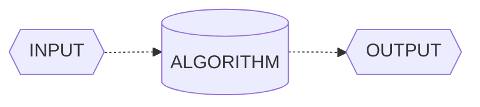

---

## Algorithms: Their Key Role in Computing

In this chapter, we aim to demystify algorithms. What exactly are algorithms, and why is it worthwhile to delve into their intricacies? How do algorithms differentiate themselves amidst the various computer technologies? This chapter wil answer these questions.

### Algorithms

Informally, an ***algorithm*** is any well-defined computational procedure that takes some value, or set of values, as ***input*** and produces some value, or set of values, as ***output*** in a finite amount of time. An algorithm is thus a sequence of computational steps that transform the input into the output.

Therefore, an algorithm serve as a tool for solving a ***well-specified computational problem***. The statement of the problem specifies in general terms the desired *input/output* relationship for problem instances. The algorithm describes a specific computational procedure for achieving that *input/output* relationship for all problem instances. 

As an example, suppose that you need to *sort a sequence of numbers into increasing order*. Here is how we formally define the ***sorting problem***: 

**INPUT:**  
**A sequence of *n* numbers  $\langle a_{1}, \\, a_{2}, \\, ... \\,,\\, a_{n}  \rangle$**.

**OUTPUT:**   
**A permutation or reordering $\langle a_{1}^{\prime}\\, ,\\, a_{2}^{\prime}\\,,\\, ... \\,,\\, a_{n}^{\prime} \rangle$ of the input sequence such that $a_{1}^{\prime} \leq \\, a_{2}^{\prime} \leq \\, a_{n}^{\prime}.$**

Thus, given the input sequence $\langle 52, \\, 28, \\, 4, \\, 12, \\, 12, \\, 36 \rangle$, a  ***correct sorting algorithm*** returns as output the sequence $\langle 4, \\, 12, \\, 12, \\, 28, \\, 36, \\, 52 \rangle$. 

#

Such an input sequence is called an ***instance*** of the ***sorting problem***. In general, an ***instance of a problem*** consists of the input (satisfying whatever **constraints** are imposed in the problem statement) needed to compute a solution to the problem.

> ***Note:** A constraint problem occurs when the wrong units (e.g.,Fahrenheit instead of Celsius) are input for a temperature conversion algorithm.*

Because many programs use it as an intermediate step, sorting is a fundamental operation in **Computer Science**. As a result, you have a large number of good sorting algorithms at your disposal. Which algorithm is best for a given application depends on several factors, including *item count*, *initial sorting*, *value constraints*, *computer architecture*, and *storage device type* (e.g., main memory or disks), among others.

An algorithm for a ***computational problem*** is ***correct*** if, for every problem instance provided as input, it ***halts*** - *its computing in finite time* - and outputs the correct solution to the problem instance. An ***incorrect*** algorithm might not halt at all on some input instances, or it might halt with an incorrect answer. 

> ***Note:** Surprisingly, incorrect algorithms can have their utility, especially when their error rate is manageable.*

#

#### What Kinds of Problems are Solved by Algorithms?

Algorithms are the unsung heroes of the digital age, silently working behind the scenes to tackle a multitude of problems across various domains. Practical applications of algorithms are ubiquitous and include the following examples: 

- **Social Media Recommendation Algorithms:** Think about how social media platforms like Facebook or Instagram suggest friends to connect with or posts to engage with. These recommendation algorithms analyze your past interactions and those of others to present content and connections tailored to your interests. For instance, when Facebook suggests reconnecting with an old friend you haven't seen in years, it's driven by algorithms mining data on mutual friends, shared interests, and past interactions.

- **Uber's Ride-Matching Algorithm:** When you book a ride through Uber, an algorithm is at work behind the scenes to optimize your journey. Uber's ride-matching algorithm considers various factors like your pickup location, destination, driver availability, and real-time traffic data to calculate the quickest and most cost-effective route. This ensures you get to your destination efficiently and at a fair price, all thanks to complex algorithms.

- **Netflix Recommendation Engine:** Ever wondered how Netflix knows exactly what TV shows and movies you'll love? Netflix's recommendation engine employs powerful algorithms that analyze your viewing history, genre preferences, and even the viewing habits of users with similar tastes. It then suggests personalized content that keeps you binge-watching. For instance, when Netflix suggests a new series that becomes your favorite, it's the result of these recommendation algorithms.

#### Algorithms as A Technology

In a hypothetical scenario where computers possessed infinite processing speed and memory came at no cost, *would you have any reason to study algorithms?* Surprisingly, the answer is **yes**. Even in such a scenario, you would still like to be certain that your solution method terminates and does so with the correct answer. 

In a world of infinitely fast computers, any method that leads to the correct solution would do. While you would still uphold the principles of good ***software engineering*** — *ensuring that your implementation is well-designed and meticulously documented* — the primary criterion for choosing a method would likely be **simplicity and ease of implementation**.

Despite their impressive speeds, computers are not infinitely fast. Time, as a computing resource, is bounded and therefore, exceedingly precious. Although the saying goes, *Time is money*, while well-known, falls short in emphasizing the true value of time; it is even more precious than money itself. Money can be regained after being spent, but once time is expended, it is irrevocably lost.

Memory, on the other hand, may seem relatively inexpensive, but it is **neither infinite nor free**. It is crucial to exercise prudence in selecting algorithms that utilize time and space resources efficiently. **In other words, even with vast computing power and memory at your disposal, the art of algorithm design remains essential, as it ensures that you maximize the utility of your finite resources.**

#

#### Efficiency

Different algorithms devised to solve the same problem often differ dramatically in their efficiency. These differences can be much more significant than differences due to hardware and software. Two common ****sorting algorithms***, **Insertion Sort** and **Merge Sort**, offer a striking contrast in terms of efficiency.

**Insertion Sort**, with its simple and intuitive nature, offers a basic way to sort a collection of elements. On the other hand, **Merge Sort** employs a more sophisticated *divide and conquer* strategy to efficiently sort large datasets. To understand the profound difference in efficiency between these two algorithms, we turn to mathematical analysis.

Efficiency in sorting algorithms can be quantified through their ***time complexity***, often expressed using **Big O** notation. The time complexity provides a mathematical representation of how an algorithm's runtime scales concerning the size of the input data.

#### Insertion Sort Efficiency:
Insertion sort operates with a time complexity of $O(n^2)$ in the worst case. This quadratic growth signifies that as the input size (n) increases, the time required to sort the data grows quadratically. It can be represented as:

$$T_{i}(n) = k_{i} \times n^2$$

$T_{i}(n) \textit{represents the time taken by insertion sort for an input of size n, and } k_{i} \textit{ is another constant factor}$

#### Merge Sort Efficiency:
Merge sort, in contrast, exhibits a time complexity of $O(n \times \log_2(n))$ for all cases, including the worst case. This indicates a more efficient growth rate as the input size increases. It can be represented as:

$$T_{m}(n) = k_{m} \times n \times \log_2(n)$$

$T_{m}(n) \textit{represents the time taken by merge sort for an input of size n, and } k_{m} \textit{ is another constant factor}$

#

Let's illustrate the difference in efficiency using a practical example. We will compare the sorting efficiency of two computers. 

Let's consider the specifications of each computer: **Computer A** operates at an impressive rate of *10 billion instructions per second*. In stark contrast, **Computer B** executes instructions at a much slower pace, managing only *10 million instructions per second*. Consequently, **Computer A** outpaces **Computer B** *by a factor of 1000* in terms of raw computing power.

To accentuate this difference further, let's assume that **Computer A** benefits from the expertise of a highly skilled programmer who codes an optimized version of the insertion sort algorithm in machine language. This finely-tuned code operates at a complexity of $2 \times n^2$ instructions to sort a dataset of n numbers.

On the other hand, **Computer B** takes a different route. Here, an average programmer has implemented the merge sort algorithm using a high-level language with an inefficient compiler. This results in a code with a time complexity of $50 \times n \times \log_2(n)$ instructions to sort the same dataset.

#### How long will it take for each computer to sort this 10 million-number dataset?

$$\text{Computer A (Insertion Sort):}$$

$$T_{i}(10^7) = \frac{k_{i} \times n^2}{10^{10}} \rightarrow \frac{2 \times (10^7)^2}{10^{10}} \\: \frac{ \text{instructions}}{\text{instructions / sec}} = 20.000 \text{ seconds} \approx 5,5 \text{ hours}$$

 

$$\text{Computer B (Merge Sort):}$$

$$T_{m}(10^7) = \frac{k_{m} \times n \times \log_2(n)}{10^7} \rightarrow \frac{50 \times 10^7 \times \log_2(10^7)}{10^{7}} \\: \frac{ \text{instructions}}{\text{instructions / sec}} \approx 1.162,5 \text{ seconds} \approx  19,375 \text{ minutes}$$

Here, it becomes evident that as the input size increases, the *efficiency difference* between Insertion Sort and Merge Sort becomes increasingly pronounced. Merge Sort's linearithmic ( $O(n \times \log_2(n) )$ ) complexity allows it to maintain a consistent advantage over Insertion Sort, especially when dealing with large datasets.

#### Algorithms and other Technologies

In computing, algorithms are as crucial as hardware and advanced technologies. Even in the age of machine learning and data science, algorithms underpin most operations, from hardware design to user interfaces and networking. 

Efficient algorithms are essential, especially as computers tackle larger problems. A solid understanding of algorithms remains a defining trait of skilled programmers, enhancing their capabilities in the ever-evolving world of computing.

#

#### Analyzing Algorithms

Analyzing an algorithm involves predicting the resources it requires, such as *memory*, *communication bandwidth*, *energy consumption*, and most commonly, ***computational time***. By evaluating multiple candidate algorithms for a problem, we can identify the *most efficient one*, often eliminating inferior alternatives. This process requires a model of the technology on which the algorithm runs, including the associated resources and their costs.

The **RAM** **(Random-Access Machine)** model is the primary framework for *algorithm analysis*. In this model, instructions execute sequentially with constant time for each operation, closely resembling real computers. It covers *common instructions*, *data types*, and *control flow*. While it simplifies some real-world complexities, like *memory hierarchy*, it offers reliable performance predictions. Analyzing algorithms in the **RAM** model can be challenging, requiring mathematical tools, but it aids in selecting efficient algorithms for various tasks.

### Asymptotic Notation

When we analyze algorithms for large inputs, we focus on their ***asymptotic efficiency*** – *how their running time scales as input size approaches infinity*. In practice, algorithms with superior asymptotic efficiency are usually the best choice, except for exceptionally small inputs. This approach helps us understand the long-term performance characteristics of algorithms.

#### $O$-Notation

$O$-Notation characterizes an *upper bound* on the ***asymptotic*** behavior of a function. In other words, it says that a function grows no faster than a certain rate, based on the highest-order term.

Consider, for example, the function $f(x) = 3n^3 - 2n^2 + 5n + 1$ . Its highest-order term is $3n^3$, and so we say that this function’s rate of growth is $n^3$. Because this function grows no faster than $n^3$ , we can write that it is $O(n^3)$. More generally, it is $O(n^c)$ for any constant $c \gg 3$.

Here is the formal definition of $O$-Notation. For a given function $g(n)$, we denote by $O(g(n))$ (*pronounced big-oh of g of n*) the *set of functions*):

$$O(g(n)) = \\{ f(n) : \text{ there exist positive constants c and } n_{0} \text{ such that }  0 \leq f(n) \leq cg(n) \text{ for all n } \geq n_{o} \\}$$

#

A function $f(n)$ belongs to the set $O(g(n))$ if there exists a ***positive constant*** $c$ such that $f(n) \leq cg(n)$ for sufficiently large $n$.

The definition of $O(g(n))$ requires that every function $f(n)$ in the set $O(g(n))$ be ***asymptotically nonnegative***: $f(n)$ must be nonnegative whenever $n$ is sufficiently large. (An ***asymptotically positive*** function is one that is positive for all
sufûciently large $n$.). 

Consequently, the function $g(n)$ itself must be ***asymptotically nonnegative***, or else the set $O(g(n))$ is **empty**. We therefore assume that every function used within $O$-Notationis ***asymptotically nonnegative***. 

You might be surprised that we defined $O$-notation in terms of sets. Indeed, you might expect that we would write $f(n) \in O(g(n))$ to indicate that $f(n)$ belongs to the set $O(g(n))$. Instead, we usually write $f(n) = O(g(n))$ and say
$f(n)$ is big-oh of $g(n)$ to express the same notion. 

Let’s explore an example of how to use the formal definition of $O$-Notation to justify our practice of discarding lower-order terms and ignoring the constant coefficient of the highest-order term: We'll show that $f(x) = 4n^2 + 100n + 500 = O(n^2)$. 

We need to find positive constants $c$ and $n_0$ such that $f(x) = 4n^2 + 100n + 500 \leq (O(n^2)$ for all $n \geq n_0$. 

Dividing both sides of the inequality by $n^2$ yields: 

$$4 + \frac{100}{n} + \frac{500}{n^2} \leq c$$ 

This inequality holds true for various choices of $c$ and $n_0$. For instance, if we set $n_0 = 1$, then this inequality is satisfied when $c = 604$). Alternatively, with $n_0 = 10$, $c = 19$ is valid.

Now, let's utilize the formal definition of $O$-notation to establish that the function $f(x) = n^3 - 100n^2$ does not belong to the set $O(n^2)$.

If $n^3 - 100n^2 = O(n^2)$, ***there would exist positive constants*** $c$ and $n_0$ such that $n^3 - 100n^2 \leq cn^2$ for all $n \geq n_0$. 

Again, dividing both sides of the inequality by $n^2$ results in:

$$n - 100 \leq c$$

Regardless of the chosen value for the constant $c$, this inequality is not satisfied for any value of $n$ > $c + 100$.

#

#### $\Omega$-Notation

$\Omega$-Notation characterizes a *lower bound* on the ***asymptotic*** behavior of a function. In other words, it says that a function grows at *least as fast* as a certain rate, based on the ***highest-order term***. 

Because the ***highest-order term*** in the function $f(x) = 7n^3 + 100n^2 - 20n + 6$ grows at least as fast as $n^3$, this function is $\Omega(n^3)$. This function is also $\Omega(n^2)$ and $\Omega(n)$. More generally, it is $\Omega(n^c)$ for any constant $c \leq 3$. 

Just as $O$-notation provides an ***asymptotic upper bound*** on a function, $\Omega$-Notation provides an ***asymptotic lower bound***. For a given function $g(n)$, we denote by $\Omega(g(n))$ (*pronounced big-omega of g of n*) the set of functions 

$$\Omega(g(n)) = \\{ f(n) : \text{ there exist positive constants c and } n_{0} \text{ such that }  0 \leq cg(n) \leq f(n) \text{ for all n } \geq n_{o} \\}$$

#

Now let’s show that $f(x) = 4n^2 + 100n + 500$ is $\Omega(n^2)$. We need to find positive constants $c$ and $n_0$ such that $f(x) = 4n^2 + 100n + 500 \leq cn^2$ for all $n \geq n_0$. As before, we divide both sides by $n^2$: 

$$4 + \frac{100}{n} + \frac{500}{n^2} \leq c$$

This inequality holds when $n_0$ is any positive integer, and we can choose $c = 4$.

What if we had a small coefficient for the $n^2$ term? The function would still be $\Omega(n^2)$. For example, let’s show that $f(x) = n^2/100 + 100n + 500$ is $\Omega(n^2)$. Dividing by $n^2$ gives: 

$$\frac{1}{100} + \frac{100}{n} + \frac{500}{n^2} \leq c$$ 

We can choose any value for $n_0$ that is at least 10,005 and find a positive value for $c$. For example, when $n_0 = 10,005$, we can choose $c = 2.49 \times 10^{-9}$. If we select a larger value for $n_0$, we can also increase $c$. For example, if $n_0 = 100,000$, then we can choose $c = 0.0089$. The higher the value of $n_0$, the closer to the coefficient $\frac{1}{100}$ we can choose $c$.

#

#### $\Theta$-Notation

$\Theta$-Notation characterizes a *tight bound* on the ***asymptotic behavior*** of a function. It says that a function grows *precisely at a certain rate*, based once again on the ***highest-order*** term. Put another way, $\Theta$-Notation characterizes the rate of growth of the function to within a **constant factor from above** and to within a **constant factor from below**. 

These two constant factors *don't need to be equal*. If you can show that a function is both $O(f(n))$ and $\Omega(f(n))$ for some function $f(n)$, then you have shown that the function is $\Theta(f(n))$. For example, $f(x) = 7n^3 + 100n^2 - 20n + 6$ it's a $\Theta(n^3)$

For a given function $g(n)$, we denote by $\Theta(g(n))$ (*theta of g of n*) the set of functions

$$\Theta(g(n)) = \\{ f(n) : \text{ there exist positive constants c1 and c2 and } n_{0} \text{ such that }  0 \leq c1g(n) \leq f(n) \leq c2g(n) \text{ for all n } \geq n_{o} \\}$$

#

For all values of n at and to the right of $n_0$, the value of $f(n)$ lies at or above $c1g(n)$ and at or below $c2g(n)$. In other words, for all $n \geq n_0$, the function $f(n)$ is equal to $g(n)$ to within constant factors. The definitions of $O$-, $\Omega$-, and ‚ $\Theta$-Notations lead to the following theorem.

For any two functions $f(n)$ and $g(n)$, we have $f(n) = \Theta(g(n))$ if and only if

$$f(n) = O(g(n))and f(n) = \Omega(g(n))$$

## Understanding the Fundamentals of Data Structures

In this chapter, we explore data structures, the essential components of computer science. What are data structures, and why are they crucial for efficient algorithms? How do they impact the world of technology and problem-solving? Let's demystify data structures and discover their profound significance.

### Data Structures

For many problems, the ability to formulate an ***efficient algorithm*** depends on being able to organize the data in an appropriate manner. The term *data structure* is used to denote a particular way of organizing data for particular types of operation.

Data structures are like organizational tools in programming, defining how data is stored and handled. They come in various forms, each tailored for specific tasks. Examples include *arrays*, *trees*, and *graphs*. These structures are vital for crafting efficient solutions in coding.
 

#### Why are They Important in Programming?

A program should undoubtedly give correct results, but along with that it should also run **efficiently**. A program is said to be efficient when it executes in *minimum time* and with *minimum memory space*. In order to write efficient programs we need to apply certain ***data management*** concepts.

The concept of data management is a complex task that includes activities like *data collection*, *organization of data into appropriate structures*, and *developing and maintaining routines for quality assurance*. A data structure is basically a group of data elements that are put together under one name, and which defines a particular way of ***storing*** and ***organizing data*** in a computer so that it can be used efficiently

Specific data structures are essential ingredients of many efficient algorithms as they enable the programmers to manage huge amounts of data easily and efficiently. Some formal design methods and programming languages emphasize data structures and the algorithms as the key organizing factor in software design. This is because **representing information is fundamental to computer science**. The primary goal of a program or software is not to perform calculations or operations but to *store* and *retrieve information* as fast as possible.

#### Choosing the Right Data Structure

In the world of problem-solving, choosing the right data structure is a fundamental step toward achieving *efficient solutions*. To gauge efficiency, we examine if a solution not only meets the problem's needs but also operates effectively within set **resource constraints**, including ***storage space*** and ***processing time***. And the best solution is the one that requires fewer resources than known alternatives. The ultimate goal is to minimize resource usage, particularly in terms of time, while still adhering to other resource limits.

In today's programming landscape, writing code extends beyond problem-solving; it's about crafting ***efficient solutions***. To accomplish this, programmers embark on a process of problem analysis, where they establish **clear performance objectives**. Subsequently, they meticulously select the data structure that best suits the task at hand.

However, in some cases, program designers lacking a solid grasp of data structure concepts may bypass this crucial analysis phase. Instead, they opt for a data structure they're familiar with. Unfortunately, this choice may not align with the specific problem, potentially leading to subpar performance, such as sluggish operation speeds.

Conversely, if a program meets its performance goals with a data structure that is simple to use, then it makes no sense to apply another complex data structure just to exhibit the programmer’s skill. When selecting a data structure to solve a problem, the following steps must be performed.

1. **Analysis of the problem to determine the basic operations that must be supported.**
2. **Quantify the resource constraints for each operation.**
3. **Select the Data Structure that best meets these requirements.**

> ***Note:** In the approach above, the first concern is the data and the operations that are to be performed on them. The second concern is the representation of the data, and the final concern is the implementation of that representation.*

C language supports various data structure types, each with its unique characteristics. Some structures allow adding data items only at the beginning, while others permit insertion at any position. Some enable sequential data access, while others facilitate random access. So, selection of an appropriate data structure for the problem is a crucial decision and may have a major impact on the performance of the program.

#

#### Classification of Data Structures

Classification of Data Structures categorizes them based on their organization and functionality, helping programmers choose the right tool for specific tasks. These categories include *Linear*, *Non-Linear* data structures, each suited to distinct data manipulation requirements. 

**Data structures are generally categorized into two classes: *Primitive* and *Non-Primitive* Data Structures.**

**Primitive and Non-Primitive Data Structures**

Primitive Data Structures are the fundamental data types which are supported by a programming language. Some basic data types are *integer*, *real*, *character*, and *boolean*. The terms ***data type***, ***basic data type***, and ***primitive data type*** are often used interchangeably. 

Non-Primitive data structures, on the other hand, are constructed using primitive data types. They encompass complex structures such as *linked lists*, *stacks*, *trees*, and *graphs*. Non-Primitive data structures can be categorized into two primary types: **Linear Structures**, which follow a linear progression, and **Non-Linear Structures**, characterized by their more intricate relationships between elements.

**Linear and Non-Linear Structures**

If data elements within a structure are organized in a sequential manner, it falls into the category of Linear data structures. Well-known examples encompass arrays, *linked lists*, *stacks*, and *queues*. Linear structures can be stored in memory using two approaches: ***contiguous memory locations*** to maintain a direct linear relationship between elements or ***linked structures*** where connections establish the linear order.

Conversely, when data elements are not arranged in a sequential order, the structure is classified as Non-Linear. Non-Linear data structures lack adjacency relationships among their elements, making them suitable for more complex scenarios. Examples of Non-Linear structures include *trees* and *graphs*, which allow for versatile data organization and retrieval.

#

### Data Types in C

Data Types in C classify variables based on the type of data they can hold, ensuring efficient memory usage and precise operations. C provides fundamental types like integers, characters, and floating-point numbers, offering versatility in data representation.

| Data Type       | Description                | Typical Size (in bytes) | Range                                                   |
|-----------------|----------------------------|:-------------------------:|---------------------------------------------------------|
| **int**           | Integer                    | 4                       | -2,147,483,648 to 2,147,483,647                        |
| **char**          | Character                  | 1                       | -128 to 127 (or 0 to 255 for `unsigned char`)           |
| **float**         | Single-Precision Floating Point | 4                   | Approximately ±1.2 x 10^-38 to ±3.4 x 10^38            |
| **double**        | Double-Precision Floating Point | 8                   | Approximately ±2.2 x 10^-308 to ±1.8 x 10^308           |

> **Note:* In addition, C also supports four modifiers — two sign specifiers (***signed*** and ***unsigned***) and two size specifiers (***short*** and ***long***).*

> [!NOTE]
> For more reference, check my [Student Guide - The C Language](https://github.com/artghieri/Student-Guide-The-C-Language/blob/main/guide.md)

---

## Conclusion

#### Reference

- TENENBAUM, Aaron M. ; LANGSAM, Yedidyah ; AUGENSTEIN, Moshe J. **Data Structures Using C**. Facsimile Edition. Pearson, 1989.
- CORMEN, Thomas H. ; LEISERSON, Charles E. ; RIVEST, Ronald L. ; STEIN, Clifford. **Introduction to Algorithms**. 4th Edition. MIT Press, 2022.

<!-- 

<!-- 
# Study Guide: Data Structures in C

## 2. Data Types in C
- Integers, floating-point, and characters.
- Pointers and dynamic memory allocation.

## 3. Arrays
- Declaration and initialization of arrays.
- Accessing elements of an array.
- Common operations on arrays.

## 4. Structures
- Declaration of structures.
- Defining and accessing structure members.
- Using structures to represent complex data.

## 5. Pointers
- Basic pointer concepts.
- Pointers to structures.
- Dynamic memory allocation with malloc and free.

## 6. Recursion
- Recursive Binary Search
  - Implementation of binary search using recursion.
  - Comparison with iterative binary search.
  - Efficiency of recursive binary search.
- Fibonacci Sequence
  - Calculating Fibonacci numbers using recursion.
  - The Fibonacci recurrence relation.
  - Efficiency considerations in recursive implementation.
- Recursive Factorial
  - Calculating the factorial of a number using recursion.
  - Illustration of the call stack concept.
  - Comparison with iterative approach.

## 7. Linked Lists
- Introduction to linked lists.
- Implementation of a simple linked list.
- Insertion and removal of elements in linked lists.

## 8. Stacks and Queues
- Concept of stacks and queues.
- Implementation of stacks and queues in C.

## 9. Trees
- Introduction to trees.
- Binary search trees.
- Tree traversal.

## 10. Sorting and Searching Algorithms
- Sorting algorithms (e.g., Bubble Sort, Quick Sort).
- Searching algorithms (e.g., Binary Search).

## 11. Advanced Data Structures (Optional)
- Graphs and their representations.
- Hash tables (hash tables).
- Balanced data structures (e.g., AVL trees).

## 12. Best Practices and Efficiency
- Code optimization.
- Proper choice of data structures.

## 13. Examples and Practical Exercises
- Small examples of data structure applications.
- Practical exercises to reinforce learning.
!-->
